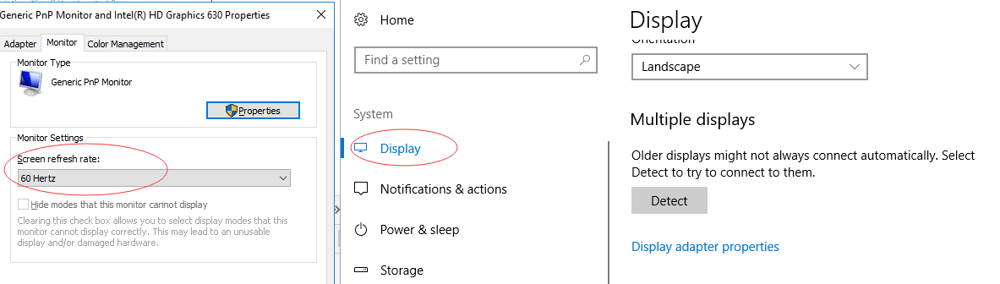

## window.requestAnimationFrame

window.requestAnimationFrame() 告诉浏览器——你希望执行一个动画，并且要求浏览器在下次重绘之前调用指定的回调函数更新动画。该方法需要传入一个回调函数作为参数，该回调函数会在浏览器下一次重绘之前执行

* 注意：若你想在浏览器下次重绘之前继续更新下一帧动画，那么回调函数自身必须再次调用window.requestAnimationFrame() => 也就是循环执行,在回调函数内部使用

* 回调函数执行次数通常是每秒60次，但在大多数遵循W3C建议的浏览器中，回调函数执行次数通常与浏览器屏幕刷新次数相匹配。为了提高性能和电池寿命，因此在大多数浏览器里，当requestAnimationFrame() 运行在后台标签页或者隐藏的`<iframe>`里时，requestAnimationFrame() 会被暂停调用以提升性能和电池寿命。

* 大多数电脑显示器的刷新频率是*60Hz*，大概相当于每秒钟*重绘60次*。大多数浏览器都会对重绘操作加以限制，不超过显示器的重绘频率，因为即使超过那个频率用户体验也不会有提升。因此，最平滑动画的最佳循环间隔是lOOOms/60，约等于*16.6ms*


### 语法

* window.requestAnimationFrame(callback)

### 参数

* callback

* 下一次重绘之前更新动画帧所调用的函数(即上面所说的回调函数)。该回调函数会被传入DOMHighResTimeStamp参数，该参数与performance.now()的返回值相同，它表示requestAnimationFrame() 开始去执行回调函数的时刻。

* Stamp 英 /stæmp/  美 /stæmp/ n. 邮票；印记；标志；跺脚 vt. 铭记；标出；盖章于…；贴邮票于…；用脚踩踏 vi. 跺脚；捣碎；毁掉
* DOM High Res Time Stamp: DOM高分辨率时间戳
* resolution 英 /rezə'luːʃ(ə)n/  美 /,rɛzə'luʃən/ n. [物] 分辨率；决议；解决；决心
* performance 英 /pə'fɔːm(ə)ns/  美 /pɚ'fɔrməns/ n. 性能；绩效；表演；执行；表现

### 返回值

* 一个 long 整数，请求 ID ，是回调列表中唯一的标识。是个非零值，没别的意义。你可以传这个值给 window.cancelAnimationFrame() 以取消回调函数。


### 范例
```
let steep = 0
function steepFun(timeStamp) {
	steep += 1
	window.requestAnimationFrame(steepFun)
	console.log(steep)
}
window.requestAnimationFrame(steepFun)
```

* progress 英 /'prəʊgres/  美 /'prɑɡrɛs/ n. 进步，发展；前进 vi. 前进，进步；进行

## DOMHighResTimeStamp

* DOMHighResTimeStamp(DOM高分辨率时间戳):  是一个double类型，用于存储时间值。该值可以是离散的时间点或两个离散时间点之间的时间差。T单位为毫秒 ms (milliseconds) ，应准确至5微秒 µs (microseconds)。但是，如果浏览器无法提供准确到5微秒的时间值(例如,由于硬件或软件的限制), 浏览器可以以毫秒为单位的精确到毫秒的时间表示该值。

* *无法获得所需精度的实现（例如，如果底层系统不支持），则只能准确到1毫秒。*
* *这个类型没有属性。它是一个双精度浮点数。*
* *这个类型没有方法。*

## window.cancelAnimationFrame || window.mozCancelAnimationFrame (无效)

### 这是一个实验中的功能
* 此功能某些浏览器尚在开发中，请参考浏览器兼容性表格以得到在不同浏览器中适合使用的前缀。由于该功能对应的标准文档可能被重新修订，所以在未来版本的浏览器中该功能的语法和行为可能随之改变。

### 概述

* 取消一个先前通过调用window.requestAnimationFrame()方法添加到计划中的动画帧请求.

### 语法

* window.mozCancelAnimationFrame(requestID);               // Firefox

### 参数

* requestID  先前调用window.requestAnimationFrame()方法时返回的ID. 

### 示例

```
let requestAnimationFrame = window.requestAnimationFrame || window.mozRequestAnimationFrame || window.webkitRequestAnimationFrame || window.msRequestAnimationFrame
// 实验中的功能 支持受限
let cancelAnimationFrame = window.cancelAnimationFrame || window.mozCancelAnimationFrame

let steep = 0
function steepFun(timeStamp) {
	steep += 1
	window.requestAnimationFrame(steepFun)
	console.log(steep)
	if (steep > 10) {
		window.cancelAnimationFrame(steepFun) // 停不下来 无效
	}
}
window.requestAnimationFrame(steepFun)
```