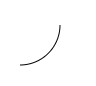
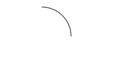

## 绘制圆弧

有两个方法可以绘制圆弧：

1、arc(x, y, r, startAngle, endAngle, anticlockwise): 以(x, y)为圆心，以r为半径，从 startAngle弧度开始到endAngle弧度结束。anticlosewise是布尔值，true表示逆时针，false表示顺时针(默认是顺时针)。

注意：
* 这里的度数都是弧度。
* 0 弧度是指的 x 轴正方向。
```
//角度转换成弧度
// 圆周长是2π
// 2π/180 = 一度的圆周
radius=(Math.PI/180)*degrees
```

例子

```
// 全局常量定义
const canvas=document.getElementById('arc')
const ctx=canvas.getContext('2d')
const canvasW = canvas.width // 必须canvas定义属性width
const canvasH = canvas.height // 必须canvas定义属性height

ctx.beginPath()
ctx.arc(50, 90, 40, 0, Math.PI / 2, false) // 顺时针
ctx.stroke()
```


anticlockwise 逆时针方向的 英 /æntɪ'klɒkwaɪz/  美 /'æntɪ'klɑkwaɪz/ adj. 逆时针的；反时针方向的 adv. 逆时针地
degree 英 /dɪ'griː/  美 /dɪ'ɡri/  n. 程度，等级；度；学位；阶层
degrees n. 角度，学历；度数（degree的复数）

2、arcTo(x1, y1, x2, y2, radius): 根据给定的起始点(moveTo()点)、控制点（参数1,2、参数3,4）和半径画一段圆弧，最后再以直线连接两个控制点。

注意：必须给定moveTo()的起始点

```
ctx.beginPath()
ctx.moveTo(100, 220)
ctx.arcTo(150, 220, 150, 250, 50)
ctx.stroke()
```
