## CentOS 7系统中的各个目录结构功能

/：根目录，文件的最顶端; 注意:/etc、/bin、/sbin 、/dev、/lib等应该和根目录放在同一个分区;

/etc：一般存放系统的配置文件;

/bin ：存放系统所需要的重要命令，ls，cp，mkdir 等;

/sbin：存放一些系统管理的命令，一般只能由超级权限用户root执行;

/dev：存放Linux 系统下的设备文件，如光驱，磁盘等;

/lib：主要存放动态链接库;

/boot：存放Linux启动时内核及引导系统程序所需要的核心文件;

/home：系统默认的用户主目录,存放普通用户的数据;

/lost+found：存放一些当系统以外崩溃或机器意外关机时产生的文件碎片;

/mnt：用于存放挂在储存设备的挂载目录;

/proc：存放操作系统运行时的运行信息;

/root：Linux超级权限用户的root目录;

/tmp：临时文件目录;

/usr：应用程序存放目录，如命令、帮助文档等;

/var：存放系统日志,系统库等经常变动文件;

/sys：目录与/proc类似，是一个虚拟的文件系统;

## CentOS 7系统分区时也会遇到设备类型的选择

标准分区: 即是主分区,注意:系统的启动文件如/boot应设置为标准分区(主分区),如果没有单独设置/boot分区,则/根目录应该设置为标准分区;

LVM: 逻辑分区(同window逻辑分区一样);

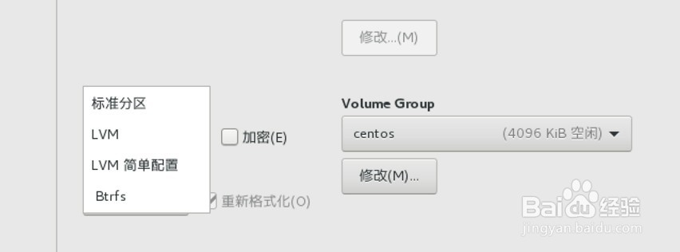

## CentOS 7系统分区方案：

/boot ：用来存放与 Linux 系统启动有关的程序，比如启动引导装载程序等，建议大小为 200MB 。 
/usr ：用来存放 Linux 系统中的应用程序，其相关数据较多，建议大于 3GB 以上。 
/var ：用来存放 Linux 系统中经常变化的数据以及日志文件，建议大于 1GB 以上。 
/home ：存放普通用户的数据，是普通用户的宿主目录，建议大小为剩下的空间。 
/ ： Linux 系统的根目录，所有的目录都挂在这个目录下面，建议大小为 5GB 以上。 
/tmp ：将临时盘在独立的分区，可避免在文件系统被塞满时影响到系统的稳定性。建议大小为 500MB 以上。 
swap ：实现虚拟内存，建议大小是物理内存的 1~2 倍。

## [root@localhost ~]# 输入命令

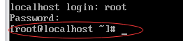

* @之前代表当前登录用户
> 在Linux中管理员用户是root，还有一些普通用户；

* @之后代表当前计算机主机名

* ~当前用户的家目录，/当前所在根目录

* `#`超级用户提示符，$是普通用户的提示符

* ls 列出目录中的内容
> man ls：我们输入ls，回车后，列出了当前文件夹下的内容。但是只有名字信息。如果我们需要查看更详细的信息，可以通过 man ls这个命令来查看。man,就是manual的意思。看以查看任意命令的具体解释。
>
格式： ls [选项]  [文件或目录]
选项：
>> 
-l  显示详细信息
-a 显示所有文件，包括隐藏文件
-i  显示inode
-t ：依时间排序，而不是用档名。
-r ：将排序结果反向输出，例如：原本档名由小到大，反向则为由大到小；
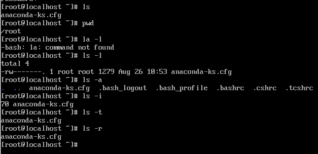
manual 英 /'mænjʊ(ə)l/  美 /'mænjuəl/ adj. 体力的；手控的；用手的 n. 说明书；小册子；（牧师主持圣礼时用）礼仪书；用手操作的器具

* int 5 启动图像界面

* cd：切换目录：
> cd [~]：进入当前用户的家目录，比如我是fuwh这个用户登陆的，则进入到/home/fuwh目录
> cd 目录名：进入到指定的目录
> cd .：就代表当前目录
> cd ..：代表进入上一层目录，比如我现在在/home/fuwh下的时候，使用该命令，则会进入到/home目录下。
> cd -：代表前一个工作目录，比如我们经常需要在两个目录之间切换，则可以使用这种快捷方式。

* pwd：查看自己当前所在的目录。

## CentOS 7系统查看网络：

输入命令**dhclient**，让CentOS 7自动获取一个IP地址。正常情况下是不会有任何输出内容的。

输入命令**ip addr**，查看IP地址。注意英文字母的大小写，Linux系统是区分大小写的。
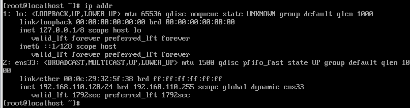

> 
1. Io（网卡名Io）：IP地址是127.0.0.1，是回环地址，网卡名是Io，Windows操作系统也有该地址，用来自己和自己通信。
2. ens33：IP地址是192.168.110.128，刚刚自动获取的IP地址，ens33是网卡。


## 设置centOS 7系统ip：

**查看真实电脑ip**：
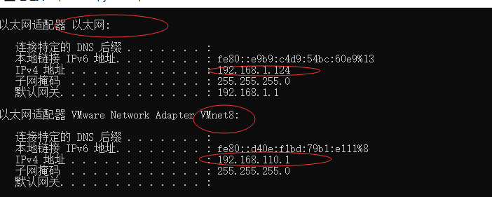

**设置虚拟机IP地址**：
* 1.VMware开启后，我们点击头部菜单中的“编辑”，在下拉菜单中点击“虚拟网络编辑器(N)”，如下图所示
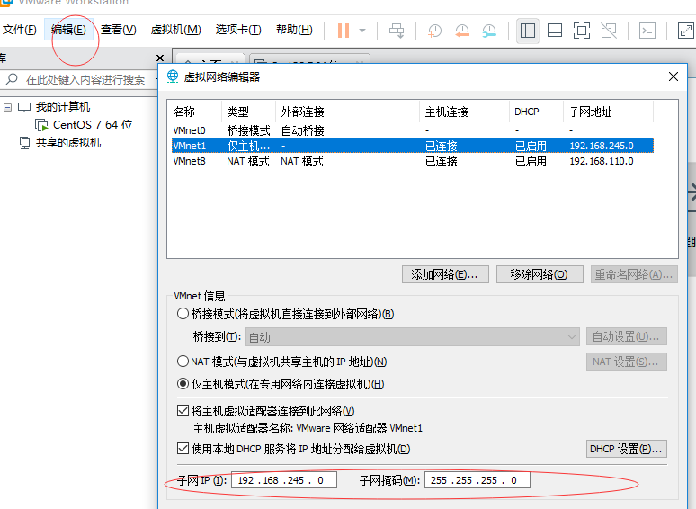
* 2.我们先点击VMnet8那一行，勾选“使用本地DHCP服务将IP地址分配给虚拟机(D)”，我们**参考VMnet1的IP**，**也以192.168开头**，至于第三个随意，第四个则是0（注意：下图的配置刚开始最好是初始配置，如果你曾经乱配过，可能会有问题，如果想要恢复到初始化配置，则点击"还原默认设置(R)"按钮来恢复初始化的配置，然后重新开始），
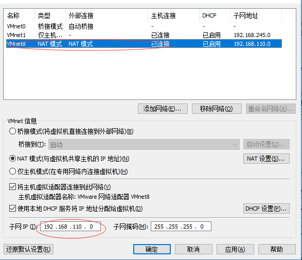

然后我们点击"NAT 设置(S)"。修改网关IP(G)，前三位和子网IP一致，后一位在0~255之间（这里使用默认设置）：
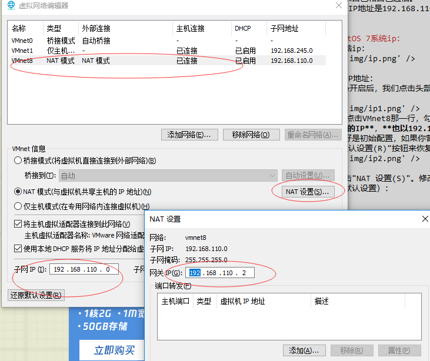

* 3.确认要启动的虚拟机的网络适配器类型是"NAT"模式，如下图所示
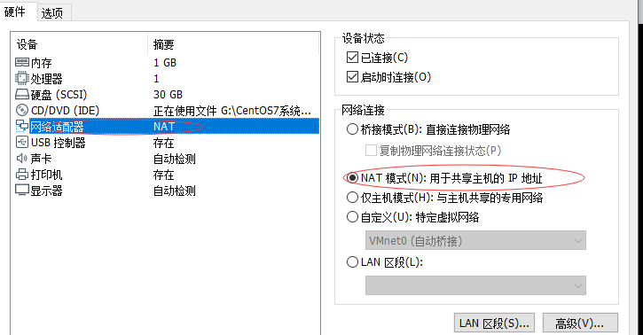

进入虚拟机centOS系统ip修改界面：
```
vi /etc/sysconfig/network-scripts/ifcfg-ens33
```
* DEVICE=eth0 #描述网卡对应的设备别名
* BOOTPROTO=static **#设置网卡获得ip地址的方式，选项可以为为static，dhcp或bootp**
* BROADCAST=192.168.1.255 #对应的子网广播地址
* `HWADDR=00:07:E9:05:E8:B4 #对应的网卡物理地址`
* NETWORK= '暂时不知道怎么修改' #网卡对应的网络地址，也就是所属的网段
* ONBOOT=yes #系统启动时是否设置此网络接口，设置为yes时，系统启动时激活此设备
* 
* IPADDR=192.168.110.0 **#IP地址：只有网卡设置成static时，才需要此字段，配一个自己想要配的地址，但是必须是同VMnet8的子网IP在同一网段**
* NETMASK=255.255.255.0 **#网卡对应的网络掩码** 
* GATEWAY=192.168.110.2 **#网关：这个值与我们在第三步“NAT（设置S）”设置的网关一样**
* DNS1=192.168.110.2 **#DNS：跟我们第三步“NAT（设置S）”设置的的网关一样**

gateway 英 /'geɪtweɪ/  美 /'ɡetwe/ n. 门；网关；方法；通道；途径 复数 gateways
NETMASK n. 网络掩码
PROTO 英 /prəʊtə/  美 /'proto/ n. 原型；样机；典型
BOOTPROTO 配置静态化

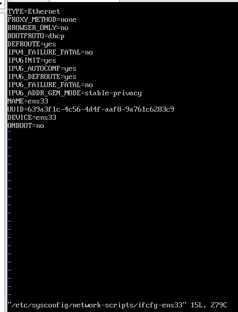

**按i开始编辑**：
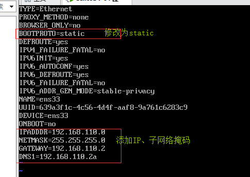

loopback /lup'bæk/ n. [计] 回送；回路
lower up 低了

按**esc**退出插入模式，然后输入指令**:**进入命令模式，输入**wq**保存并退出


##CentOS 7系统 测试网络连通性：

ping -c 4 www.baidu.com
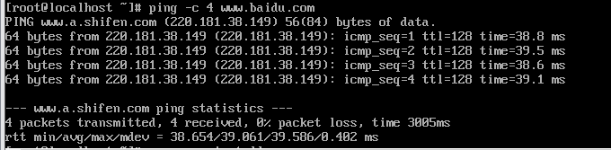

## CentOS 7系统安装图形界面：

查看一下ip地址ip addr，再测试一下网络的连通性ping -c 4 www.baidu.com。如果网络没问题，运行如下命令来安装图形界面

### 方法一

查询到。在 group 软件包中，Desktop、Desktop Platform、KDE Desktop、X Window System 是主要的桌面环境。
```
# yum grouplist
```

因为 KDE Desktop 和  X Window System 两个软件包名称中间都包含空格，需要用引号引起来才行。
```
# yum groupinstall "X Window System" "KDE Desktop" "Chinese Support" "Desktop" "GNOME Desktop" -y
```

从命令行直接启动图形桌面环境
```
# startx
```

既然是桌面环境，可能还需要诸如字体、管理工具之类的，如，

```
# yum -y groupinstall "Graphical Administration Tools"
# yum -y groupinstall "Internet Browser"
# yum -y groupinstall "General Purpose Desktop"
# yum -y groupinstall "Office Suite and Productivity"
# yum -y groupinstall "Graphics Creation Tools"
```

闭图形界面：
```
 init 3   // 关闭图形界面（XServer服务也会关闭）
```

开启图形界面：
```
init 5 或 
startx  //进入第一个图形界面（如果有多个的话）
````


GNOME 英 /nəʊm/ n. 土地神；格言；箴言 linux下的桌面环境
Desktop 英 /'desktɒp/  美 /'dɛsk'tɑp/ n. 桌面；台式机 复数 desktops
yum 英 /jʌm/  美 /jʌm/ int. （表示味道或气味好）嗯
group 英 /gruːp/  美 /ɡrup/ n. 组；团体 adj. 群的；团体的 vi. 聚合 vt. 把…聚集；把…分组

## startX 进入桌面后闪退

## 修复yum rpmdb open failed
```
cd /var/lib/rpm/
rm __db.* -rf
rpm --rebuilddb
yum clean all
yum update
```
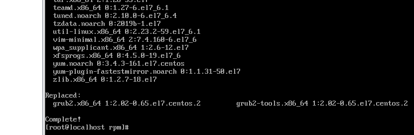

