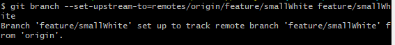

## git基本操作

### 远程分支-删除远程分支
```
git push origin --delete 远程分支名字
```


### 远程分支-创建远程分支
```
git push origin 本地分支名字:远程分支名字
```


### 本地分支-创建本地分支的上游分支
```
git branch --set-upstream-to=remotes/origin/分支名 本地分支名
```
