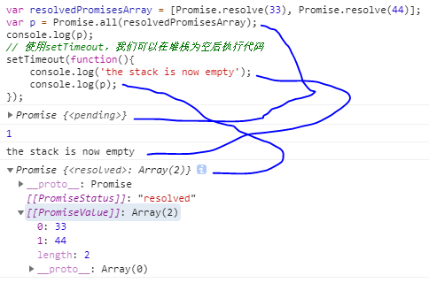

## Promise
* <b>Promise 对象用于表示一个异步操作的最终状态（完成或失败），以及该异步操作的结果值。</b>
```
	本条目为Promise构造函数。想要了解promises，请首先阅读 使用 promises。
	构造函数主要是用来包装还未支持promises的函数。
``` 
> 
promise 答应 承诺 约定 英 /'prɒmɪs/  美 /'prɑmɪs/ n. 许诺，允诺；希望 vt. 允诺，许诺；给人以…的指望或希望 vi. 许诺；有指望，有前途 过去式 promised过去分词 promised现在分词 promising
> 
resolve 解析 解决 英 /rɪ'zɒlv/  美 /rɪ'zɑlv/ vt. 决定；溶解；使…分解；决心要做… vi. 解决；决心；分解 n. 坚决；决定要做的事 过去式 resolved过去分词 resolved现在分词 resolving
> 
reject 拒绝 驳回 英 /(for v.)rɪˈdʒɛkt; (for n.)ˈriːdʒɛkt/ 美 /(for v.)rɪˈdʒɛkt; (for n.)ˈriːdʒɛkt/ vt. 拒绝；排斥；抵制；丢弃 n. 被弃之物或人；次品
 
* <b>JavaScript Demo: Promise Constructor（javascript演示：Promise构造函数）</b>
>* constructor 英 /kənˈstrʌktə(r)/  美 /kənˈstrʌktər/ n. 构造函数；构造器；建造者
>* executor 执行者 英 /ɪg'zekjʊtə; eg-/  美 /ɪg'zɛkjətɚ/ n. 执行者；[法] 遗嘱执行人
```
	var promise1 = new Promise(function(resolve, reject) {
  		setTimeout(function() {
    		resolve('foo');
  		}, 300);
	})
	promise1.then(function(value) {
  		console.log(value);
  		// expected output: "foo"
	});
	console.log(promise1);
	// expected output: [object Promise]
```

## 语法
``` 
	new Promise(function(resolve, reject){...} /* executor */ );
``` 
* <b>参数</b>
**executor**是带有 **resolve** 和 **reject** 两个参数的函数 。
Promise构造函数执行时立即调用executor 函数， resolve 和 reject 两个函数作为参数传递给executor（executor 函数在Promise构造函数返回所建promise实例对象前被调用）。
resolve 和 reject 函数被调用时，分别将promise的状态改为**fulfilled（完成）**或**rejected（失败）**。
executor 内部通常会执行一些异步操作，一旦异步操作执行完毕(可能成功/失败)，要么调用resolve函数来将promise状态改成fulfilled，要么调用reject 函数将promise的状态改为rejected。如果在executor函数中抛出一个错误，那么该promise 状态为rejected。executor函数的返回值被忽略。
>* fulfilled 英 /fʊl'fɪld/ adj. 满足的；十分愉快的 v. 实现（fulfill的过去分词）；履行；满足

## 描述
* **Promise 对象**是一个**代理对象（代理一个值）**，**被代理的值在Promise对象**创建时可能是未知的。它允许你为异步操作的成功和失败分别绑定 相应的处理方法（handlers）。 这让异步方法可以像同步方法那样返回值，但并不是立即返回最终执行结果，而是一个能代表未来出现的结果的promise对象
<b>一个 Promise有以下几种状态:</b>
<b>pending: 初始状态，既不是成功，也不是失败状态。</b>
<b>fulfilled: 意味着操作成功完成。</b>
<b>rejected: 意味着操作失败。</b>
> 
* **pending 状态(挂起状态)**的 Promise 对象可能会变为**fulfilled 状态**并传递一个值给相应的状态处理方法，也可能变为**失败状态（rejected）**并传递失败信息。
* 当其中任一种情况出现时，**Promise 对象**的 then 方法绑定的处理方法（handlers ）就会被调用（then方法包含两个参数：**onfulfilled** 和 **onrejected**，它们都是 Function 类型。
* **当Promise状态为fulfilled时**，调用 then 的 onfulfilled 方法，**当Promise状态为rejected时**，调用 then 的 onrejected 方法， 所以在异步操作的完成和绑定处理方法之间不存在竞争）。
> pending 挂起 有待 英 /'pendɪŋ/ 美 /'pɛndɪŋ/ adj. 未决定的；行将发生的 prep. 在…期间；直到…时为止；在等待…之际 v. 待定；悬而不决（pend的ing形式）
> fulfill /ful'fil/ vt. 履行；实现；满足；使结束（等于fulfil）
过去式 fulfill, fulfilled过去分词 fulfill, fulfilled现在分词 fulfill, fulfilling
>* then 英 /ðen/  美 /ðɛn/ adv. 然后；那么；于是；当时；此外
>* settled 稳定的 英 /'setld/  美 /'sɛtld/ adj. 稳定的；固定的 v. 解决；定居（settle的过去分词）
>* fulfillment 履行 英 /fʊl'fɪlmənt/  美 /fʊl'fɪlmənt/ n. 履行；实行；满足（感）
>* asynchronous 异步 英 /ə'sɪŋkrənəs; eɪ-/  美 /e'sɪŋkrənəs/ adj. [电] 异步的；不同时的；不同期的
>* actions 美 /'ækʃən/ n. 行动（action的复数）；动作
>* rejection 英 /rɪ'dʒekʃ(ə)n/  美 /rɪ'dʒɛkʃən/ n. 抛弃；拒绝；被抛弃的东西；盖帽
>* handing 处理 操作 n. 管理；处理方法；操纵 v. 交给；支持（hand的ing形式）
>* catch 捕捉 英 /kætʃ/  美 /kætʃ/ vt. 赶上；抓住；感染；了解 vi. 赶上；抓住 n. 捕捉；捕获物；窗钩 过去式 caught过去分词 caught现在分词 catching
> 
>* 因为 Promise.prototype.then 和  Promise.prototype.catch 方法返回promise 对象， 所以它们可以被链式调用。
>


* 不要和惰性求值混淆： 有一些语言中有惰性求值和延时计算的特性，它们也被称为“promises”，例如Scheme. 
* Javascript中的promise代表一种已经发生的状态， 而且可以通过回调方法链在一起。 
* 如果你想要的是表达式的延时计算，考虑无参数的"箭头方法":  f = () =>表达式 创建惰性求值的表达式，使用 f() 求值。
* 注意： 如果一个promise对象处在fulfilled或rejected状态而不是pending状态，那么它也可以被称为settled状态。
* 你可能也会听到一个术语resolved ，它表示promise对象处于settled状态。关于promise的术语， Domenic Denicola 的 States and fates 有更多详情可供参考。

## 属性
* <b>Promise.length
> length属性，其值总是为 1 (构造器参数的数目).
>
* <b>Promise.prototype
> 表示 Promise 构造器的原型.

## 方法

### Promise.all(iterable)[等待所有Peomise resolve成功][或者一个Promise reject失败]
>* iter /'aɪtɛr/ n. 通路；[解剖] 导管
>* resolve 解析 解决 英 /rɪ'zɒlv/  美 /rɪ'zɑlv/ vt. 决定；溶解；使…分解；决心要做… vi. 解决；决心；分解 n. 坚决；决定要做的事 过去式 resolved过去分词 resolved现在分词 resolving
>* reject 拒绝 驳回 英 /(for v.)rɪˈdʒɛkt; (for n.)ˈriːdʒɛkt/ 美 /(for v.)rɪˈdʒɛkt; (for n.)ˈriːdʒɛkt/ vt. 拒绝；排斥；抵制；丢弃 n. 被弃之物或人；次品
>
>* 方法返回一个Promise实例，此实例在 iterable(可迭代)参数内所有的 promise 都“完成（resolved）”或参数中不包含 promise 时回调完成（resolve）；如果参数中promise 有一个失败（rejected），此实例回调失败（reject），失败原因的是第一个失败 promise 的结果。

>* 例子:
```
	var promise1 = Promise.resolve(3)
	var promise2 = 42
	var promise3 = new Promise(function(resolve,reject) {
		setTimeout(resolve, 100, 'f00')
	})
	Promise.all([promise1, promise2, promise3]).then(function(value){
		console.log(value)
	})
	// 输出数组：[3，42，‘f00’]
	var promise3 = new Promise(function(resolve, reject){
		setTimeout(resolve, 100, 'foo')
	}).then(function(value) {
		console.log(value)
	})
	// new Promise回隐式的输出: Promise{<pending>}
	// console.log(value)输出：foo
	// Promise对象的三种状态:
	// pending: 初始状态，既不是成功，也不是失败状态。</b>
	// fulfilled: 意味着操作成功完成。
	// rejected: 意味着操作失败。
```
>* 语法
```
	Promise.all(iterable)
```
>>* 参数
>>> iterable： 一个可迭代对象,如 Array 或 String。
>>* 返回值
>>>1. 如果传入的参数是一个空的可迭代对象，则返回一个已完成（already resolved）状态的 Promise。
```
		Promise.all([]).then(values => {console.log(values)})
		// Promise对象隐式输出：Promise {<resolved: undefined>}
		// console.log(values)输出: []
```
>>>2. 如果传入的参数不包含任何 promise，则返回一个异步完成（asynchronously resolved） Promise。注意：Google Chrome 58 在这种情况下返回一个已完成（already resolved）状态的 Promise。
>>>3. 其它情况下返回一个处理中（pending）的Promise。这个返回的 promise 之后会在所有的 promise 都完成或有一个 promise 失败时异步地变为完成或失败。 见下方关于“Promise.all 的异步或同步”示例。返回值将会按照参数内的 promise 顺序排列，而不是由调用 promise 的完成顺序决定。
>
* 说明
>>* 此方法在集合多个 promise 的返回结果时很有用。
>>* 完成（Fulfillment）：
>>> 如果传入的可迭代对象为空，Promise.all 会同步地返回一个已完成（resolved）状态的promise。
>>>
>>> 如果所有传入的 promise 都变为完成状态，或者传入的可迭代对象内没有 promise，Promise.all 返回的 promise 异步地变为完成。
>>> 
>> 在任何情况下，Promise.all 返回的 promise 的完成状态的结果都是一个数组，它包含所有的传入迭代参数对象的值（也包括非 promise 值）。
>> 
>>* 失败/拒绝（Rejection）：
>>> 如果传入的 promise 中有一个失败（rejected），Promise.all 异步地将失败的那个结果给失败状态的回调函数，而不管其它 promise 是否完成。
>>
* 示例
>>* **Promise.all 的使用**
>>>* Promise.all 等待所有都完成（或第一个失败）。
```
	var p1 = Promise.resolve(3)
	var p2 = 1337
	var p3 = new Promise((resolve, reject) => {
		setTimeout(resolve, 100, 'f00')
	})
	Promise.all([p1, p2, p3]).then(values => {
		console.log(values);
	})
	// new Promise回隐式的输出: Promise{<pending>}
    // console.log(value)输出：foo
    // Promise对象的三种状态:
    // pending: 初始状态，既不是成功，也不是失败状态。</b>
    // fulfilled: 意味着操作成功完成。
    // rejected: 意味着操作失败。
```
>>>  
>>> 
>>>* 如果参数中包含非 promise 值，这些值将被忽略，但仍然会被放在返回数组中（如果 promise 完成的话）：
>>>
```
	// 这将被视为可迭代传递的是空的，因此它得到了fulfilled(操作完成状态)
	var p = Promise.all([1,2,3]);
	// 这将被视为迭代传递只包含值为“444”的resolved Promise, 因此它得到了fulfilled(操作完成状态)
	var p2 = Promise.all([1,2,3,Promise.resolve(444)])
	// 这将被视为迭代传递只包含值为“555”的resolved Promise, 因此它得到了fulfilled(操作完成状态)
	var p3 = Promise.all([1,2,3,Promise.resolve(555)])
	// 使用setTimeout，我们可以在堆栈为空后执行代码
	setTimeout(() => {
		console.log(p)
		console.log(p2)
		console.log(p3)
	})
	// 输出：
	// Promise {<resolved>} -->
		Promise {[[PromiseDtatus]]: "resolved", [[PromiseValue]]: Array(3)}
	// Promise {<resolved>} -->
		Promise {[[PromiseDtatus]]: "resolved", [[PromiseValue]]: Array(4)}
	// Promise {<resolved>} -->
		Promise {[[PromiseDtatus]]: "resolved", [[PromiseValue]]: Array(4)}
```
>>> 
>>>  
>>* **Promise.all 的异步和同步**
>>>* 如果传入的可迭代对象是空的，就是同步
```
	var resolvedPromisesArray = [Promise.resolve(33), Promise.resolve(44)];
	var p = Promise.all(resolvedPromisesArray);
	console.log(p);
	// 使用setTimeout，我们可以在堆栈为空后执行代码
	setTimeout(function(){
    	console.log('the stack is now empty');
    	console.log(p);
	});
```
>>> 
>>>* 如果 Promise.all 失败，也是一样的, 就是同步
```
	var mixedPromisesArray = [Promise.resolve(33), Promise.reject(44)];
	var p = Promise.all(mixedPromisesArray);
	console.log(p);
	setTimeout(function(){
    	console.log('the stack is now empty');
    	console.log(p);
	});
```
>>> 
>>>* 但是，Promise.all 当且仅当传入的可迭代对象为空时为同步：
```
	var p = Promise.all([]); 
	var p2 = Promise.all([1337, "hi"]);
	console.log(p);
	console.log(p2)
	setTimeout(function(){
    	console.log('the stack is now empty');
    	console.log(p2);
	});
```
>>> 
>>>
>>* Promise.all 的快速返回失败行为
>>>* Promise.all 在任意一个传入的 promise 失败时返回失败。例如，如果你传入的 promise中，有四个 promise 在一定的时间之后调用成功函数，有一个立即调用失败函数，那么 Promise.all 将立即变为失败。
>>>
```
	var p1 = new Promise((resolve, reject) => { 
  		setTimeout(resolve, 1000, 'one'); 
	}); 
	var p2 = new Promise((resolve, reject) => { 
  		setTimeout(resolve, 2000, 'two'); 
	}); 
	var p3 = new Promise((resolve, reject) => {
  		setTimeout(resolve, 3000, 'three');
	});
	var p4 = new Promise((resolve, reject) => {
  		setTimeout(resolve, 4000, 'four');
	});
	var p5 = new Promise((resolve, reject) => {
  		reject('reject');
	});
	Promise.all([p1, p2, p3, p4, p5]).then(values => { 
  		console.log(values);
	}, reason => {
  		console.log(reason)
	});
```
>>> 
>>> reason 英 /'riːz(ə)n/  美 /ˈrizən/ n. 理由；理性；动机 vi. 推论；劝说 vt. 说服；推论；辩论
>>> 

### Promise.race(iterable)[等待任何一个Peomise resolve成功 或者 reject失败]
>* Promise.race(iterable) 方法返回一个 promise，一旦迭代器中的某个promise解决或拒绝，返回的 promise就会解决或拒绝。
>> race 英 /reɪs/ n. 属，种；种族，人种；家庭，门第；赛事，赛跑 vt. 使参加比赛；和…竞赛；使急走，使全速行进 vi. 比速度，参加竞赛；全速行进

>* JavaScript Demo: Promise.race()
```
	var promise1 = new Promise(function(resolve, reject) { 
		setTimeout(resolve, 500, 'one');
	});
	var promise2 = new Promise(function(resolve, reject) {
	    setTimeout(resolve, 100, 'two');
	});
	Promise.race([promise1, promise2]).then(function(value) {
  		console.log(value);
  		// Both resolve, but promise2 is faster
	});
```
>* 
 
>* 语法
>> Promise.race(iterable);
>>>* 参数
>>>> iterable
>>>>> 可迭代对象，类似Array。
>>>* 返回值
>>>> 一个待定的 Promise 只要给定的迭代中的一个promise解决或拒绝，就采用第一个promise的值作为它的值，从而异步地解析或拒绝（一旦堆栈为空）。

>* 描述
>>* race 函数返回一个 Promise，它将与第一个传递的 promise 相同的完成方式被完成。它可以是完成（ resolves），也可以是失败（rejects），这要取决于第一个完成的方式是两个中的哪个。
>>* race 函数返回一个 Promise，它将与第一个传递的 promise 相同的完成方式被完成。它可以是完成（ resolves），也可以是失败（rejects），这要取决于第一个完成的方式是两个中的哪个。
>>* 如果迭代包含一个或多个非承诺值和/或已解决/拒绝的承诺，则 Promise.race 将解析为迭代中找到的第一个值。

>* 例子
>> Promise.race的异步性
```
	var resolvedPromisesArray = [Promise.resolve(33), Promise.resolve(44)];
	var p = Promise.race(resolvedPromisesArray);
	console.log(p)
	setTimeout(function(){
    	console.log('the stack is now empty');
    	console.log(p);
	});
```
>> 
>> 使用 Promise.race –  setTimeout 的示例
```
	var p1 = new Promise(function(resolve, reject) { 
    	setTimeout(resolve, 500, "one"); 
	});
	var p2 = new Promise(function(resolve, reject) { 
    	setTimeout(resolve, 100, "two"); 
	});
	Promise.race([p1, p2]).then(function(value) {
  		console.log(value); // "two"
  		// 两个都完成，但 p2 更快
	});
	var p3 = new Promise(function(resolve, reject) { 
    	setTimeout(resolve, 100, "three");
	});
	var p4 = new Promise(function(resolve, reject) { 
   		setTimeout(reject, 500, "four"); 
	});
	Promise.race([p3, p4]).then(function(value) {
  		console.log(value); // "three"
  		// p3 更快，所以它完成了              
	}, function(reason) {
  		// 未被调用
	});
	var p5 = new Promise(function(resolve, reject) { 
    	setTimeout(resolve, 500, "five"); 
	});
	var p6 = new Promise(function(resolve, reject) { 
    	setTimeout(reject, 100, "six");
	});
	Promise.race([p5, p6]).then(function(value) {
  		// 未被调用             
	}, function(reason) {
  	console.log(reason); // "six"
  		// p6 更快，所以它失败了
	});
```
>> 

### Promise.reject(reason)方法返回一个带有拒绝原因reason参数的Promise对象。
>* reason 英 /'riːz(ə)n/  美 /ˈrizən/ n. 理由；理性；动机 vi. 推论；劝说 vt. 说服；推论；辩论
>* 语法
>> Promise.reject(reason);
>* 参数
>> reason
>>> 表示Promise被拒绝的原因。
>* 返回值
>> 一个给定原因了的被拒绝的 Promise。
>* 描述
>> 静态函数Promise.reject返回一个被拒绝的Promise对象。通过使用Error的实例获取错误原因reason对调试和选择性错误捕捉很有帮助。
>* 例子
```
	Promise.reject("Testing static reject").then(function(reason) {
  		// 未被调用
	}, function(reason) {
  		console.log(reason) // "Testing static reject" 测试静态拒绝
	})
	Promise.reject(new Error("fail")).then(function(result) {
  		// 未被调用
	}, function(error) {
  		console.log(error) // stack trace 堆栈跟踪
	})
``` 
> 
> 

### Promise.resolve(value)方法
>* Promise.resolve(value)方法返回一个以给定值解析后的Promise 对象。但如果这个值是个thenable（即带有then方法），返回的promise会“跟随”这个thenable的对象，采用它的最终状态（指resolved/rejected/pending/settled）；如果传入的value本身就是promise对象，则该对象作为Promise.resolve方法的返回值返回；否则以该值为成功状态返回promise对象。
>* 语法
>> Promise.resolve(value);
>> Promise.resolve(promise);
>> Promise.resolve(thenable);
>* 参数
>> value
>>> 将被Promise对象解析的参数。也可以是一个Promise对象，或者是一个thenable。
>* 返回值
>> 返回一个解析过带着给定值的Promise对象，如果返回值是一个promise对象，则直接返回这个Promise对象。
>* 描述
>> 静态方法 Promise.resolve返回一个解析过的Promise对象.
>* 例子
>>* 使用静态方法Promise.resolve
```
	Promise.resolve("Success").then(function(value) {
  		console.log(value); // "Success"
	}, function(value) {
  		// 不会被调用
	})
```
>> 
>> 
>>* 对一个数组进行resolve
```
	var p = Promise.resolve([1,2,3])
	p.then(function(v) {
  		console.log(v[0]) // 1
	})
```
>> 
>>
>>* Resolve另一个promise对象
```
	// Resolve一个thenable对象
	var p1 = Promise.resolve({ 
  		then: function(onFulfill, onReject) { onFulfill("fulfilled!"); }
	});
	console.log(p1 instanceof Promise) // true, 这是一个Promise对象
	p1.then(function(v) {
    	console.log(v); // 输出"fulfilled!"
  	}, function(e) {
    	// 不会被调用
	});
	//
	// Thenable在callback之前抛出异常
	// Promise rejects
	var thenable = { then: function(resolve) {
  		throw new TypeError("Throwing");
  		resolve("Resolving");
	}};
	var p2 = Promise.resolve(thenable);
	p2.then(function(v) {
  		// 不会被调用
	}, function(e) {
  		console.log(e); // TypeError: Throwing
	});
	//
	// Thenable在callback之后抛出异常
	// Promise resolves
	var thenable = { then: function(resolve) {
  		resolve("Resolving");
  		throw new TypeError("Throwing");
	}};
	var p3 = Promise.resolve(thenable);
	p3.then(function(v) {
  		console.log(v); // 输出"Resolving"
	}, function(e) {
  		// 不会被调用
	}); 
```
>> 


## Promise 原型
### 属性
### Promise.prototype.constructor
> 返回被创建的实例函数.  默认为 Promise 函数.

### 方法
### Promise.prototype.catch(onRejected)
> 添加一个拒绝(rejection) 回调到当前 promise, 返回一个新的promise。当这个回调函数被调用，新 promise 将以它的返回值来resolve，否则如果当前promise 进入fulfilled状态，则以当前promise的完成结果作为新promise的完成结果.
>
> catch() 方法返回一个Promise，并且处理拒绝的情况。它的行为与调用Promise.prototype.then(undefined, onRejected) 相同。 (事实上, calling obj.catch(onRejected) 内部calls obj.then(undefined, onRejected)).
>### 语法
```
	p.catch(onRejected);
	p.catch(function(reason) {
		// 拒绝
	});
```
>> 参数
>>> onRejected
>>>> 当Promise 被rejected时,被调用的一个Function。 该函数拥有一个参数：
>>>>> reason：rejection 的原因。
>>>>>> 如果 onRejected 抛出一个错误或返回一个本身失败的 Promise ，  通过 catch() 返回的Promise 被rejected；否则，它将显示为成功（resolved）。 
>>
>> 返回值
>>> 一个Promise.
>
>### 描述
>> catch 方法可以用于您的promise组合中的错误处理。
>
>### 示例
>> 使用链式语句的 catch方法
>>
>>		var p1 = new Promise(function(resolve, reject) {
>>  		resolve('Success')
>>		})
>>		p1.then(function(value){
>>			console.log(value) // “Success!”
>>			throw 'oh no!' // 抛出错误
>>		}).catch(function(e){
>>			console.log(e)	// "oh, no!"
>>		}).then(function(){
>>			console.log('after a catch the chain is restored') // 钓到鱼后，铁链就恢复了
>>		}, function(){
>>			console.log('Not fried due to the catch') // 不是油炸的，因为要抓鱼
>>		})

```
		// 以下行为与上述相同
		p1.then(function(value) {
			console.log(value) // 'Success!'
			return Promise.reject('oh No!')
		}).catch(function(e){
			console.log(e)
		}).then(function(){
			console.log('after a catch the chain is restored')  // 钓到鱼后，铁链就恢复了
		},function(){
			console.log('Not fried due to the catch') // 不是油炸的，因为要抓鱼
		})
```

>>
>> 捕获抛出的错误
```
		// 抛出一个错误，大多数时候将调用catch方法
		var p1 = new Promise(function(resolve, reject){
			throw 'Uh-oh!'
		})
		p1.catch(function(e){
			console.log(e) // 'Uh-oh!'
		})
		// 
		// 在异步函数中抛出的错误不会被catch捕获到
		var p2 = new Promise(function(resolve, reject){
			setTimeout(() => {
				throw 'Uncaught Exception!'
			}, 1000)
		})
		p2.catch(() => {
			console.log(e) // 不会执行
		})
		// 
		// 在resolve()后面抛出的错误会被忽略
		var p3 = new Promise(function(resolve, reject){
			resolve()
			throw 'Slienced Exception!' // 抛出错误
		})
		p3.catch(function(e){
			console.log(e) // 不执行
		})
```

>> 
>> 如果已决议
```
		//创建一个新的 Promise ，且已决议（resolve）
		var p1 = Promise.resolve('calling next')
		var p2 = p1.catch(function(reson){
			//这个方法永远不会调用
			console.log('catch p1!')
			console.log(reson)
		})
		p2.then(function(value){
			console.log("next promise's onFulfiiled")
			console.log(value) /* calling next */
		},function(){
			console.log("next promise's onRejected")
			console.log(reason)
		})
```


### Promise.prototype.finally()
> 添加一个事件处理回调于当前promise对象，并且在原promise对象解析完毕后，返回一个新的promise对象。回调会在当前promise运行完毕后被调用，无论当前promise的状态是完成(fulfilled)还是失败(rejected)
>
> finally() 方法返回一个Promise。在promise结束时，无论结果是fulfilled或者是rejected，都会执行指定的回调函数。这为在Promise是否成功完成后都需要执行的代码提供了一种方式。
这避免了同样的语句需要在then()和catch()中各写一次的情况。
> 
> finaly 英 /'faɪnəlɪ/  美 /'faɪnlɪ/ adv. 最后；终于；决定性地
>### 语法
```
	p.finally(onFinally)
	p.finally(function(){
		// 返回状态为(resolved 或 rejected)
	})
```
>> 参数
>>> <B>onFinally</b>
>>>> Promise 结束后调用的Function。
>> 
>> 返回值
>>> 返回一个设置了 finally 回调函数的Promise对象。 

>### 描述
> 如果你想在 promise 执行完毕后无论其结果怎样都做一些处理或清理时，finally() 方法可能是有用的。
>
> finally() 虽然与 .then(onFinally, onFinally) 类似，它们不同的是：
>* 调用内联函数时，不需要多次声明该函数或为该函数创建一个变量保存它。
>* 由于无法知道promise的最终状态，所以finally的回调函数中不接收任何参数，它仅用于无论最终结果如何都要执行的情况。
>* 与Promise.resolve(2).then(() => {}, () => {}) （resolved的结果为undefined）不同，Promise.resolve(2).finally(() => {}) resolved的结果为 2。
>* 同样，Promise.reject(3).then(() => {}, () => {}) (resolved 的结果为undefined), Promise.reject(3).finally(() => {}) rejected 的结果为 3。
```
	注意: 在finally回调中 throw（或返回被拒绝的promise）将以 throw() 指定的原因拒绝新的promise.
```

>### 示例
```
	let isLoading = true
	fetch(myRequest).then(function(response){
		var contentType = response.headers.get("content-type")
		if(contentType && contentType.includes("application/json")){
			return response.json()
		}
		throw new TypeError("Oops, we havan't got JSON!")
	}).then(function(json){
		/* process your JSON further */
	}).catch(function(error){
		console.log(error)
	}).finally(function(){
		isLoading = false
	})
```

## 创建Promise
> Promise 对象是由关键字 new 及其构造函数来创建的。该构造函数会把一个叫做“处理器函数”（executor function）的函数作为它的参数。这个“处理器函数”接受两个函数——resolve 和 reject ——作为其参数。当异步任务顺利完成且返回结果值时，会调用 resolve 函数；而当异步任务失败且返回失败原因（通常是一个错误对象）时，会调用reject 函数。
``` 
	const myFirstPromise = new Promise((resolve, reject) => {
		// ?做一些异步操作，最终会调用下面两者之一:
		//
	  	//   resolve(someValue); // fulfilled
	  	// ?或
	  	//   reject("failure reason"); // rejected	
	})
```
想要某个函数?拥有promise功能，只需让其返回一个promise即可。
```
	function myAsyncFunction(url) {
	  return new Promise((resolve, reject) => {
	    const xhr = new XMLHttpRequest();
	    xhr.open("GET", url);
	    xhr.onload = () => resolve(xhr.responseText);
	    xhr.onerror = () => reject(xhr.statusText);
	    xhr.send();
	  });
	}
```

## 示例子
> 非常简单的例子
```
	let myFirstPromise = new Promise(function(resolve, reject){
		// 当异步代码执行成功时，我们才会调用resolve(...), 当异步代码失败时就会调用reject(...)
		//在本例中，我们使用setTimeout(...)来模拟异步代码，实际编码时可能是XHR请求或是HTML5的一些API方法.
		setTimeout(function(){
			resolve("成功！") // 代码正常执行！
		}， 250)
	})
	myFirstPromise.then(function(succussMessage){
		//successMessage的值是上面调用resolve(...)方法传入的值.
    	//successMessage参数不一定非要是字符串类型，这里只是举个例子
		console.log("Yay! " + successMessage);
	})
```
> 高级一点的例子
>> 1412 本例展示了 Promise 的一些机制。 testPromise() 方法在每次点击 `<button>` 按钮时被调用，该方法会创建一个`promise对象`，使用 `window.setTimeout()` 让Promise等待 1-3 秒不等的时间来填充数据（通过Math.random()方法）。

>> Promise 的值的填充过程都被日志记录（logged）下来，这些日志信息展示了方法中的同步代码和异步代码是如何通过Promise完成解耦的。
```
	'use strict';
	var promiseCount = 0;
	function testPromise(){
		let thisPromise = ++ promiseCount
		let log = document.getElementById('log')
		log.insertAdjacentHTML('beforeed', thisPromiseCount + ')开始(<small>同步代码开始</small><br />')
		// 新构建一个 Promise 实例：使用Promise实现每过一段时间给计数器加一的过程，每段时间间隔为1~3秒不等
		let p1 = new Promise(
			// resolver 函数在 Promise 成功或失败时都可能被调用
			(resolve, reject) => {
				log.insertAdjacentHTML('beforeend', thisPromiseCount + ')Promise开始(<small>异步代码开始</small>)<br/>')
				// 创建一个异步调用
				window.setTimeout(() => {}, Math.random() * 2000 + 1000)
			}
		)
	}
	// Promise 不论成功或失败都会调用 then
    // catch() 只有当 promise 失败时才会调用
	p1.then(
		// 记录填充值
		function(val) {
			log.insertAdjacentHTML('beforeend', val + ')Promise已填充完毕(<small>异步代码结束</small>)<br />')
		}
	).catch(
		// 记录失败原因
		(reson) => {
			console.log('处理失败的Promise(' + reason + ')')
		}
	)
	log.insertAdjacentHTML('beforeend', thisPromiseCount + 'Promise made(<small>同步代码结束</small>)<br />')
```


>>> 
方法名称：element.insertAdjacentHTML(position, text)
adjacent 英 /ə'dʒeɪs(ə)nt/  美 /ə'dʒesnt/ adj. 邻近的，毗连的
参数介绍：
>>>>*  
position是相对于元素的位置，并且必须是以下字符串之一：
>>>>> 
beforeBegin: 元素自身的前面。
afterbegin: 插入元素内部的第一个子节点之前。
beforeend: 插入元素内部的最后一个子节点之后。
afterend: 元素自身的后面。

>>>>* 
text是要被解析为HTML或XML,并插入到DOM树中的字符串。