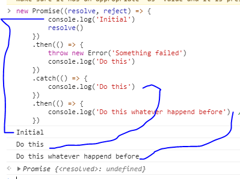
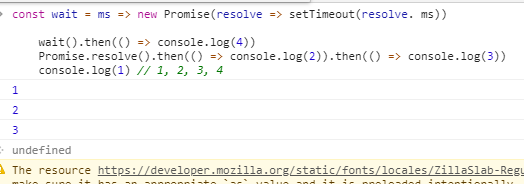

## 使用promise

一个 Promise 就是一个对象，它代表了一个异步操作的最终完成或者失败。大多数人仅仅是使用已创建的Promise实例对象，因此本教程将首先说明怎样使用 Promise，之后说明如何创建Promise。

本质上，Promise 是一个绑定了回调的对象，而不是将回调传进函数内部。

假设，现有一个名为 createAudioFileAsync() 的函数，在给定的配置文件和两个回调函数（一个是声音文件成功创建时的回调，另一个是出现异常时的回调）的情况下，这个函数能异步地生成声音文件。

以下为使用createAudioFileAsync()的示例：
```
	// 成功的回调函数
	function successCallback(result){
		console.log("声音文件创建成功: " + result)
	}

	// 失败的回调函数
	function failureCallback(error){
		console.log("声音文件创建失败: " + error)
	}
	
	createAudioFileAsync(audioSetting, successCallback, failureCallback)
```

最新的方式就是返回一个promise对象，使得你可以将你的 callback 绑定在该 promise 上（如下所示）：

如果函数createAudioFileAsync()被重写为返回Promise 对象，就可以像这样简单的使用：
```
	const promise = createAudioFileAsync(audioSetting)
	promise.then(succcessCallback, failCallback)
```
简写为：
```
	createAudioFileAsync(audioSetting).then(succcessCallback, failureCallback)
```
我们把这个称为异步函数调用，这种形式有若干优点。我们将会逐一讨论。

## 约定

不同于老式的传入回调，在应用 Promise 时，我们将会有以下约定：

* 在 本轮 Javascript event loop（事件循环）运行完成 之前，callbacks（回调）是不会被调用的。
* 综上，通过 .then() 形式添加的回调函数总会被调用，即便是在异步操作完成之后才被添加的函数。
* 通过多次调用 .then()，可以添加多个回调函数，它们会按照插入顺序并且独立运行。

因此，Promise 最直接的好处就是链式调用。

## 链式调用

一个常见的需求就是连续执行两个或者多个异步操作，在上一个操作执行成功之后开始下一个的操作，并带着上一步操作所返回的结果。我们可以通过创造一个 Promise chain 来完成这种需求。

见证奇迹的时刻：then() 函数会返回一个全新的 Promise，和原来的不同：
```
	const promise = doSomething()
	const promise = promise.then(successCallback,failureCallback)
```
或者
```
	const promise2 = doSomething().then(successCallback, failureCallback)
```
第二个对象(promise2)不仅代表doSomething()函数的完成，也代表了你传入的 successCallback 或者failureCallback 的完成，successCallback 或 failureCallback 有可能返回一个Promise对象从而形成另一个异步操作。这样的话，任何一个 promise2 新增的回调函数都会被依次排在由上一个successCallback(成功回调函数) 或 failureCallback(失败回调函数) 执行后所返回的 Promise对象的后面。

基本上，每一个 Promise 代表了链式中另一个异步过程的完成。

在过去，做多重的异步操作，会导致经典的回调地狱：
```
	doSomething(function(result){
		doSomethingElse(result, function(newResult){
			doThirdThimg(newResult, function(finalResult){
				console.log('Got the final result:' + finalResult)
			}, failureCallback)
		}, failureResult)
	}, failureResult)
```

通过新的功能方法，我们把回调绑定到被返回的 Promise 上代替以往的做法，形成一个 Promise 链：
```
	doSomething().then(function(result){
		return doSonethingElse(result)
	}).then(function(newResult){
		return doThirdThing(newResult)
	}).then(function(finalResult){
		console.log('Got the final result:' + finalResult)
	}).catch(faniureCallback)
```

fanil 英 /'faɪn(ə)l/ adj. 最终的；决定性的；不可更改的 n. 决赛；期末考试；当日报纸的末版
failure 英 /'feɪljə/  美 /'feljɚ/ n. 失败；故障；失败者；破产

then里的参数是可选的，catch(failureCallback) 是 then(null, failureCallback) 的缩略形式。如下所示，也可以用 arrow functions（箭头函数）来表示：
```
	doSomething()
	.then(result => doSomethingElse(result))
	.then(newResult => doSomething(newResult))
	.then(finalResult => {
		console.log('Got the final result: ${finalResult}')
	})
	.catch(failureCallback)
```

注意：一定要有返回（即 需要 return ），否则 callback 无法获取上个 Promise 的结果。(使用 () => x 比() => { return x; } 更简洁一点).

### Catch 的后续链式操作

很可能会在一个回调失败之后继续使用链式操作，即 使用一个catch，这对于在链式操作中抛出一个失败之后，再次开启新的操作很有用。请阅读下面的例子：

inital 英 /ɪ'nɪʃəl/  美 /ɪ'nɪʃəl/  adj. 最初的；字首的 vt. 用姓名的首字母签名 n. 词首大写字母
过去式 initialed或-tialled，过去分词 initialed或-tialled，现在分词 initialing或initialling

whatever 英 /wɒt'evə/  美 /wət'ɛvɚ/ det. 任何事物；不管什么；究竟是什么；（非正式）无所谓 pron. 无论什么；诸如此类 adj. 都，任何 adv. 一点儿都不，丝毫；（非正式）不管怎样 conj. 任何事物 int. （非正式）随便（常暗示不感兴趣）

```
	new Promise((resolve, reject) => {
		console.log('Initial')
		resolve()
	})
	.then(() => {
		throw new Error('Something failed')
		console.log('Do this')
	})
	.catch(() => {
		console.log('Do this')
	})
	.then(() => {
		console.log('Do this whatever happend before')  // 以前发生过这种事吗
	})
```

注意：由于“Something failed”错误的抛出导致了失败回调函数的调用，所以“Do this”文本没有被输出。

## 错误传递

在之前的回调地狱示例中，你可能记得有3次failureCallback的调用，而在 Promise 链中只有尾部的一次调用。
```
	doSomething()
	.then(result => doSomethingElse(value))
	.then(newResult => doThirdThing(newResult))
	.then(finalResult => console.log(`Got the final result: ${finalResult}`))
	.catch(failureCallback)
```

通常，一遇到异常抛出，promise链就会停下来，直接调用链式中的catch处理程序来继续当前执行。这看起来和以下的同步代码的执行很相似。

```
	try {
	  let result = syncDoSomething();
	  let newResult = syncDoSomethingElse(result);
	  let finalResult = syncDoThirdThing(newResult);
	  console.log(`Got the final result: ${finalResult}`);
	} catch(error) {
	  failureCallback(error);
	}
```

在ECMAScript 2017标准的async/await语法糖中，这种同步形式代码的对称性得到了极致的体现：


```
	async function foo(){
		try {
			let result -await doSomething()
			let newResult = await doSomethingElse(result)
			let finalResult = await doThirdThing(newResult)
			console.log('Got the final reult: ${finalResult}')
		}.catch(error){
			failureCallback(error)
		}
	}
```

await 英 /ə'weɪt/  美 /ə'wet/  vt. 等候，等待；期待
async abbr. 异步，非同步（asynchronous）
reason 英 /'riːz(ə)n/  美 /ˈrizən/  n. 理由；理性；动机 vi. 推论；劝说 vt. 说服；推论；辩论

这个例子是在 Promise 的基础上构建的，例如，doSomething()与之前的函数是相同的。

通过捕获所有的错误，甚至抛出异常和程序错误，Promise 解决了回调地狱的基本缺陷。这对于构建异步操作的基础功能是很有必要的。

## Promise rejection events

rejection 拒绝 英 /rɪ'dʒekʃ(ə)n/  美 /rɪ'dʒɛkʃən/  n. 抛弃；拒绝；被抛弃的东西；盖帽
handled 处理 美 /'hændld/ adj. 有把手的，有把柄的 v. 使用；负责；触摸；指挥；买；卖（handle 的过去式和过去分词）

当 Promise 被拒绝时，会有下文所述的两个事件之一被派发到全局作用域（通常而言，就是window；如果是在web worker中使用的话，就是 Worker  或者其他 worker-based 接口）。这两个事件如下所示：

### rejectionhandled
当 Promise rejected、并且在 reject 函数处理该 rejection 之后会派发此事件。

> 每当JavaScript Premise承诺被拒绝，但在 Premise承诺拒绝被处理之后，rejectionhandling事件被发送到脚本的全局范围(通常是窗口，也包括Worker)。这可以用于调试和一般应用程序弹性，以及unhandledreject事件，后者在承诺被拒绝时发送，但没有拒绝的hander。
>
```
	window.addEventListener("rejectionhandled", event => {
	  console.log("Promise rejected; reason: " + event.reason);
	}, false);
```


### unhandledrejection
当 Promise rejected，但没有提供 reject 函数来处理该 rejection 时，会派发此事件。

> 继承
> unhandledrejection继承自PromiseRejectionEvent，PromiseRejectionEvent又继承自Event。因此unhandledrejection含有PromiseRejectionEvent和Event的属性和方法
>

>
```
	window.addEventListener('unhandledrejection', event => {
		console.warn('WARNING: Unhandled promise rejection. Shame on you! Reason:' + event.reson)
	})
```
Shame 英 /ʃeɪm/  美 /ʃem/ n. 羞耻，羞愧；憾事，带来耻辱的人 vt. 使丢脸，使羞愧

以上两种情况中，PromiseRejectionEvent 事件都有两个属性，一个是 promise 属性，该属性指向被驳回的 promise，另一个是 reason 属性，该属性用来说明 promise 被驳回的原因。

因此，我们可以通过以上事件为promise失败时提供补偿处理，也有利于调试 promise 相关的问题。在每一个上下文中，该处理都是全局的，因此不管源码如何，所有的错误都会在同一个handler中被捕捉处理。

一个特别有用的例子：当你写 Node.js代码时，有些依赖模块可能会有未被处理的 rejected promises，这些都会在运行时打印到控制台。你可以在自己的代码中捕捉这些信息然后添加unhandledrejection相应的 handler 来做分析和处理，或者只是为了让你的输出更整洁。举例如下：

handled 美 /'hændld/ adj. 有把手的，有把柄的 v. 使用；负责；触摸；指挥；买；卖（handle 的过去式和过去分词）

```
	window.addEventListener('unhandledrejection', event => {
		/* 你可以在这里添加代码来查看event.promise和event.reason */
		event.preventDefault()
	})
```
调用 event 的 preventDefault()方法是为了告诉Javascript当promise rejected时不要执行默认操作，默认操作一般会包含把错误打印到控制台。

理想情况下，在忽略这些事件之前，我们应该检查所有 rejected promise 来确认这不是代码的bug。

## 在旧式回调 API 中创建 Promise

Promise通过它的构造器从头开始创建。 只应用在包裹旧的 API。

理想状态下，所有的异步函数都已经返回 Promise 了。但有一些 API 仍然使用旧式的被传入的成功或者失败的回调。典型的例子就是setTimeout()函数：
```
	setTimeout(() => saySomething('10 seconds passed'), 10000)
```

混用旧式回调和 Promise 是会有问题的。如果 saySomething  函数失败了或者包含了编程错误，那就没有办法捕获它了。

幸运的是我们可以用 Promise 来包裹它。最好的做法是将有问题的函数包装在最低级别，并且永远不要再直接调用它们：
```
	const wait = ms => new Promise(resolve => setTimeout(resolve, ms))
	wait(10000).then(() => saySomething('10 seconds')).catch(failureCallback) 
```
通常，Promise 的构造器会有一个可以让我们手动操作resolve和reject的执行函数。既然 setTimeout 没有真的执行失败，那么我们可以在这种情况下忽略reject。

## 组合

Promise.resolve() 和 Promise.reject() 是手动创建一个已经resolve或者reject的promise快捷方法。它们有时很有用。

Promise.all() 和 Promise.race()是并行运行异步操作的两个组合式工具。

我们可以发起并行操作，然后等多个操作全部结束后进行下一步操作，如下：
```
	Promise.all([func1(), func2(), func3()]).then(([[result1, result2, result3]) => {
		/* use result1, result2 and result3 */
	})
```
race 比赛 英 /reɪs/  美 /res/ n. 属，种；种族，人种；家庭，门第；赛事，赛跑 vt. 使参加比赛；和…竞赛；使急走，使全速行进 vi. 比速度，参加竞赛；全速行进

时序组合可以使用一些优雅的javascript形式：
```
	[func1().func2(), func3()].reduce((p, f) => p.then(f),Promise.resolve())
	.then(result3 => {
		/* use result3 */
	})
```

通常，我们递归调用一个由异步函数组成的数组时相当于一个 Promise 链式：
```
	Promise.resolve().then(func1).then(func2).then(func3);
```

我们也可以写成可复用的函数形式，这在函数式 编程中极为普遍：
```
	onst applyAsync = (acc,val) => acc.then(val);
	const composeAsync = (...funcs) => x => funcs.reduce(applyAsync, Promise.resolve(x));
```

composeAsync函数将会接受任意数量的函数作为其参数，并返回一个新的函数，该函数接受一个通过composition pipeline传入的初始值。这对我们来说非常有益，因为任一函数可以是异步 或同步的，它们能被保证按顺序执行：

```
	const transformData = composeAsync(func1, func2, func3)
	const result3 = transformData(data)
```

在 ECMAScript 2017标准中, 时序组合可以通过使用async/await而变得更简单：
```
	let result
	for(const f of [func1,func2, func3]){
		result = await f(result)
	}
	/* use last result (i.e. result3) */
```

## 时序

为了避免意外，即使是一个已经变成 resolve 状态的 Promise，传递给 then 的函数也总是会被异步调用：
```
	Promise.resolve().then(() => console.log(2))
	console.log(1)
```

传递到then中的函数被置入了一个微任务队列，而不是立即执行，这意味着它是在JavaScript事件队列的所有运行时结束了，事件队列被清空之后才开始执行：
```
	const wait = ms => new Promise(resolve => setTimeout(resolve. ms))

	wait().then(() => console.log(4))
	Promise.resolve().then(() => console.log(2)).then(() => console.log(3))
	console.log(1) // 1, 2, 3, 4
```


## 嵌套

简便的 Promise 链式编程最好保持扁平化，不要嵌套 Promise，嵌套经常会是粗心导致的。可查阅下一节的常见错误中的例子。

嵌套 Promise 是一种可以限制 catch 语句的作用域的控制结构写法。明确来说，嵌套的 catch 仅捕捉在其之前同时还必须是其作用域的 failures，而捕捉不到在其链式以外或者其嵌套域以外的 error。如果使用正确，那么可以实现高精度的错误修复。

failures 美 /'feljɚ/ n. 失败（failure的复数）
critical 英 /'krɪtɪk(ə)l/  美 /'krɪtɪkl/  adj. 鉴定的；[核] 临界的；批评的，爱挑剔的；危险的；决定性的；评论的
optical 英 /'ɒptɪk(ə)l/  美 /'ɑptɪkl/  adj. 光学的；眼睛的，视觉的
extra 英 /'ekstrə/  美 /'ɛkstrə/ adj. 额外的；另外收费的；特大的 n. 额外的事物；另外收费的事物；临时演员；（报纸的）号外；上等产品；（非击球所得的）附加分 adv. 额外；特别地，格外地 pron. 额外的东西（尤其指钱财）

```
	doSomethingCritical()
	.then(result => doSomethingOptical()
		.then(opticalResult => doSomrthingExtraNice(opaticalResult))
		.catch(e => {console.log(e.message)})) // 即使有异常也会忽略，继续运行;(最后会输出)
	.then(() => moreCriticalStuff())
	.catch(e => consle.log('Critical failure:' + e.message)) // 没有输出
```

注意,有些代码步骤是嵌套的，而不是一个简单的纯链式，这些语句前与后都被（）包裹着。

这个内部的 catch 语句仅能捕获到 doSomethingOptional() 和 doSomethingExtraNice() 的失败，而且还是在moreCriticalStuff() 并发运行以后。重要提醒，如果 doSomethingCritical() 失败，这个错误才仅会被最后的（外部）catch 语句捕获到。

## 常见错误

在编写 Promise 链时，需要注意以下示例中展示的几个错误：
```
	// 错误示例，包含 3 个问题
	doSomething().then(function(result){
		doSomethingElse(result) // 没有返回 Promise 以及没有必要的嵌套 Promise
		.then(newResult => doThirdThing(newResult))
	}).then(() => doFourthThing())
	// 最后是没有使用 catch 终止 Promise 调用链，可能导致没有捕获的异常

```

第一个错误是没有正确地将事物相连接。当我们创建新 Promise 但忘记返回它时，会发生这种情况。因此，链条被打破，或者更确切地说，我们有两个独立的链条竞争（同时在执行两个异步而非一个一个的执行）。这意味着 doFourthThing() 不会等待 doSomethingElse() 或doThirdThing() 完成，并且将与它们并行运行，可能是无意的。单独的链也有单独的错误处理，导致未捕获的错误。

第二个错误是不必要地嵌套，实现第一个错误。嵌套还限制了内部错误处理程序的范围，如果是非预期的，可能会导致未捕获的错误。其中一个变体是 promise 构造函数反模式，它结合了 Promise 构造函数的多余使用和嵌套。

第三个错误是忘记用 catch 终止链。这导致在大多数浏览器中不能终止的 Promise 链里的 rejection。

一个好的经验法则是总是返回或终止 Promise 链，并且一旦你得到一个新的 Promise，返回它。下面是修改后的平面化的代码：
```
	doSomething()
	.then(function(result){
		return doSomething(result)
	})
	.then(nreResult => doThirdThing(newResult))
	.then(() => doFourthThing())
	.catch(error => console.log(error))
```
注意：() => x 是 () => { return x; }的快捷方便的写法。

上述代码的写法就是具有适当错误处理的简单明确的链式写法。

使用 async/await 可以解决以上大多数错误，使用 async/await 时最常见的错误就是忘记了await 关键字。