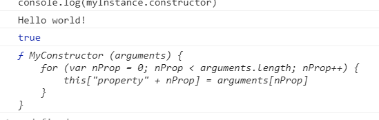

### Function.prototype.apply()

```
const numbers = [5, 6, 2, 3, 7]

const max = Math.max.apply(null, numbers)  // apply继承max方法， 参数是数组

console.log(max)  // 7
```

---
#### 语法
```
func.apply(thisArg, [argsArray])
```

thisArg : 可选的。在 func 函数运行时使用的 this 值。请注意，this可能不是该方法看到的实际值：如果这个函数处于非严格模式下，则指定为 null 或 undefined 时会自动替换为指向全局对象，原始值会被包装。

argsArray: 可选的。一个数组或者类数组对象，其中的数组元素将作为单独的参数传给 func 函数。如果该参数的值为 null 或  undefined，则表示不需要传入任何参数。从ECMAScript 5 开始可以使用类数组对象。 浏览器兼容性 请参阅本文底部内容。

---
#### 返回值

调用有指定this值和参数的函数的结果。


---
#### 描述

在调用一个存在的函数时，你可以为其指定一个 this 对象。 this 指当前对象，也就是正在调用这个函数的对象。 使用 apply， 你可以只写一次这个方法然后在另一个对象中继承它，而不用在新对象中重复写该方法。

apply 与 call() 非常相似，不同之处在于提供参数的方式。apply 使用参数数组而不是一组参数列表。apply 可以使用`数组字面量`（array literal），如 fun.apply(this, ['eat', 'bananas'])，或数组对象， 如  fun.apply(this, new Array('eat', 'bananas'))。

你也可以使用 arguments对象作为 `argsArray 参数`。 arguments 是一个函数的局部变量。 它可以被用作被调用对象的所有未指定的参数。 这样，你在使用apply函数的时候就不需要知道被调用对象的所有参数。 你可以使用arguments来把所有的参数传递给被调用对象。 被调用对象接下来就负责处理这些参数。

从 ECMAScript 第5版开始，可以使用任何种类的类数组对象，就是说只要有一个 length 属性和(0..length-1)范围的整数属性。例如现在可以使用 NodeList 或一个自己定义的类似 {'length': 2, '0': 'eat', '1': 'bananas'} 形式的对象。
```
const numbers = {'length': 2, '0': 10, '1': 2}

const max = Math.max.apply(null, numbers)  // apply继承max方法， 参数是数组

console.log(max)  // 10
```

---
#### 示例

##### 用 apply 将数组添加到另一个数组

push将元素追加到数组中,但是，如果我们传递一个数组来推送，它实际上会将该数组作为单个元素添加，而不是单独添加元素，因此我们最终得到一个数组内的数组。在这种情况下，concat确实具有我们想要的行为，但它实际上并不附加到现有数组，而是创建并返回一个新数组,但是我们想要附加到我们现有的阵列......那么现在呢？

apply继承push对象方法，并且处理数组参数里的每个元素
```
var array = ['a', 'b']
var elements = [0, 1, 2]
array.push.apply(array, elements)
console.info(array) // ["a", "b", 0, 1, 2]
```

##### 使用apply和内置函数

聪明的apply用法允许你在某些本来需要写成遍历数组变量的任务中使用内建的函数。在接下里的例子中我们会使用Math.max/Math.min来找出一个数组中的最大/最小值。

```
/* 找出数组中最大/小的数字 */
var numbers = [5, 6, 2, 3, 7]

/* 方法一： */
/* 应用(apply) Math.min/Math.max 内置函数完成 */
var max = Math.max.apply(null, numbers)  /* 基本等同于 Math.max(numbers[0], ...) 或 Math.max(5, 6, ..) */
var min = Math.min.apply(null, numbers)

/* 方法二： */
max = -Infinity, min = +Infinity
for (var i = 0; i < numbers.length; i++) {
  if (numbers[i] > max)
    max = numbers[i]
  if (numbers[i] < min) 
    min = numbers[i]
}
```

但是当心：如果用上面的方式调用apply，会有超出JavaScript引擎的参数长度限制的风险。当你对一个方法传入非常多的参数（比如一万个）时，就非常有可能会导致越界问题, 这个临界值是根据不同的 JavaScript 引擎而定的（JavaScript 核心中已经做了硬编码  参数个数限制在65536），因为这个限制（实际上也是任何用到超大栈空间的行为的自然表现）是未指定的. 有些引擎会抛出异常。更糟糕的是其他引擎会直接限制传入到方法的参数个数，导致参数丢失。


如果你的参数数组可能非常大，那么推荐使用下面这种策略来处理：将参数数组切块后循环传入目标方法：
```
function minOfArray(arr) {
  var min = Infinity
  var QUANTUM = 32768  // JavaScript 核心中参数个数限制在65536

  for (var i = 0, len = arr.length; i < len; i += QUANTUM) {
    var submin = Math.min.apply(null, arr.slice(i, Math.min(i + QUANTUM, len)))
    min = Math.min(submin, min)
  }

  return min
}

var min = minOfArray([5, 6, 2, 3, 7])  // 2
```

quantum 量子 英 /ˈkwɒntəm/  美 /ˈkwɑːntəm/  n. 量子论；额；美国昆腾公司（世界领先的硬盘生产商）


##### 使用apply来链接构造器

你可以使用apply来链接一个对象构造器，类似于Java。在接下来的例子中我们会创建一个全局Function 对象的construct方法 ，来使你能够在构造器中使用一个类数组对象而非参数列表。

construct 构造 英 /kənˈstrʌkt/  美 /kənˈstrʌkt/ v. 建造，修建（某物，尤指建筑物，公路，机器）；组成，创建；（按照数学规则）编制，绘制；形成（观念，理论） n. 构想，概念；编造，杜撰；（短语的）结构成分，结构体；建造物，构筑物
```
Function.prototype.construct = function (aArgs) {
  var oNew = Object.create(this.prototype)  // Object.create(proto[, propertiesObject]) 一个新对象，带着指定的原型对象和属性。
  this.apply(oNew, aArgs)
  return oNew
}
```

* 注意: 上面使用的Object.create()方法相对来说比较新。另一种可选的方法，请考虑如下替代方法：

Using Object.__proto__:

```
Function.prototype.construct = function (aArgs) {
  var oNew = {}
  oNew.__proto__ = this.prototype
  this.apply(oNew, aArgs)
  return oNew
}
```

* 使用闭包：
```
Function.prototype.construct = function(aArgs) {
  var fConstructor = this, fNewConstructor = function() {
    fConstructor.apply(this, aArgs);
  };
  fNewConstructor.prototype = fConstructor.prototype
  return new fNewConstructor()
}
```

* 使用 Function 构造器：
```
Function.prototype.construct = function (aArgs) {
  var fNewConstr = new Function("")
  fNewConstr.prototype = this.prototype
  var oNew = new fNewConstr()
  this.apply(oNew, aArgs)
  return oNew
}
```

* 使用示例：
```
function MyConstructor (arguments) {
    for (var nProp = 0; nProp < arguments.length; nProp++) {
        this["property" + nProp] = arguments[nProp]
    }
}

var myArray = [4, "Hello world!", false]
var myInstance = new MyConstructor(myArray)

console.log(myInstance.property1)
console.log(myInstance instanceof MyConstructor)
console.log(myInstance.constructor)
```


注意： 这个非native的Function.construct方法无法和一些native构造器（例如Date）一起使用。 在这种情况下你必须使用Function.bind方法（例如，想象有如下一个数组要用在Date构造器中： [2012, 11, 4]；这时你需要这样写： new (Function.prototype.bind.apply(Date, [null].concat([2012, 11, 4])))() – -无论如何这不是最好的实现方式并且也许不该用在任何生产环境中).

