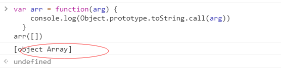

### 内置对象_数组_方法Array.isArray()

Array.isArray() 用于确定传递的值是否是一个 Array。

---
#### 语法
```
Array.isArray(obj)
```
obj: 需要检测的值。


---
#### 返回值
```
如果值是 Array，则为true; 否则为false。
```

---
#### 示例
```
// 下面的函数调用都返回 true
Array.isArray([])
Array.isArray([1])
Array.isArray(new Array())
Array.isArray(new Array('a', 'b', 'c', 'd'))
// 鲜为人知的事实：其实 Array.prototype 也是一个数组。
Array.isArray(Array.prototype)

// 下面的函数调用都返回 false
Array.isArray()
Array.isArray({})
Array.isArray(null)
Array.isArray(undefined)
Array.isArray(17)
Array.isArray('Array')
Array.isArray(true)
Array.isArray(false)
Array.isArray(new Uint8Array(32))
Array.isArray({ __proto__: Array.prototype })
```

---
#### instanceof 和 isArray

当检测Array实例时, Array.isArray 优于 instanceof,因为Array.isArray能检测iframes.
```
var iframe = document.createElement('iframe');
document.body.appendChild(iframe);
xArray = window.frames[window.frames.length-1].Array;
var arr = new xArray(1,2,3); // [1,2,3]

Array.isArray(arr);  // true
arr instanceof Array; // false
```

---
#### Polyfill

假如不存在 Array.isArray()，则在其他代码之前运行下面的代码将创建该方法。
```
if (!Array.isArray) {
  Array.isArray = function(arg) {
    return Object.prototype.toString.call(arg) === '[object Array]'
  }
}
```
