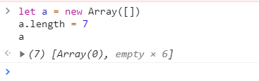
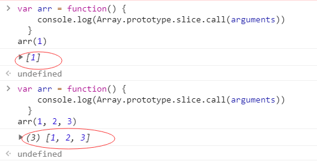

### 内置对象_数组_方法Array.of()

Array.of() 方法创建一个具有可变数量参数的`新数组实例`，而不考虑参数的数量或类型。

array.of() 和 Array 构造函数之间的区别在于处理整数参数：Array.of(7) 创建一个具有单个元素 7 的数组。
而 Array(7) 创建一个长度为7的空数组（注意：这是指一个有`7个空位(empty)的数组`，而不是由7个undefined组成的数组）。


```
Array.of(7)       // [7] 
Array.of(1, 2, 3) // [1, 2, 3]
Array(7)          // [ , , , , , , ]
Array(1, 2, 3)    // [1, 2, 3]
```

---
#### 语法
```
Array.of(element0[, element1[, ...[, elementN]]])
```

* elementN: 任意个参数，将按顺序成为返回数组中的元素。


---
#### 返回值
新的 Array 实例。


---
#### Polyfill

如果原生不支持的话，在其他代码之前执行以下代码会创建 Array.of() 。
```
if (!Array.of) {
  Array.of = function() {
    return Array.prototype.slice.call(arguments)
  }
}
```
