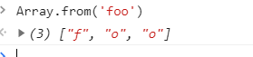
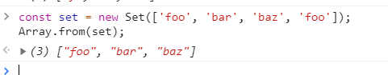

### 内置对象_数组_方法Array.from()

Array.from() 方法从一个类似数组或可迭代对象创建一个新的，浅拷贝的数组实例。

---
#### 语法
```
Array.from(arrayLike[, mapFn[, thisArg]])
```

* arrayLike: 想要转换成数组的伪数组对象或可迭代对象。
* mapFn: 如果指定了该参数，新数组中的每个元素会执行该回调函数。
* thisArg: 可选参数，执行回调函数 mapFn 时 this 对象。

---
#### 返回值

一个新的数组实例。

---
#### 描述

Array.from() 可以通过以下方式来创建数组对象：
* 伪数组对象（拥有一个 length 属性和若干索引属性的任意对象）
* 可迭代对象（可以获取对象中的元素,如 Map和 Set 等）

Array.from() 方法有一个可选参数 mapFn，让你可以在最后生成的数组上再执行一次 map 方法后再返回。也就是说 Array.from(obj, mapFn, thisArg) 就相当于 Array.from(obj).map(mapFn, thisArg), 除非创建的不是可用的中间数组。 这对一些数组的子类,如 typed arrays 来说很重要, 因为中间数组的值在调用 map() 时需要是适当的类型。

from() 的 length 属性为 1 ，即 Array.from.length === 1。

---
#### 示例

##### 从 String 生成数组
```
Array.from('foo')
```


##### 从 Set 生成数组(new Set数组去重)
```
const set = new Set(['foo', 'bar', 'baz', 'foo'])
Array.from(set)
// [ "foo", "bar", "baz" ]
```


##### 从 Map 生成数组
```
const map = new Map([[1, 2], [2, 4], [4, 8]])
Array.from(map)
// [[1, 2], [2, 4], [4, 8]]

const mapper = new Map([['1', 'a'], ['2', 'b']])
Array.from(mapper.values())
// ['a', 'b']

Array.from(mapper.keys())
// ['1', '2']
```

##### 从类数组对象（arguments）生成数组
```
function f() {
  return Array.from(arguments)
}
f(1, 2, 3)  // [ 1, 2, 3 ]
```

##### 在 Array.from 中使用箭头函数
```
Array.from([1, 2, 3], x => x) // [1, 2, 3]

Array.from({length: 5}, (v, i) => i) // [0, 1, 2, 3, 4]
```


##### 序列发生器(范围)
```
const range = (start, stop, step) => Array.from({ length: ((stop - start) / step) + 1}, (_, i) => start + (i * step))
range(0, 4, 1)   // [0, 1, 2, 3, 4] 
range(1, 10, 2)  // [1, 3, 5, 7, 9]

range('A'.charCodeAt(0), 'Z'.charCodeAt(0), 1).map(x => String.fromCharCode(x))
// ["A", "B", "C", "D", "E", "F", "G", "H", "I", "J", "K", "L", "M", "N", "O", "P", "Q", "R", "S", "T", "U", "V", "W", "X", "Y", "Z"]
```

##### 数组去重合并
```
function combine(){ 
    let arr = [].concat.apply([], arguments)  //没有去重复的新数组 //apply()继承cancat方法
    return Array.from(new Set(arr))
}

var m = [1, 2, 2], n = [2,3,3]; 
console.log(combine(m,n))                    // [1, 2, 3]
console.log(combine(m))                    // [1, 2]
```
combine 英 /kəmˈbaɪn/  美 /kəmˈbaɪn/ vt. 使化合；使联合，使结合 vi. 联合，结合；化合 n. 联合收割机；联合企业

---
#### Polyfill

poly 英 /ˈpɒli/  美 /ˈpɑːli/ n. 聚乙烯（全称polyethylene）

ECMA-262 第六版标准中添加了 Array.from 。有些实现中可能尚未包括在其中。你可以通过在脚本前添加如下内容作为替代方法，以使用未原生支持的 Array.from 方法。该算法按照 ECMA-262 第六版中的规范实现，并假定 Object 和 TypeError 有其本身的值， callback.call 对应 Function.prototype.call 。此外，鉴于无法使用 Polyfill 实现真正的的迭代器，该实现不支持规范中定义的泛型可迭代元素。

```
if (!Array.from) {
  Array.from = (function () {
    var toStr = Object.prototype.toString;
    var isCallable = function (fn) {
      return typeof fn === 'function' || toStr.call(fn) === '[object Function]';
    };
    var toInteger = function (value) {
      var number = Number(value);
      if (isNaN(number)) { return 0; }
      if (number === 0 || !isFinite(number)) { return number; }
      return (number > 0 ? 1 : -1) * Math.floor(Math.abs(number));
    };
    var maxSafeInteger = Math.pow(2, 53) - 1;
    var toLength = function (value) {
      var len = toInteger(value);
      return Math.min(Math.max(len, 0), maxSafeInteger);
    };

    // The length property of the from method is 1.
    return function from(arrayLike/*, mapFn, thisArg */) {
      // 1. Let C be the this value.
      var C = this;

      // 2. Let items be ToObject(arrayLike).
      var items = Object(arrayLike);

      // 3. ReturnIfAbrupt(items).
      if (arrayLike == null) {
        throw new TypeError("Array.from requires an array-like object - not null or undefined");
      }

      // 4. If mapfn is undefined, then let mapping be false.
      var mapFn = arguments.length > 1 ? arguments[1] : void undefined;
      var T;
      if (typeof mapFn !== 'undefined') {
        // 5. else
        // 5. a If IsCallable(mapfn) is false, throw a TypeError exception.
        if (!isCallable(mapFn)) {
          throw new TypeError('Array.from: when provided, the second argument must be a function');
        }

        // 5. b. If thisArg was supplied, let T be thisArg; else let T be undefined.
        if (arguments.length > 2) {
          T = arguments[2];
        }
      }

      // 10. Let lenValue be Get(items, "length").
      // 11. Let len be ToLength(lenValue).
      var len = toLength(items.length);

      // 13. If IsConstructor(C) is true, then
      // 13. a. Let A be the result of calling the [[Construct]] internal method 
      // of C with an argument list containing the single item len.
      // 14. a. Else, Let A be ArrayCreate(len).
      var A = isCallable(C) ? Object(new C(len)) : new Array(len);

      // 16. Let k be 0.
      var k = 0;
      // 17. Repeat, while k < len… (also steps a - h)
      var kValue;
      while (k < len) {
        kValue = items[k];
        if (mapFn) {
          A[k] = typeof T === 'undefined' ? mapFn(kValue, k) : mapFn.call(T, kValue, k);
        } else {
          A[k] = kValue;
        }
        k += 1;
      }
      // 18. Let putStatus be Put(A, "length", len, true).
      A.length = len;
      // 20. Return A.
      return A;
    };
  }());
}
```