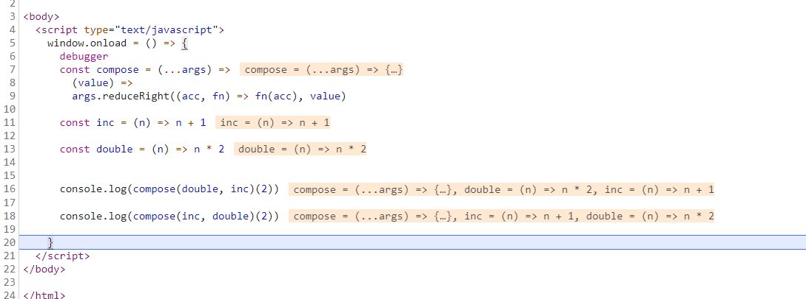

## Array.prototype.reduceRight()

reduceRight() 方法接受一个函数作为**累加器**（accumulator）和数组的每个值（**从右到左**）将其减少为**单个值**。

callback：一个回调函数，用来操作数组中的每个元素，可接受四个参数：
* accumulator -- 上一次调用回调的返回值，或提供的 initialValue。
* currentValue -- 当前被处理的元素。
* index可选 -- 数组中当前被处理的元素的索引。
* array可选 -- 调用 reduceRight() 的数组

initialValue可选 -- 值用作回调的第一次调用的累加器。如果未提供初始值，则将使用并跳过数组中的最后一个元素。在没有初始值的空数组上调用reduce或reduceRight就会创建一个TypeError。

返回值 -- 执行之后的返回值。


## 描述

如果调用 reduceRight 时提供了 initialValue 参数，则 **accumulator等于 initialValue，currentValue 等于数组中的最后一个值**。

* 如果没有提供 initialValue 参数，则 accumulator 等于数组**最后一个值**， currentValue 等于数组中**倒数第二个值**。

```
[0, 1, 2, 3, 4].reduceRight(function(accumulator, currentValue, index, array) {
	console.log(accumulator, currentValue, index, array, accumulator + currentValue)
    return accumulator + currentValue;
});

输出：
/* 
4 3 3 [0, 1, 2, 3, 4] 7
7 2 2 [0, 1, 2, 3, 4] 9
9 1 1 [0, 1, 2, 3, 4] 10
10 0 0 [0, 1, 2, 3, 4] 10
10
*/
```
回调将会被调用四次，每次调用的参数及返回值如下：

**如果没有提供 initialValue 参数，则 accumulator 等于数组最后一个值， currentValue 等于数组中倒数第二个值。**

| callback | accumulator |  currentValue |  currentIndex |  array |  return value | 
| -::- | -::- |  -::- |  -::- |  -::- |  -::- | 
| first call | 4 | 3 | 3 | [0, 1, 2, 3, 4] | 7 |
| second call | 7 | 2 | 2 | [0, 1, 2, 3, 4] | 9 |
| third call | 9 | 1 | 1 | [0, 1, 2, 3, 4] | 10 |
| fourth call | 10 | 0 | 0 | [0, 1, 2, 3, 4] | 10 |


* 如果提供了一个 initialValue 参数，则结果如下：

```
[0, 1, 2, 3, 4].reduceRight(function(accumulator, currentValue, index, array) {
	console.log(accumulator, currentValue, index, array, accumulator + currentValue)
    return accumulator + currentValue;
}, 10);

输出：
/* 
10 4 4 [0, 1, 2, 3, 4] 14
14 3 3 [0, 1, 2, 3, 4] 17
17 2 2 [0, 1, 2, 3, 4] 19
19 1 1 [0, 1, 2, 3, 4] 20
20 0 0 [0, 1, 2, 3, 4] 20
10
*/
```

| callback | accumulator |  currentValue |  currentIndex |  array |  return value | 
| -::- | -::- |  -::- |  -::- |  -::- |  -::- | 
| first call | 4 | 3 | 3 | [0, 1, 2, 3, 4] | 7 |
| second call | 7 | 2 | 2 | [0, 1, 2, 3, 4] | 9 |
| third call | 9 | 1 | 1 | [0, 1, 2, 3, 4] | 10 |
| fourth call | 10 | 0 | 0 | [0, 1, 2, 3, 4] | 10 |


## 求一个数组中所有值的和

```
var sum = [0, 1, 2, 3].reduceRight(function(a, b) {
  return a + b;
});
sum // 6
```


## 扁平化（flatten）一个元素为数组的数组

```
var flattened = [[0, 1], [2, 3], [4, 5]].reduceRight(function(a, b) {
    return a.concat(b);
}, []);
flatened // [4, 5, 2, 3, 0, 1]
```

## 运行一个带有回调每个函数将其结果传给下一个的异步函数列表

```
// 工具函数1
const waterfall = (...functions) => 
	// 1.执行const computation = waterfall(add5, mult3, sub2, split, add, div4)时	
	// functions 输出： 
	/*  (callback, x) => {…}
		(callback, x) => {…}
		(callback, x) => {…}
		(callback, x) => {…}
		(callback, x, y) => {…}
		(callback, x) => {…}
	*/

	// 2.第一次执行computation(console.log, 5)时
	// (callback, ...args)对应下面的add5等函数里的callback, x|y，也就是console.log, 5
	(callback, ...args) =>
	functions.reduceRight(
	// composition = callback, fn = 元素最后一个值div4函数
	(composition, fn) => (...results) => fn(composition, ...results),
	callback
	)(...args)
	// (..args) 等于 console.log函数

// 工具函数2
const randInt = max => Math.floor(Math.random() * max)

// 工具函数2使用
const add5 = (callback, x) => {
  setTimeout(callback, randInt(1000), x + 5);
};
const mult3 = (callback, x) => {
  setTimeout(callback, randInt(1000), x * 3);
};
const sub2 = (callback, x) => {
  setTimeout(callback, randInt(1000), x - 2);
};
const split = (callback, x) => {
  setTimeout(callback, randInt(1000), x, x);
};
const add = (callback, x, y) => {
  setTimeout(callback, randInt(1000), x + y);
};
const div4 = (callback, x) => {
  setTimeout(callback, randInt(1000), x / 4);
};

// 工具函数1使用
const computation = waterfall(add5, mult3, sub2, split, add, div4);
computation(console.log, 5) // -> 14

```

## reduce 与 reduceRight 之间的区别

```
var a = ['1', '2', '3', '4', '5']; 
var left  = a.reduce(function(prev, cur)      { return prev + cur; }); 
var right = a.reduceRight(function(prev, cur) { return prev + cur; }); 
console.log(left);  // "12345"
console.log(right); // "54321"
```

## 定义可组合函数

组合函数的概念简单，它结合了n个函数。它是一个从右向左流动的函数，用上一个函数的输出调用每个函数。

```
const compose = (...args) => 
	// value值等于立即执行函数后面参数
	(value) => 
		// acc = value值
		// fn = 最后一个函数 inc 或者 double
		args.reduceRight((acc, fn) => fn(acc), value)

const inc = (n) => n + 1

const double = (n) => n * 2


console.log(compose(double, inc)(2)) // 3 * 2

console.log(compose(inc, double)(2)) // 4 + 1

```


## 兼容性旧环境（Polyfill）

```
/**
 * Function Composition is way in which result of one function can
 * be passed to another and so on.
 *
 * h(x) = f(g(x))
 *
 * Function execution happens right to left
 *
 * https://en.wikipedia.org/wiki/Function_composition
 */

const compose = (...args) => (value) => args.reduceRight((acc, fn) => fn(acc), value)

// Increament passed number
const inc = (n) => n + 1

// Doubles the passed value
const double = (n) => n * 2

// using composition function
console.log(compose(double, inc)(2)); // 6

// using composition function
console.log(compose(inc, double)(2)); // 5
```

