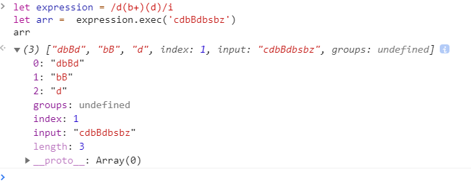
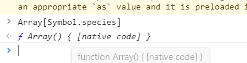
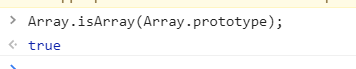

### 内置对象_数组

---
#### 语法
```
[element0, element1, ..., elementN]
new Array(element, element1[, ..[, elementN]])
new Array(arrayLength)  // 只是知道数组长度， 该数组此时并没有包含任何实际的元素
```

```
let arr = ['apple', 'banna']
let arr = new Array(10)
```

---
#### 参数
elementN : 创建的数组字面量

arrayLength: 一个范围在 0 到 232-1 之间的整数，此时将返回一个 length 的值等于 arrayLength 的数组对象, 该数组此时并没有包含任何实际的元素

---
#### 描述
数组是一种类列表对象，它的原型中提供了遍历和修改元素的相关操作。JavaScript 数组的长度和元素类型都是非固定的。因为数组的长度可随时改变，并且其数据在内存中也可以不连续，所以 JavaScript 数组不一定是密集型的，这取决于它的使用方式。一般来说，数组的这些特性会给使用带来方便，但如果这些特性不适用于你的特定使用场景的话，可以考虑使用类型数组 TypedArray。

只能用整数作为数组元素的索引，而不能用字符串。后者称为关联数组。使用非整数并通过方括号或点号来访问或设置数组元素时，所操作的并不是数组列表中的元素，而是数组对象的属性集合上的变量。数组对象的属性和数组元素列表是分开存储的，并且数组的遍历和修改操作也不能作用于这些命名属性。


##### 访问数组元素

JavaScript 数组的索引是从0开始的，第一个元素的索引为0，最后一个元素的索引等于该数组的长度减1。如果指定的索引是一个无效值，JavaScript 数组并不会报错，而是会返回 undefined。
```
let arr = ['apple', 'banna']
let last = arr[arr.length - 1]
```
并不是 JavaScript 数组有什么特殊之处，而是因为在 JavaScript 中，以数字开头的属性不能用点号引用，必须用方括号。

years[2] 中的 2 会被 JavaScript 解释器通过调用 toString 隐式转换成字符串。正因为这样，'2' 和 '02' 在 years 中所引用的可能是不同位置上的元素。

##### length 和数字下标之间的关系

JavaScript 数组的 length 属性和其数字下标之间有着紧密的联系。数组内置的几个方法（例如 join、slice、indexOf 等）都会考虑 length 的值。另外还有一些方法（例如 push、splice 等）还会改变 length 的值。


##### 正则匹配结果所返回的数组
使用正则表达式匹配字符串可以得到一个数组。这个数组中包含本次匹配的相关信息和匹配结果。RegExp.exec、String.match、String.replace 都会返回这样的数组。

```
// 匹配1个 d 后面紧跟着至少1个 b，再后面又跟着1个 d 的子串，
// 并且需要记住子串中匹配到的 b 和最后的 d （通过正则表达式中的分组），
// 同时在匹配时忽略大小写

let expression = /d(b+)(d)/i
let arr =  expression.exec('cdbBdbsbz')
```


该正则匹配返回的数组包含以下属性和元素：

| 属性/元素 | 说明 | 示例 |
| -::- | -::- | -::- |
| input | 只读属性，原始字符串 | cdbBdbsbz |
| index | 只读属性，匹配到的子串在原始字符串中的索引 | 1 |
| [0] | 只读元素，本次匹配到的子串 | dbBd |
| [1], ...[n] | 只读元素，正则表达式中所指定的分组所匹配到的子串，其数量由正则中的分组数量决定，无最大上限 | [1]: bB <br />[2]: d |

---
#### 属性

##### Array.length
Array 构造函数的 length 属性，其值为1（注意该属性为静态属性，不是数组实例的 length 属性）。

##### get Array[@@species]

species 访问器属性返回 Array 对象的默认构造函数。子类的构造函数可能会覆盖并改变构造函数的赋值。

species 英 /ˈspiːʃiːz/  美 /ˈspiːʃiːz/ n. [生物] 物种；种类  adj. 物种上的 复数 species

```
Array[Symbol.species] // function Array()
```


在继承类的对象中（例如你自定义的数组 MyArray），MyArray 的 species 属性返回的是 MyArray 这个构造函数. 然而你可能想要覆盖它，以便在你继承的对象 MyArray 中返回父类的构造函数 Array :
```
class MyArray extends Array {
  // 重写 MyArray 的 species 属性到父类 Array 的构造函数
  static get [Symbol.species]() { return Array }
}
```

ie不支持

extends 英 /ɪk'stendz; ek-/  美 /ɪk'stɛndz/ v. 延伸；扩充；继承（extend的第三人称单数形式）
symbol 英 /ˈsɪmbl/  美 /ˈsɪmbl/  n. 象征；符号；标志


##### Array.prototype

Array.prototype  属性表示 Array 构造函数的原型，并允许您向所有Array对象添加新的属性和方法。

鲜为人知的事实：Array.prototype 本身也是一个 Array。


Array.prototype.constructor: 所有的数组实例都继承了这个属性，它的值就是 Array，表明了所有的数组都是由 Array 构造出来的。

Array.prototype.length: 上面说了，因为 Array.prototype 也是个数组，所以它也有 length 属性，这个值为 0，因为它是个空数组。


---
#### 方法

分文件书写

