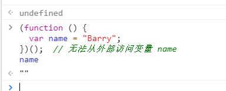

## IIFE（立即调用函数表达式）

IIFE Immediately-Invoked Function Expression

immediately英 /ɪ'miːdɪətlɪ/  美 /ɪ'midɪətli/  adv. 立即，立刻；直接地 conj. 一…就
invoke英 /ɪn'vəʊk/  美 /ɪn'vok/ vt. 调用；祈求；引起；恳求 过去式 invoked过去分词 invoked现在分词 invoking
expression英 /ɪkˈspreʃn/ 美 /ɪk'sprɛʃən/  n. 表现，表示，表达；表情，脸色，态度，腔调，声调；式，符号；词句，语句，措辞，说法


IIFE（ 立即调用函数表达式）是一个在定义时就会立即执行的  JavaScript 函数。

```
(function () {
statements
})();
```

这是一个被称为**自执行匿名函数**的设计模式，主要包含两部分。

第一部分是包围在**圆括号运算符 ()**里的一个匿名函数，这个匿名函数拥有独立的词法作用域。这不仅避免了外界访问此 IIFE 中的变量，而且又不会污染全局作用域。

第二部分再一次使用**()**创建了一个立即**执行函数表达式**，JavaScript 引擎到此将直接执行函数。


## 当函数变成立即执行的函数表达式时，表达式中的变量不能从外部访问。

```
(function () { 
  var name = "Barry";
})();  // 无法从外部访问变量 name
name
```



## 将 IIFE 分配给一个变量，不是存储 IIFE 本身，而是存储 IIFE 执行后返回的结果。

```
var result = (function () { 
  var name = "Barry"; 
  return name; 
})(); // IIFE 执行后返回的结果：
result; // "Barry"
```