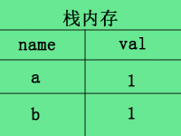
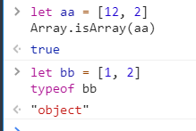

## 深拷贝与浅拷贝

* 假设B对象赋值了A对象，当修改A时，如果B也跟着变了，说明这是浅拷贝，如果B没变，那就是深拷贝。

* 浅拷贝例子

```
let a = [0, 1, 2, 3, 4], b = a
a[0] = 1
console.log(a, b)
```


## 基本数据类型和复杂引用数据

* 基本数据类型：Number String Boolean Null undefined Symbol (ES10)BigInt(任意精度整数)
>* 基本类型--变量名和值存储在*栈内存中*，例如let a=1
>* 
>
>* 当你b=a复制时，栈内存会新开辟一个内存，例如这样：
>* 
>
>* 所以当你此时修改a=2，对b并不会造成影响
>* 当然，let a=1,b=a;虽然b不受a影响，但这也算不上深拷贝，因为深拷贝本身只针对较为复杂的object类型数据。


* 引用数据类型：无序对象{a:1}、数组、函数
>* 引用数据类型--变量名和存在*栈内存中*，值存在于堆内存中，但是栈内存会提供一个引用的地址指向堆内存中的值
>* 
>
>* 当b=a进行浅拷贝时，其实复制的是a的*引用地址*，而并*非堆里面的值*。
>* 
>
>* 而当我们a[0]=1时进行数组修改时，由于a与b指向的是同一个地址，所以b也受了影响，这就是浅拷贝。
>* 
>
>* 要是在*堆内存中*也开辟一个新的内存专门为b存放值，就像基本类型那样，就达到深拷贝的效果了。
>* 

## 深拷贝嵌套对象值

* 1.递归去复制所有层级属性
```
function deepClone(obj){
	let objClone = Array.isArray(obj) ? [] : {}
	// 判断是否是对象
	if (obj && typeof obj === 'object'){
		// 循环key值
		for(key in obj){
			// 是否有key属性 
			if(obj.hasOwnProperty(key)){
				// 对象值是 对象 或者 数组 或者 字面量值
				if(obj[key] && typeof obj[key]){
					// 对象递归复制
					objClone[key] = deepClone(obj[key])
				} else if(obj[key] && Array.isArray(obj[key])) {
					// 数组 // 字面量
					// typeof 数组 => 结果 'object'
					// 所以使用 Array.isArray()
					objClone[key] = obj[key]
				}
			}
		}
	}
   return objClone
}
let a = [1, 2, 3, 4]
let b = {a: 1, b: 2}
let c = {
	a: {aa: 1},
	b: {bb: 2}
}
let d = {
	a: {aa: 1},
	b: 2
}
console.log(deepClone(a), deepClone(b), deepClone(c), deepClone(d))
```

* *注意：typeof Array => 结果: 'object'*
* *注意：所以使用 Array.isArray(obj)*
* 

## 深拷贝非嵌套对象值

```
let a = {1, 2, 3, 4}
let b = {1, 2, 3, 4}
let cloneObjA = JSON.parse(JSON.strigify(a))
let cloneObjB = JSON.parse(JSON.strigify(b))
```