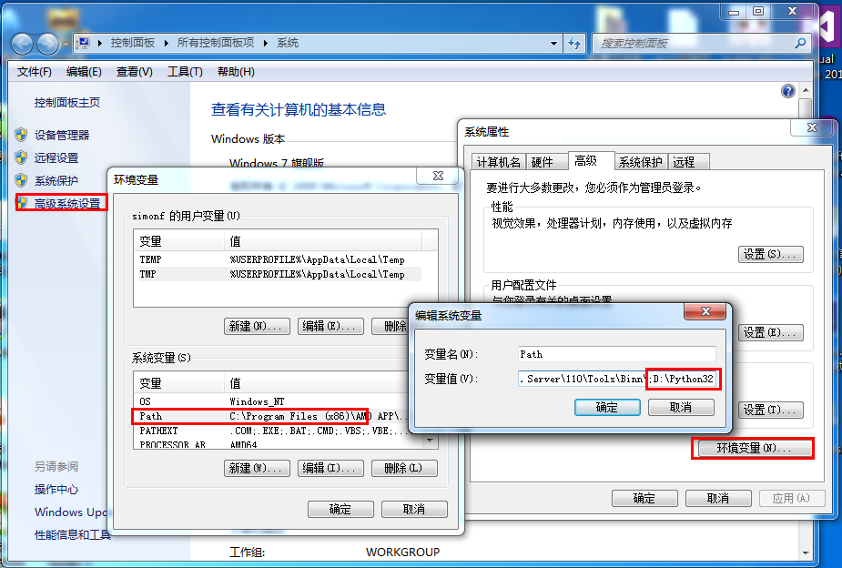
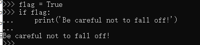
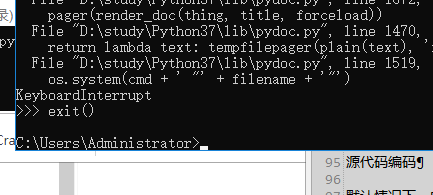
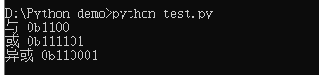

## Python3 环境搭建

##Python3 下载
Python 官网：https://www.python.org/
Python文档下载地址：https://www.python.org/doc/
Python官方教程https://docs.python.org/3/tutorial/index.html

## Python 安装

您需要下载适用于您使用平台的二进制代码，然后安装 Python。
如果您平台的二进制代码是不可用的，你需要使用C编译器手动编译源代码。

### Window 平台安装 Python:

打开 WEB 浏览器访问 https://www.python.org/downloads/windows/ ，一般就下载 executable installer(可执行安装程序)，x86 表示是 32 位机子的，x86-64 表示 64 位机子的。

executable 英 /ɪg'zekjʊtəb(ə)l; eg-/  美 /ɪɡ'zɛkjətəbl/ adj. 可执行的；可实行的


记得勾选 Add Python 3.6 to PATH。


按 Win+R 键，输入 cmd 调出命令提示符，输入 python:


## 环境变量配置
程序和可执行文件可以在许多目录，而这些路径很可能不在操作系统提供可执行文件的搜索路径中。
path(路径)存储在环境变量中，这是由操作系统维护的一个命名的字符串。这些变量包含可用的命令行解释器和其他程序的信息。
### 在 Windows 设置环境变量
在环境变量中添加Python目录：
> 1. (此方法只有一次有效)
在命令提示框中(cmd) : 输入 
```
path=%path%;C:\Python
```
按下"Enter"。
注意: C:\Python 是Python的安装目录。

> 2.
也可以通过以下方式设置：
右键点击"计算机"，然后点击"属性"
然后点击"高级系统设置"
选择"系统变量"窗口下面的"Path",双击即可！
然后在"Path"行，添加python安装路径即可(我的D:\Python32)，所以在后面，添加该路径即可。 ps：记住，路径直接用分号"；"隔开！
最后设置成功以后，在cmd命令行，输入命令"python"，就可以有相关显示。


### Python 环境变量

下面几个重要的环境变量，它应用于Python：


| 变量名 | 描述 |
| --- | --- |
| PYTHONPATH | PYTHONPATH是Python搜索路径，默认我们import的模块都会从PYTHONPATH里面寻找。|
| PYTHONSTARTUP | Python启动后，先寻找PYTHONSTARTUP环境变量，然后执行此变量指定的文件中的代码。 |
| PYTHONCASEOK | 加入PYTHONCASEOK的环境变量, 就会使python导入模块的时候不区分大小写. |
| PYTHONHOME | 另一种模块搜索路径。它通常内嵌于的PYTHONSTARTUP或PYTHONPATH目录中，使得两个模块库更容易切换。|

case 英 /keɪs/  美 /kes/  n. 情况；实例；箱 vt. 包围；把…装于容器中
startup 英 /stɑ:tʌp/  美 /'stɑrt'ʌp/ n. 启动；开办 n. 初创企业

PYTHONPATH	PYTHONPATH是Python搜索路径，默认我们import的模块都会从PYTHONPATH里面寻找。
PYTHONSTARTUP	Python启动后，先寻找PYTHONSTARTUP环境变量，然后执行此变量指定的文件中的代码。
PYTHONCASEOK	加入PYTHONCASEOK的环境变量, 就会使python导入模块的时候不区分大小写.
PYTHONHOME	另一种模块搜索路径。它通常内嵌于的PYTHONSTARTUP或PYTHONPATH目录中，使得两个模块库更容易切换。

## 运行Python 使用Python解释器¶

### 1.调用解释器:
有三种方式可以运行Python：
> 
#### 1、交互式解释器：
你可以通过命令行窗口进入python并开在交互式解释器中开始编写Python代码。
(win + R,输入cmd)

退出交互解释器的方法： exit()

> 
#### 2、命令行脚本
在你的应用程序中通过引入解释器可以在命令行中执行Python脚本，如下所示：
(win + R,输入cmd)
(cd到.py文件所在目录)

> 
#### 3、集成开发环境（IDE：Integrated Development Environment）: PyCharm
PyCharm 是由 JetBrains 打造的一款 Python IDE，支持 macOS、 Windows、 Linux 系统。
PyCharm 功能 : 调试、语法高亮、Project管理、代码跳转、智能提示、自动完成、单元测试、版本控制……
PyCharm 下载地址 : https://www.jetbrains.com/pycharm/download/

### 2.解释器及其环境¶
源代码编码¶

默认情况下，Python源文件被视为以UTF-8编码。在该编码中，世界上大多数语言的字符可以在字符串文字，标识符和注释中同时使用 - 尽管标准库仅使用ASCII字符作为标识符，这是任何可移植代码都应遵循的约定。要正确显示所有这些字符，编辑器必须识别该文件是UTF-8，并且必须使用支持文件中所有字符的字体。

要声明非默认编码，应添加一个特殊注释行作为文件的第一行。语法如下：
```
# -*- coding: encoding -*-
```
例如
```
# -*- coding: utf-8 # utf-8前面空格是必须的
# 或者
# coding=utf-8
```
coding /'kodɪŋ/ n. 译码 v. 把…编码（code的ing形式）
encoding 英 /ɪn'kəʊdɪŋ/  美 /ɪn'kodɪŋ/ n. [计] 编码 v. [计] 编码（encode的ing形式）

其中encoding(编解码器注册表和基类)是codecsPython支持的有效编码之一。

例如，要声明要使用Windows-1252编码，源代码文件的第一行应为：
```
# -*- coding: cp1252
```

第一行规则的一个例外是源代码以UNIX“shebang”行开头 。在这种情况下，应将编码声明添加为文件的第二行。例如：
```
#!/usr/bin/env python3
# -*- coding: cp1252 -*-
```
（UNIX“shebang”(可执行的Python脚本。(假设解释器位于用户的路径上)在脚本的开头，并给文件一个可执行模式。# !必须是文件的前两个字符。在某些平台上，第一行必须以unix风格的行结束('\n')，而不是Windows ('\r ' n')行结束。注意，在Python中，散列(或磅)字符'#'用于开始注释。)）
