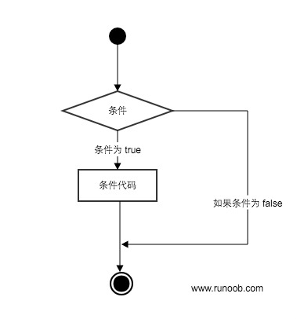

## Python3 条件语句

Python条件语句是通过一条或多条语句的执行结果（True或者False）来决定执行的代码块。

可以通过下图来简单了解条件语句的执行过程:


Python程序语言指定任何非0和非空（null）值为true，0 或者 null为false。

Python 编程中 if 语句用于控制程序的执行，基本形式为：

```python
if condition_1:
    statement_block_1
elif condition_2:
    statement_block_2
else:
    statement_block_3
```

condition 英 /kənˈdɪʃn/  美 /kənˈdɪʃn/ n. 条件；情况；环境；身份 vt. 决定；使适应；使健康；以…为条件
statement 英 /ˈsteɪtmənt/  美 /ˈsteɪtmənt/  n. 声明；陈述，叙述；报表，清单

注意：
1、每个条件后面要使用冒号 :，表示接下来是满足条件后要执行的语句块。
2、使用缩进来划分语句块，相同缩进数的语句在一起组成一个语句块。
3、在Python中没有switch – case语句。

```python
#!/usr/bin/python3
 
age = int(input("请输入你家狗狗的年龄: "))
print("")
if age <= 0:
    print("你是在逗我吧!")
elif age == 1:
    print("相当于 14 岁的人。")
elif age == 2:
    print("相当于 22 岁的人。")
elif age > 2:
    human = 22 + (age -2)*5
    print("对应人类年龄: ", human)
 
### 退出提示
input("点击 enter 键退出")
```

## if 嵌套
```python
if 表达式1:
    语句
    if 表达式2:
        语句
    elif 表达式3:
        语句
    else:
        语句
elif 表达式4:
    语句
else:
    语句
```

