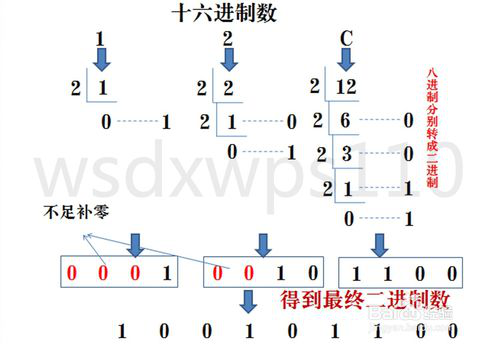

## Python3 循环语句

Python 中的循环语句有 for 和 while。

Python 循环语句的控制结构图如下所示：


condition英 /kən'dɪʃ(ə)n/ 美 /kən'dɪʃən/ n. 条件；情况；环境；身份vt. 决定；使适应；使健康；以…为条件
conditional英 /kən'dɪʃ(ə)n(ə)l/ 美 /kən'dɪʃənl/ adj. 有条件的；假定的 n. 条件句；条件语

---
## 循环类型

python提供了for循环和while循环（在Python中没有do..while循环）:

| 循环类型 | 描述 |
| -::- | -::- |
| while 循环 | 在给定的判断条件为 true 时执行循环体，否则退出循环体。 | 
| for 循环 | 重复执行语句 |
| 嵌套循环 | 你可以在while循环体中嵌套for循环 |  

### white循环
```
while 判断条件(condition)：
    执行语句(statements)……
```
```
n = 100
sum = 0
counter = 0
while sum < n:
    sum += 1
    counter += sum
print('1到100的总和是', counter) # 1到100的总和是 5050
```

### while 循环使用 else 语句
```
while <expr>:
    <statement(s)>
else:
    <additional_statement(s)>
```
### 无限循环
```
var = 1
while var == 1 : 
	num = int(input('输入一个数字：'))
	print("你输入的数字是：", num)
print("Good bye!")
```

你可以使用 CTRL+C 来退出当前的无限循环。

无限循环在服务器上客户端的实时请求非常有用。

### for循环

Python for循环可以遍历任何序列的项目，如一个列表或者一个字符串。
```
for <variable> in <sequence>:
    <statements>
else:
    <statements>
```

variable 英 /ˈveəriəbl/  美 /ˈveriəbl,ˈværiəbl/ adj. 变量的；可变的；易变的，多变的；变异的，[生物] 畸变的 n. [数] 变量；可变物，可变因素
sequence 英 /ˈsiːkwəns/  美 /ˈsiːkwəns/ n. [数][计] 序列；顺序；续发事件 vt. 按顺序排好
statements 美 /'stetmənt/ n. 声明；报告；陈述句；状态说明（statement的复数形式）

```
sites = ['baidu', 'google', 'runoob', 'taobao']
for site in sites:
    if site == 'runoob':
        print('菜鸟教程')
        break
else:
    print('没有循环数据!')
print('完成循环')
```

### range()函数
1. 如果你需要遍历数字序列，可以使用内置range()函数。它会生成数列，例如:
```
for i in range(5):
    print(i)  # 0 1 2 3 4
```

2. 使用range指定区间的值：
```
for i in range(5, 9):
    print(i) # 5, 6, 7, 8
```

3. 使range以指定数字开始并指定不同的增量(甚至可以是负数，有时这也叫做'步长'):
```
for i in range(0, 10, 3):
    print(i) # 0, 3, 6, 9
```

4. 负数：
```
for i in range(-10, -100, -30):
    print(i) # -10 -40 -70
```

5. 您可以结合range()和len()函数以遍历一个序列的索引,如下所示:
```
a = ['google', 'baidu', 'runoob', 'taobao', 'qq']
for i in range(len(a)):
    print(i, a[i])
输出
0 google
1 baidu
2 runoob
3 taobao
4 qq
```

6. 还可以使用range()函数来创建一个列表：
```
print(list(range(5)))  # [0, 1, 2, 3, 4]
```

---
## 循环控制语句

循环控制语句可以更改语句执行的顺序。Python支持以下循环控制语句：
| 控制语句 | 描述 |
| -::- | -::- |
| break 语句 | 在语句块执行过程中终止循环，并且跳出整个循环 | 
| continue 语句 | 在语句块执行过程中终止当前循环，跳出该次循环，执行下一次循环。 |
| pass 语句 | pass是空语句，是为了保持程序结构的完整性。 |  

pass英 /pɑːs/ 美 /pæs/ n. 及格；经过；护照；途径；传球vi. 经过；传递；变化；终止 vt. 通过；经过；传递

### break
```
n = 5
while n > 0:
    n -= 1
    if n == 2:
        break
    print(n)
print('循环结束。')
```

### break
```
n = 5
while n > 0:
    n -= 1
    if n == 2:
        continue
    print(n)
print('循环结束。')
```

### pass

Python pass是空语句，是为了保持程序结构的完整性。

pass 不做任何事情，一般用做占位语句，如下实例

```
while True:
	pass  # 等待键盘中断 (Ctrl+C)
```
```
class MyEmptyClass:
	pass
```

## 摇骰子游戏
```
# -*- coding:UTF-8 -*-
# coding=utf-8  # 注释中有中文，所以编码格式要放在上面，不然无法报错无法读取中文
# !/D:/Python37   # Python解释器目录(python.exe所在目录)
import random
import sys
import time

result = []
while True:
    result.append(int(random.uniform(1, 7)))
    result.append(int(random.uniform(1, 7)))
    print(result)
    count = 0
    index = 2
    pointStr = ''
    for number in result:
        count += number
    if count <= 9:
        sys.stdout.write(pointStr + '->' + '小' + '\n')
        time.sleep(1)  # 推迟执行一秒钟
    else:
        sys.stdout.write(pointStr + '->' + '大' + '\n')
        time.sleep(1)  # 推迟执行一秒钟
    result = []
```
<ing rsc='img/shaizi.png' />

### time.sleep()

描述：Python time sleep() 函数推迟调用线程的运行，可通过参数secs指秒数，表示进程挂起的时间。
语法：
 time.sleep(t)
参数：
 t -- 推迟执行的秒数。
返回值：
 该函数没有返回值。

### print()不换行

Python 2.x下的print语句在输出字符串之后会默认换行，如果不希望换行，只要在语句最后加一个“，”即可。但是在Python 3.x下，print()变成内置函数，加“，”的老方法就行不通了。

查询Python的Library Reference>Built-in Functions，找到如下条目：
* print([object, ...], *, sep=' ', end='\n', file=sys.stdou)

其中，sep=''和end='\n'均是print()的关键参数，sep的默认值为空，end默认值为换行符，这就是print()在输出后默认换行的原因。相应的，解决办法就是对end赋值：print(something, something,.., end=' ')，使end值为空，这个换行就消除了。

### sys.stdout.write() 和 print()

当我们使用print(obj)在console上打印对象的时候，实质上调用的是sys.stdout.write(obj+'\n')，print在打印时会自动加个换行符，以下两行等价：
* sys.stdout.write(‘hello’ + ‘\n’)
* print(‘hello’)

### uniform(x , y)

描述：uniform() 方法将随机生成下一个实数，它在 [x,y] 范围内。
语法：
```
import random 
random.uniform(x, y)
```
参数：
> 
x -- 随机数的最小值。
y -- 随机数的最大值。

返回值：
> 返回一个浮点数 N，取值范围为如果 x<y 则 x <= N <= y，如果 y<x 则y <= N <= x。

注：uniform()是不能直接访问的，需要导入 random 模块，然后通过 random 静态对象调用该方法。

### 十进制、二进制转换

#### 十进制转二进制:十进制数除2取余法


#### 二进制转十进制:把二进制数按权(从0开始)展开、相加即得十进制数。


#### 二进制转八进制：3位二进制数按权展开相加得到1位八进制数。（注意事项，3位二进制转成八进制是从右到左开始转换，不足时补0）。


#### 八进制转成二进制：八进制数通过除2取余法，得到二进制数，对每个八进制为3个二进制，不足时在最左边补零。


#### 二进制转十六进制：与二进制转八进制方法近似，八进制是取三合一，十六进制是取四合一。（注意事项，4位二进制转成十六进制是从右到左开始转换，不足时补0）。


#### 十六进制转二进制：十六进制数通过除2取余法，得到二进制数，对每个十六进制为4个二进制，不足时在最左边补零。


scale英 /skeɪl/ 美 /skel/ n. 规模；比例；鳞；刻度；天平；数值范围vi. 衡量；攀登；剥落；生水垢vt. 测量；攀登；刮鳞；依比例决定n. (Scale)人名；(意)斯卡莱
过去式 scaled过去分词 scaled现在分词 scaling


## 九九乘法表
```
# -*- coding:UTF-8 -*-
# coding=utf-8  # 注释中有中文，所以编码格式要放在上面，不然无法报错无法读取中文
# !/D:/Python37   # Python解释器目录(python.exe所在目录)

i = 1
while 1:
    j = 1
    while j:
        print(j, '*', i, '=', i * j, end='  ')
        if (i == j):
            break
        j += 1
        if (j >= 10):
            break
    print('\n')
    i += 1
    if (i >= 10):
        break
```


## 去除首尾空格
```
# -*- coding:UTF-8 -*-
# coding=utf-8  # 注释中有中文，所以编码格式要放在上面，不然无法报错无法读取中文
# !/D:/Python37   # Python解释器目录(python.exe所在目录)

def trim(s):
    while s[:1] == ' ':
        s = s[1:]
    while s[-1:] == ' ':
        s = s[:-1]
    return s

str = ' runoob '
print(trim(str))
```