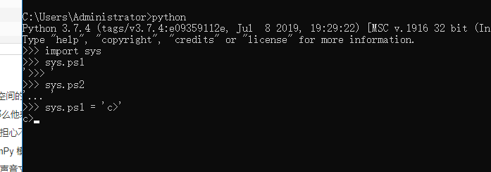

## Python3 模块

* ython 提供了一个办法，把这些定义存放在文件中，为一些脚本或者交互式的解释器实例使用，这个文件被称为模块。

* 模块是一个包含所有你定义的函数和变量的文件，其后缀名是.py。模块可以被别的程序引入，以使用该模块中的函数等功能。这也是使用 python 标准库的方法。

```
#!/usr/bin/python3
# 文件名: using_sys.py

import sys
 
print('命令行参数如下:')
for i in sys.argv:
   print(i)
 
print('\n\nPython 路径为：', sys.path, '\n')
```

1、import sys 引入 python 标准库中的 sys.py 模块；这是引入某一模块的方法。
2、sys.path 包含了一个 Python 解释器自动查找所需模块的路径的列表。

## import 语句

* 想使用 Python 源文件，只需在另一个源文件里执行 import 语句，语法如下：

```
import module1[, module2[,... moduleN]
```

当解释器遇到 import 语句，如果模块在当前的搜索路径就会被导入。

搜索路径是一个解释器会先进行搜索的所有目录的列表。如想要导入模块 support，需要把命令放在脚本的顶端：

support.py 文件代码
```
def print_func( par ):
    print ("Hello : ", par)
    return
```

test.py 文件代码
```
# 导入模块
import support
 
# 现在可以调用模块里包含的函数了
support.print_func("Runoob")
```

一个模块只会被导入一次，不管你执行了多少次import。这样可以防止导入模块被一遍又一遍地执行。

这就涉及到Python的搜索路径，搜索路径是由一系列目录名组成的，Python解释器就依次从这些目录中去寻找所引入的模块。

这看起来很像环境变量，事实上，也可以通过定义环境变量的方式来确定搜索路径。

搜索路径是在Python编译或安装的时候确定的，安装新的库应该也会修改。搜索路径被存储在sys模块中的path变量，做一个简单的实验，在交互式解释器中，输入以下代码：

```
import sys

print(sys.path)
```
输出：[
'F:\\Study_objectMenu\\Python\\Object_hello', 
'F:\\Study_objectMenu\\Python\\Object_hello', 
'D:\\study\\PyCharm 2019.2.1\\helpers\\pycharm_display', 
'F:\\Study_objectMenu\\Python\\Object_hello\\venv\\Scripts\\python37.zip', 
'E:\\softwareDirectory\\Python37\\Lib', 
'E:\\softwareDirectory\\Python37\\DLLs', 
'D:\\study\\Anaconda\\Lib', 
'D:\\study\\Anaconda\\DLLs', 
'E:\\softwareDirectory\\Python37', 
'F:\\Study_objectMenu\\Python\\Object_hello\\venv', 
'F:\\Study_objectMenu\\Python\\Object_hello\\venv\\lib\\site-packages', 
'F:\\Study_objectMenu\\Python\\Object_hello\\venv\\lib\\site-packages\\setuptools-39.1.0-py3.7.egg', 
'F:\\Study_objectMenu\\Python\\Object_hello\\venv\\lib\\site-packages\\pip-10.0.1-py3.7.egg', 
'D:\\study\\PyCharm 2019.2.1\\helpers\\pycharm_matplotlib_backend']

## from … import 语句

* Python 的 from 语句让你从模块中导入一个指定的部分到当前命名空间中，语法如下：

```
from modname import name1[, name2[, ... nameN]]
```
```
from fibo import fib, fib2
```

## from … import * 语句

* 把一个模块的所有内容全都导入到当前的命名空间也是可行的，只需使用如下声明：

```
from modname import *
```
这提供了一个简单的方法来导入一个模块中的所有项目。然而这种声明不该被过多地使用。

## 深入模块

模块除了方法定义，还可以包括**可执行的代码**。这些代码一般用来初始化这个模块。这些代码只有在第一次被导入时才会被执行。

每个模块有各自独立的**符号表**，在模块内部为所有的函数当作全局符号表来使用。

所以，模块的作者可以放心大胆的在模块内部使用这些**全局变量**，而不用担心把其他用户的全局变量搞混。

从另一个方面，当你确实知道你在做什么的话，你也可以通过 **modname.itemname** 这样的表示法来访问模块内的函数。

模块是可以导入其他模块的。在一个模块（或者脚本，或者其他地方）的最前面使用 import 来导入一个模块，当然这只是一个惯例，而不是强制的。被导入的模块的名称将被放入当前操作的模块的符号表中。

还有一种导入的方法，可以使用 import 直接把模块内（函数，变量的）名称导入到当前操作模块。比如:

```
from fibo import fib, fib2
fib(500)
```

这种导入的方法不会把被导入的模块的名称放在当前的字符表中（所以在这个例子里面，fibo 这个名称是没有定义的）。

这还有一种方法，可以一次性的把模块中的所有（函数，变量）名称都导入到当前模块的字符表:

```
from fibo import *
fib(500)
```

这将把所有的名字都导入进来，但是那些由单一下划线（_）开头的名字不在此例。大多数情况， Python程序员不使用这种方法，因为引入的其它来源的命名，很可能覆盖了已有的定义。

## __name__属性

* 一个模块被另一个程序第一次引入时，其主程序将运行。如果我们想在模块被引入时，**模块中的某一程序块不执行**，我们可以用__name__属性来使该程序块**仅在该模块自身运行时执行**。

```
if __name__ == '__main__':
   print('程序自身在运行')
else:
   print('我来自另一模块')
```

说明： 每个模块都有一个__name__属性，当其值是'__main__'时，表明该模块自身在运行，否则是被引入。

说明：__name__ 与 __main__ 底下是双下划线， _ _ 是这样去掉中间的那个空格。

## dir() 函数

* 内置的函数 dir() 可以找到模块内定义的所有名称。以一个字符串列表的形式返回:

```
import sys

print(dir(sys))
```
输出：
[
'__breakpointhook__', 
'__displayhook__',
 '__doc__', 
'__excepthook__',
 '__interactivehook__', 
'__loader__', '__name__', 
'__package__', '__spec__', '__stderr__', '__stdin__', '__stdout__', '_clear_type_cache', '_current_frames', '_debugmallocstats', '_enablelegacywindowsfsencoding', '_framework', '_getframe', '_git', '_home', '_xoptions', 'api_version', 'argv', 'base_exec_prefix', 'base_prefix', 'breakpointhook', 'builtin_module_names', 'byteorder', 'call_tracing', 'callstats', 'copyright', 'displayhook', 'dllhandle', 'dont_write_bytecode', 'exc_info', 'excepthook', 'exec_prefix', 'executable', 'exit', 'flags', 'float_info', 'float_repr_style', 'get_asyncgen_hooks', 'get_coroutine_origin_tracking_depth', 'get_coroutine_wrapper', 'getallocatedblocks', 'getcheckinterval', 'getdefaultencoding', 'getfilesystemencodeerrors', 'getfilesystemencoding', 'getprofile', 'getrecursionlimit', 'getrefcount', 'getsizeof', 'getswitchinterval', 'gettrace', 'getwindowsversion', 'hash_info', 'hexversion', 'implementation', 'int_info', 'intern', 'is_finalizing', 'maxsize', 'maxunicode', 'meta_path', 'modules', 'path', 'path_hooks', 'path_importer_cache', 'platform', 'prefix', 'set_asyncgen_hooks', 'set_coroutine_origin_tracking_depth', 'set_coroutine_wrapper', 'setcheckinterval', 'setprofile', 'setrecursionlimit', 'setswitchinterval', 'settrace', 'stderr', 'stdin', 'stdout', 'thread_info', 'version', 'version_info', 'warnoptions', 'winver']

* 如果没有给定参数，那么 dir() 函数会罗列出当前定义的所有名称:

```
a = 5 # 建立一个新的变量 'a'
print(dir())
#输出：['__annotations__', '__builtins__', '__cached__', '__doc__', '__file__', '__loader__', '__name__', '__package__', '__spec__', 'a']
```

## 标准模块

Python 本身带着一些标准的模块库，在 Python 库参考文档中将会介绍到（就是后面的"库参考文档"）。

有些模块直接被构建在解析器里，这些虽然不是一些语言内置的功能，但是他却能很高效的使用，甚至是系统级调用也没问题。

这些组件会根据不同的操作系统进行不同形式的配置，比如 winreg 这个模块就只会提供给 Windows 系统。

应该注意到这有一个特别的模块 sys ，它内置在每一个 Python 解析器中。变量 sys.ps1 和 sys.ps2 定义了主提示符和副提示符所对应的字符串:



##  包

包是一种管理 Python **模块命名空间的形式**，采用"**点模块名称**"。

比如一个模块的名称是** A.B**， 那么他表示一个包 **A中的子模块 B **。

就好像使用模块的时候，你不用担心不同模块之间的全局变量相互影响一样，采用点模块名称这种形式也不用担心不同库之间的模块重名的情况。

不妨假设你想设计一套统一处理声音文件和数据的模块（或者称之为一个"包"）。

现存很多种不同的音频文件格式（基本上都是通过后缀名区分的，例如： .wav，:file:.aiff，:file:.au，），所以你需要有一组不断增加的模块，用来在不同的格式之间转换。

并且针对这些音频数据，还有很多不同的操作（比如混音，添加回声，增加均衡器功能，创建人造立体声效果），所以你还需要一组**怎么也写不完的模块**来处理这些操作。

这里给出了一种可能的包结构（在分层的文件系统中）:

```
sound/                          顶层包
      __init__.py               初始化 sound 包
      formats/                  文件格式转换子包
          __init__.py
          wavread.py
          wavwrite.py
          aiffread.py
          aiffwrite.py
          auread.py
          auwrite.py
          ...
 	 effects/                  声音效果子包
          __init__.py
          echo.py
          surround.py
          reverse.py
          ...
  	filters/                  filters 子包
          __init__.py
          equalizer.py
          vocoder.py
          karaoke.py
          ...
```

在导入一个包的时候，Python 会根据 sys.path 中的目录来寻找这个包中包含的子目录。

目录只有包含一个叫做 **__init__.py 的文件**才会被认作是一个包，主要是为了避免一些滥俗的名字（比如叫做 string）不小心的影响搜索路径中的有效模块。


最简单的情况，放一个**空的 :file:__init__.py**就可以了。当然这个文件中也可以包含一些初始化代码或者为（将在后面介绍的） __all__变量赋值。

* **用户可以每次只导入一个包里面的特定模块**，比如:
```
import sound.effects.echo
```

这将会导入子模块:sound.effects.echo。 他必须使用全名去访问:

```
sound.effects.echo.echofilter(input, output, delay=0.7, atten=4)
```

* **还有一种导入子模块的方法是:**

```
from sound.effects import echo
```

这同样会导入子模块: echo，并且他不需要那些冗长的前缀，所以他可以这样使用:

```
echo.echofilter(input, output, delay=0.7, atten=4)
```

* **还有一种变化就是直接导入一个函数或者变量:**

```
from sound.effects.echo import echofilter
```

```
echofilter(input, output, delay=0.7, atten=4)
```

注意当使用 from package import item 这种形式的时候，对应的 item 既可以是包里面的子模块（子包），或者包里面定义的其他名称，比如函数，类或者变量。

import 语法会首先把 item 当作一个包定义的名称，如果没找到，再试图按照一个模块去导入。如果还没找到，抛出一个 :exc:ImportError 异常。

反之，如果使用形如 import item.subitem.subsubitem 这种导入形式，除了最后一项，都必须是包，而最后一项则可以是模块或者是包，但是不可以是类，函数或者变量的名字。

## 从一个包中导入*

设想一下，如果我们使用 from sound.effects import *会发生什么？

Python 会进入文件系统，找到这个包里面所有的子模块，一个一个的把它们都导入进来。

但是很不幸，这个方法在 Windows平台上工作的就不是非常好，因为Windows是一个大小写不区分的系统。

**在这类平台上，没有人敢担保一个叫做 ECHO.py 的文件导入为模块 echo 还是 Echo 甚至 ECHO**。

**导入语句遵循如下规则**：如果包定义文件 __init__.py 存在一个叫做 __all__ 的列表变量，那么在使用 from package import * 的时候就把这个列表中的所有名字作为包内容导入。

---
**在:file:sounds/effects/__init__.py中包含如下代码:**
```
__all__ = ["echo", "surround", "reverse"]
```

这表示当你使用from sound.effects import *这种用法时，你只会导入包里面这三个子模块。

无论是隐式的还是显式的相对导入都是从当前模块开始的。主模块的名字永远是"__main__"，一个Python应用程序的主模块，应当总是使用绝对路径引用。

包还提供一个额外的属性__path__。这是一个目录列表，里面每一个包含的目录都有为这个包服务的__init__.py，你得在其他__init__.py被执行前定义哦。可以修改这个变量，用来影响包含在包里面的模块和子包。

这个功能并不常用，一般用来扩展包里面的模块。
