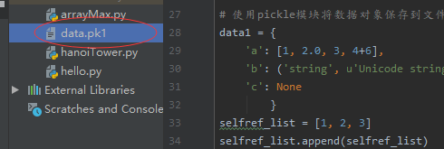

## Python3 输入和输出

---
## 输出格式美化

Python两种输出值的方式: **表达式语句**和** print() 函数**。

第三种方式是使用文件对象的** write() 方法**，标准输出文件可以用 sys.stdout 引用。

可以使用 str.format() 函数来格式化输出值。

可以使用 repr() 或 str() 函数将输出的值转成字符串

> str()： 函数返回一个用户易读的表达形式。

> repr()： 产生一个解释器易读的表达形式。 repr() 的参数可以是 Python 的任何对象

### 1.repr(), .format, str()
```python
s = 'Hello, Runoob'
y = 0

print(s) #Hello, Runoob

print(repr(s)) #'Hello, Runoob'

print(repr((s, y, ('Google', 'Runoob')))) #('Hello, Runoob', 0, ('Google', 'Runoob'))
```

```python
for x in range(1, 11):
    print('{0:2d} {1:3d} {2:4d}'.format(x, x*x, x*x*x)) 

'''输出:
 1   1    1
 2   4    8
 3   9   27
 4  16   64
 5  25  125
 6  36  216
 7  49  343
 8  64  512
 9  81  729
10 100 1000
'''
```

### 2.zfill(), rjust()

```python
print('12'.zfill(5)) #00012
print('12'.ljust(5)) #12 
```

### 3. .format()

>* 括号

```python
print('{}网址： "{}!"'.format('菜鸟教程', 'www.runoob.com')) #菜鸟教程网址： "www.runoob.com!"
```

>* 数字参数

```python
print('{0} 和 {1}'.format('Google', 'Runoob')) #Google 和 Runoob
```

>* 关键字参数

```python
print('{name}网址： {site}'.format(name='菜鸟教程', site='www.runoob.com')) #菜鸟教程网址： www.runoob.com
```

### 4. !a (使用 ascii()), !s (使用 str()) 和 !r (使用 repr()) 可以用于在格式化某个值之前对其进行转化:

```python
import math
print('常量 PI 的值近似为： {}。'.format(math.pi)) # 常量 PI 的值近似为： 3.141592653589793。
print('常量 PI 的值近似为： {!r}。'.format(math.pi)) # 常量 PI 的值近似为： 3.141592653589793。
print('常量 PI 的值近似为： {!a}。'.format(math.pi)) # 常量 PI 的值近似为： 3.141592653589793。
print('常量 PI 的值近似为： {!s}。'.format(math.pi)) # 常量 PI 的值近似为： 3.141592653589793。
```

### 5. 可选项 : 格式标识符可以跟着字段名。 这就允许对值进行更好的格式化。 下面的例子将 Pi 保留到小数点后三位：
> 3f -> 保留小数点后3位

```python
import math
print('常量 PI 的值近似为 {0:.3f}。'.format(math.pi)) #常量 PI 的值近似为 3.142。
```

### 6. 在 : 后传入一个整数, 可以保证该域至少有这么多的宽度。 用于美化表格时很有用。
* 10d -> 宽度为10

```python
table = {'Google': 1, 'Runoob': 2, 'Taobao': 3}
for name, number in table.items():
    print('{0:10} ==> {1:10d}'.format(name, number))
    
'''输出:
Google     ==>          1
Runoob     ==>          2
Taobao     ==>          3
'''
```
* 如果你有一个很长的格式化字符串, 而你不想将它们分开, 那么在格式化时通过变量名而非位置会是很好的事情。
* 最简单的就是传入一个字典, 然后使用方括号 [] 来访问键值 :
* d -> 宽度为1

```python
table = {'Google': 1, 'Runoob': 2, 'Taobao': 3}
print('Runoob: {0[Runoob]:d}; Google: {0[Google]:d}; Taobao: {0[Taobao]:d}'.format(table))
#Runoob: 2; Google: 1; Taobao: 3
```

### 7.也可以通过在 table 变量前使用 ** 来实现相同的功能：
.format(*[]) 取列表   .format(**{}) 取字典

```python
table = {'Google': 1, 'Runoob': 2, 'Taobao': 3}
print('Runoob: {Runoob:d}; Google: {Google:d}; Taobao: {Taobao:d}'.format(**table)) #Runoob: 2; Google: 1; Taobao: 3
```

---
## 旧式字符串格式化

% 操作符也可以实现字符串格式化。 它将左边的参数作为类似 sprintf() 式的格式化字符串, 而将右边的代入, 然后返回格式化后的字符串. 例如:

```python
print('常量 PI 的值近似为：%5.3f。' % math.pi)
#常量 PI 的值近似为：3.142。
```

因为 str.format() 比较新的函数， 大多数的 Python 代码仍然使用 % 操作符。但是因为这种旧式的格式化最终会从该语言中移除, 应该更多的使用 str.format().

---
## 读取键盘输入

Python提供了 input() 内置函数从标准输入读入一行文本，默认的标准输入是键盘。

input 可以接收一个Python表达式作为输入，并将运算结果返回。

```python
str = input("请输入：");
print ("你输入的内容是: ", str)

'''输出：
请输入：1232131
你输入的内容是:  1232131
'''
```

---
## 读和写文件（r w a）

### 1.open() 将会返回一个 file 对象，基本语法格式如下:
```python
open(filename, mode)
```
* filename：包含了你要访问的文件名称的字符串值。
* mode：决定了打开文件的模式：只读，写入，追加等。所有可取值见如下的完全列表。这个参数是非强制的，**默认文件访问模式为只读(r)**。

| 模式 | 描述 |
| --- | --- |
| r | 以**只读**方式打开文件。文件的指针将会放在文件的开头。这是默认模式。 |
| r+ | 打开一个文件用于**读写**。文件指针将会放在文件的开头。 |
| rb | 以**二进制格式**打开一个文件用于**只读**。文件指针将会放在文件的开头。 |
| rb+ | 以**二进制格式**打开一个文件用于打开一个文件用于**读写**。如果该文件已存在则打开文件，并从开头开始编辑，即**原有内容会被删除**。如果该文件不存在，**创建新文件**。文件指针将会放在文件的开头。 |
| w | 打开一个文件只用于**写入**。如果该文件已存在则打开文件，并从开头开始编辑，**即原有内容会被删除**。如果该文件不存在，**创建新文件**。 |
| w+ | 打开一个文件用于**读写**。如果该文件已存在则打开文件，并从开头开始编辑，**即原有内容会被删除**。如果该文件不存在，**创建新文件**。 |
| wb | 以**二进制格式**打开一个文件只用于**写入**。如果该文件已存在则打开文件，并从开头开始编辑，即原有内容会被删除。如果该文件不存在，**创建新文件**。 |
| wb+ | 以**二进制格式**打开一个文件用于**读写**。如果该文件已存在则打开文件，并从开头开始编辑，即**原有内容会被删除**。如果该文件不存在，**创建新文件**。|
| a | 打开一个文件用于**追加**。如果该文件已存在，文件指针将会放在文件的结尾。也就是说，新的内容将会被写入到已有内容之后。如果该文件不存在，**创建新文件进行写入**。|
| a+ | 打开一个文件用于**读写**。如果该文件已存在，文件指针将会放在文件的结尾。文件打开时会是追加模式。如果该文件不存在，**创建新文件用于读写**。|
| ab | 以**二进制格式**打开一个文件用于**追加**。如果该文件已存在，文件指针将会放在文件的结尾。也就是说，新的内容将会被写入到已有内容之后。如果该文件不存在，**创建新文件进行写入**。|
| ab+ | 以**二进制格式**打开一个文件用于**追加**。如果该文件已存在，文件指针将会放在文件的结尾。如果该文件不存在，**创建新文件用于读写**。|

### 文件对象的方法f.read()

为了读取一个文件的内容，调用 f.read(size), 这将读取一定数目的数据, 然后作为字符串或字节对象返回。

size 是一个可选的数字类型的参数。 当 size 被忽略了或者为负, 那么该文件的所有内容都将被读取并且返回。

```python
f = open("test.txt", "r", encoding='UTF-8') # r->只读
str = f.read()
print(str)
print(f)

f.close() #关闭打开的文件

'''输出：
Python 是一个非常好的语言。
是的，的确非常好!!
<_io.TextIOWrapper name='test.txt' mode='r' encoding='UTF-8'>
'''
```

### 2.文件对象的方法f.readline()

f.readline() 会从文件中读取单独的一行。换行符为 '\n'。f.readline() 如果返回一个空字符串, 说明已经已经读取到最后一行。
```python
f = open("test.txt", "r", encoding='UTF-8') # r->只读
str = f.readline()
print(str)
print(f)

f.close() #关闭打开的文件

'''输出：
Python 是一个非常好的语言。

<_io.TextIOWrapper name='test.txt' mode='r' encoding='UTF-8'>
'''
```

### 3.文件对象的方法f.readlines()

f.readlines() 将返回该文件中包含的所有行。并且返回一个列表。

如果设置可选参数 sizeint, 则读取指定长度的字节, 并且将这些字节按行分割。

```python
f = open("test.txt", "r", encoding='UTF-8') # r->只读
str = f.readlines()
print(str)
print(f)

f.close() #关闭打开的文件

'''输出：
['Python 是一个非常好的语言。\n', '是的，的确非常好!!']
<_io.TextIOWrapper name='test.txt' mode='r' encoding='UTF-8'>
'''
```

### 4.文件对象的方法f.write()
f.write(string) 将 string 写入到文件中, 然后返回写入的字符数。

```python
f = open("test.txt", "w", encoding='UTF-8') # w->写入
num = f.write( "Python 是一个非常好的语言。\n是的，的确非常好!!\n" )
#如果要写入一些不是字符串的东西, 那么将需要先进行转换:
# num =  f.write( str("Python 是一个非常好的语言。\n是的，的确非常好!!\n") )
print(num) #29

f.close() #关闭打开的文件
```

### 5.文件对象的方法f.tell()
tell 英 /tel/  美 /tel/ vt. 告诉，说；辨别；吩咐；断定 vi. 讲述；告发，泄密；识别

f.tell() 返回文件对象当前所处的位置, 它是从文件开头开始算起的字节数。
```python
f = open("test.txt", "w", encoding='UTF-8') # w->写入
num =  f.write( str("Python 是一个非常好的语言。\n是的，的确非常好!!\n") )
print(num) #29
print(f.tell()) #67
f.close() #关闭打开的文件
```

### 6.文件对象的方法f.seek()

seek 英 /siːk/  美 /siːk/ vt. 寻求；寻找；探索；搜索 vi. 寻找；探索；搜索

如果要改变文件当前的位置, 可以使用 f.seek(offset, from_what) 函数。

from_what 的值, 如果是 0 表示开头, 如果是 1 表示当前位置, 2 表示文件的结尾，例如：
> 
seek(x,0) ： 从起始位置即文件**首行首字符**开始移动 x 个字符
seek(x,1) ： 表示从**当前位置**往后移动x个字符
seek(-x,2)：表示从**文件的结尾**往前移动x个字符

from_what 值为默认为0，即文件开头。下面给出一个完整的例子：

```python
f = open("test.txt", "w", encoding='UTF-8') # w->写入
num =  f.write( str("Python 是一个非常好的语言。\n是的，的确非常好!!\n") )
f.seek(5)  # 移动到文件的第六个字节
print(f.tell())
f.close() #关闭打开的文件
```

### 7.文件对象的方法f.close()

在文本文件中 (那些打开文件的模式下没有 b 的), 只会相对于文件起始位置进行定位。

当你处理完一个文件后, 调用 f.close() 来关闭文件并释放系统的资源，如果尝试再调用该文件，则会抛出异常。

```python
f = open("test.txt", "w", encoding='UTF-8') # w->写入
f.close()
f.read()

'''输出：
Traceback (most recent call last):
  File "F:/Study_objectMenu/Python/Object_hello/hello.py", line 33, in <module>
    f.read()
ValueError: I/O operation on closed file.
'''
```


当处理一个文件对象时, 使用 with 关键字是非常好的方式。在结束后, 它会帮你正确的关闭文件。 而且写起来也比 try - finally 语句块要简短:

```python
with open('test.txt', 'r', encoding='utf-8') as f:
    read_data = f.read()

open('test.txt', 'r')
```

---
## pickle 模块

python的pickle模块实现了基本的数据序列和反序列化。

pickle 英 /ˈpɪkl/  美 /ˈpɪkl/ n. 泡菜；盐卤；腌制食品 vt. 泡；腌制

通过pickle模块的序列化操作我们能够将程序中运行的**对象信息保存到文件中去，永久存储**。

通过pickle模块的反序列化操作，我们能够从文件中创建上一次程序保存的对象。

### 1.基本接口：

```python
pickle.dump(obj, file, [,protocol])
```

dump 倾倒 转储 英 /dʌmp/  美 /dʌmp/ v. 倾倒；丢下；猛地放下；（向国外）倾销；随便堆放；与（某人）结束恋爱关系；（非正式）抛弃；（非正式）抛售；卸出（数据）；（内存信息）转储 n. 垃圾场；废渣堆；矿山废石堆；（非正式）脏地方；军需品临时存放处；转储；（非正式）拉屎

### 2.有了 pickle 这个对象, 就能对 file 以读取的形式打开:

```python
x = pickle.load(file)
```

注解：从 file 中读取一个字符串，并将它重构为原来的python对象。

### 3.file: 类文件对象，有read()和readline()接口。
```python
import pickle

# 使用pickle模块将数据对象保存到文件
data1 = {
    'a': [1, 2.0, 3, 4+6],
    'b': ('string', u'Unicode string'),
    'c': None
        }
selfref_list = [1, 2, 3]
selfref_list.append(selfref_list)

output = open('data.pkl', 'wb')

pickle.dump(data1, output)

pickle.dump(selfref_list, output, -1)

output.close()
```




```python
import pprint, pickle

# 使用pickle模块从文件中重构python对象
pkl_file = open('data.pkl', 'rb')

# 读取文件输出
data1 = pickle.load(pkl_file)
pprint.pprint(data1)

# 读取文件输出
data2 = pickle.load(pkl_file)
pprint.pprint(data2)

# 关闭文件
pkl_file.close()
'''输出：
{'a': [1, 2.0, 3, 10], 'b': ('string', 'Unicode string'), 'c': None}
[1, 2, 3, <Recursion on list with id=1990510784200>]
'''
```
