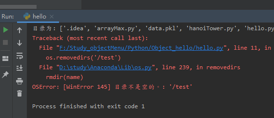

## Python3 OS.removedirs()

os.removedirs() 方法用于递归删除目录。像rmdir(), 如果子文件夹成功删除, removedirs()才尝试它们的父文件夹,直到抛出一个error(它基本上被忽略,因为它一般意味着你文件夹不为空)。

directory 英 /dəˈrektəri; daɪˈrektəri/  美 /dəˈrektəri,daɪˈrektəri/  n. [计] 目录；工商名录；姓名地址录 adj. 指导的；咨询的

```python
os.removedirs(path)
```

* path-- 要移除的目录路径
* 返回值 -- 该方法没有返回值

```python
import os,sys

#列出目录
print('目录为: %s' % os.listdir(os.getcwd()))

#移除
os.removedirs('/test')

#移除后列出目录
print('移除后: %s' % os.listdir(os.getcwd()))
```


**解释：**os.removedirs(path)通过在目录上由深及浅逐层调用rmdir()函数实现的，所以最底层目录必须是空的，/test目录不为空所以报错


