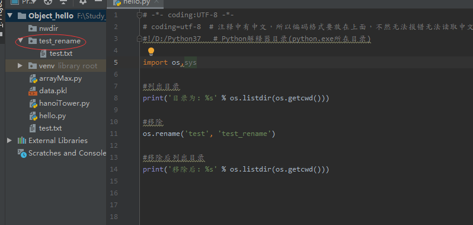
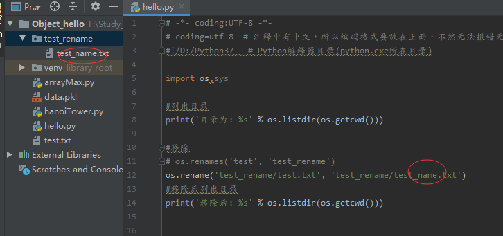

## Python3 OS.rename()

os.rename() 方法用于命名文件或目录，从 src 到 dst,如果dst是一个存在的目录, 将抛出OSError。

```python
os.rename(srcName, dst)
```
* srcName -- 要修改的目录名(**注：只会匹配第一层当前目录**)
* dst -- 修改后的目录名
* 返回值 -- 该方法没有返回值

---
## 重命名目录
```python
import os,sys

#列出目录
print('目录为: %s' % os.listdir(os.getcwd()))
# 目录为: ['.idea', 'arrayMax.py', 'data.pkl', 'hanoiTower.py', 'hello.py', 'nwdir', 'test', 'test.txt', 'venv']

#移除
os.rename('test', 'test_rename')

#移除后列出目录
print('移除后: %s' % os.listdir(os.getcwd()))
# 移除后: ['.idea', 'arrayMax.py', 'data.pkl', 'hanoiTower.py', 'hello.py', 'nwdir', 'test.txt', 'test_rename', 'venv']
```

**注：只会匹配第一层当前目录**


---
## 重命名文件
```python
import os,sys

#列出目录
print('目录为: %s' % os.listdir(os.getcwd()))

#移除
# os.rename('test', 'test_rename')
os.rename('test_rename/test.txt', 'test_rename/test_name.txt')
#移除后列出目录
print('移除后: %s' % os.listdir(os.getcwd()))
```

