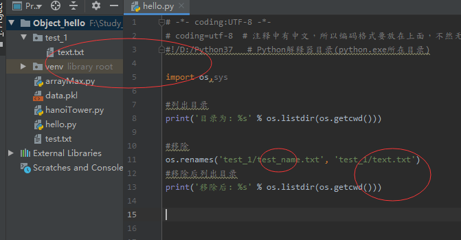

## Python3 OS.renames()

os.renames() 方法用于递归重命名目录或文件。类似rename()。

```python
os.renames(old, new)
```

old -- 要重命名的**目录**
new --**文件或目录**的新名字。甚至可以是**包含在目录中的文件**，或者**完整的目录树**。
返回值 -- 该方法没有返回值


### renames目录
```python
import os,sys

#列出目录
print('目录为: %s' % os.listdir(os.getcwd()))

#移除
os.renames('test', 'test_1')
#移除后列出目录
print('移除后: %s' % os.listdir(os.getcwd()))
```
输出：
> 
目录为: ['.idea', 'arrayMax.py', 'data.pkl', 'hanoiTower.py', 'hello.py', 'test', 'test.txt', 'venv']
移除后: ['.idea', 'arrayMax.py', 'data.pkl', 'hanoiTower.py', 'hello.py', 'test.txt', 'test_1', 'venv']

### ### renames目录下文件
```python
import os,sys

#列出目录
print('目录为: %s' % os.listdir(os.getcwd()))

#移除
os.renames('test_1/test_name.txt', 'test_1/text.txt')
#移除后列出目录
print('移除后: %s' % os.listdir(os.getcwd()))
```
输出：
> 
目录为: ['.idea', 'arrayMax.py', 'data.pkl', 'hanoiTower.py', 'hello.py', 'test.txt', 'test_1', 'venv']
移除后: ['.idea', 'arrayMax.py', 'data.pkl', 'hanoiTower.py', 'hello.py', 'test.txt', 'test_1', 'venv']

