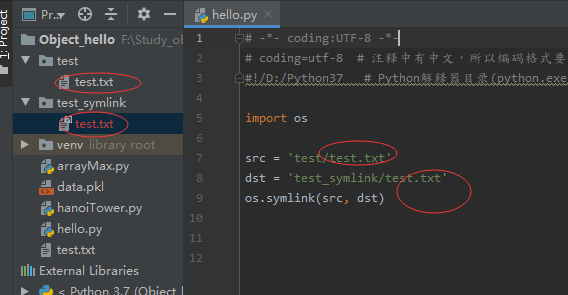

## Python3 OS.symlink()

os.symlink() 方法用于创建一个**软链接(对一个文件的间接指针，也就是windows的快捷方式)**。

```python
os.symlink(src, dst)
``` 
* src -- 源地址。
* dst -- 目标地址。
* 返回值 -- 该方法没有返回值。

```python
import os

src = 'test/test.txt'
dst = 'test_symlink/test.txt'
os.symlink(src, dst)
```


