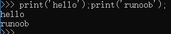
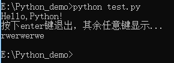
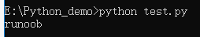
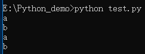
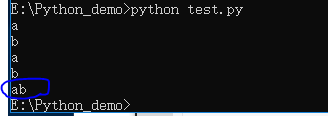
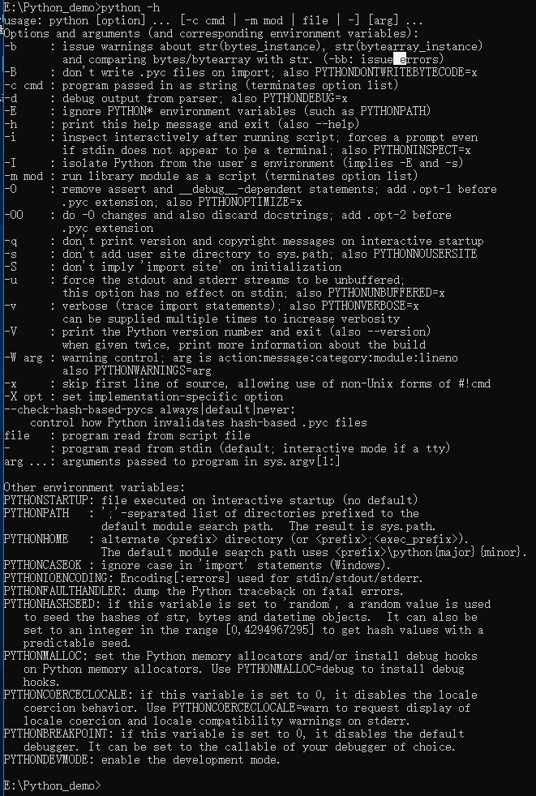
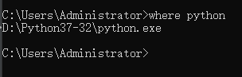

## Python基础语法

## 编码

默认情况下，Python 3 源码文件以 UTF-8 编码，所有字符串都是 unicode 字符串。 当然你也可以为源码文件指定不同的编码：
```
# -*- coding: cp-1252 -*-
# coding=cp-1252
```
binary英 /'baɪnərɪ/ 美 /'baɪnəri/  adj. [数] 二进制的；二元的，二态的 复数 binaries

## Python 标识符

在 Python 里，标识符由字母、数字、下划线组成。

在 Python 中，所有标识符可以包括英文、数字以及下划线(_)，但不能以数字开头。

Python 中的标识符是区分大小写的。

以下划线开头的标识符是有特殊意义的。
以单下划线开头 _foo 的代表不能直接访问的类属性，需通过类提供的接口进行访问，不能用 from xxx import * 而导入。
以双下划线开头的 __foo 代表类的私有成员，以双下划线开头和结尾的 __foo__ 代表 Python 里特殊方法专用的标识，如 __init__() 代表类的构造函数。

Python 可以同一行显示多条语句，方法是用分号 ; 分开，如：
```
print 'hello';print 'runoob';
```


## Python 保留字符
下面的列表显示了在Python中的保留字。这些保留字不能用作常数或变数，或任何其他标识符名称。所有 Python 的关键字只包含小写字母。

| and | exec | not |
| :-: |
| assert | finally | or |
| break | for | pass |
| class | feom | print |
| continue | globle | raise |
| def | if | return |
| del | inport | try |
| elif | in | while |
| else | is | with |
| except | lambdm | yield |

assert英 /ə'sɜːt/ 美 /ə'sɝt/  vt. 维护，坚持；断言；主张；声称

finally英 /'faɪnəlɪ/ 美 /'faɪnlɪ/ adv. 最后；终于；决定性地

exec英 /ɪg'zek; eg-/  n. 执行，执行程序；主任参谋，副舰长 abbr. 实行（execute）；实行（executive）

pass英 /pɑːs/  美 /pæs/ n. 及格；经过；护照；途径；传球 vi. 经过；传递；变化；终止 vt. 通过；经过；传递

lambda英 /'læmdə/ 美 /'læmdə/ n. 希腊字母的第11个   匿名函数 (大写∧	 小写λ /'læmdə/ lambda	拉姆达 波长、体积、导热系数 普朗克常数)

print英 /prɪnt/ 美 /prɪnt/n. 印刷业；印花布；印刷字体；印章；印记vt. 印刷；打印；刊载；用印刷体写；在…印花样 vi. 印刷；出版；用印刷体写

raise英 /reɪz/ 美 /rez/ vt. 提高；筹集；养育；升起 vi. 上升 n. 高地；上升；加薪

yield英 /jiːld/ 美 /jild/ vt. 屈服；出产，产生；放弃 vi. 屈服，投降 n. 产量；收益

while英 /waɪl/ 美 /hwaɪl/ conj. 虽然；然而；当……的时候n. 一会儿；一段时间vt. 消磨；轻松地度过 过去式 whiled过去分词 whiled现在分词 whiling

## 多行语句

Python语句中一般以新行作为语句的结束符。

但是我们可以使用斜杠（ \）将一行的语句分为多行显示，如下所示：
```
total = item_one + \
		item_two + \
		item_three + \
```
语句中包含 [], {} 或 () 括号就不需要使用多行连接符。如下实例：
```
days = [‘Monday’, ’Tuesday’,‘Wednesday’,
	   ‘Thursday’, ‘Friday’]
```

## Python 引号

Python 可以使用引号( ' )、双引号( " )、三引号( ''' 或 """ ) 来表示字符串，引号的开始与结束必须的相同类型的。 
其中三引号可以由多行组成，编写多行文本的快捷语法，常用于文档字符串，在文件的特定地点，被当做注释。
```
word = ‘word’
sentence = “这是一个句子。”
paragraph = '''这是一个段落。
			包含了多个语句'''
paragraph = “””这是一个段落。
			包含了多个语句”””
```

## Python注释

python中单行注释采用 # 开头。
```
#!/D:/Python37-32
# -*- coding: UTF-8 -*-
#coding=utf-8
# 文件名: test.py

#第一个注释
print(‘Hello,Python!’)
```

注释可以在语句或表达式行末：

```
name = “	Madiseti” #这是一个注释
```

name = “	Madiseti” #这是一个注释
```
#!/D:/Python37-32
# -*- coding: UFT-8 -*-
# coding=utf-8
# 文件名: test.py

‘’’
这是多行注释，使用单引号。
这是多行注释，使用单引号。
这是多行注释，使用单引号。
‘’’

“””
这是多行注释，使用双引号。
这是多行注释，使用双引号。
这是多行注释，使用双引号。
“””
```

## Python空行

函数之间或类的方法之间用空行分隔，表示一段新的代码的开始。类和函数入口之间也用一行空行分隔，以突出函数入口的开始。

空行与代码缩进不同，空行并不是Python语法的一部分。书写时不插入空行，Python解释器运行也不会出错。但是空行的作用在于分隔两段不同功能或含义的代码，便于日后代码的维护或重构。

记住：空行也是程序代码的一部分。

```
#!/D:/Python37-32
# -*- coding:UTF-8 -*-
#coding=utf-8

input(“按下enter键退出，其余任意键显示...\n”)
#使用input(“按下enter键退出，其余任意键显示...\n”)
```

Python3将raw_input和input进行整合成了input....去除了raw_input()函数，其接受任意输入, 将所有输入默认为字符串处理,并返回字符串类型

以上代码中 ，\n 实现换行。一旦用户按下 enter(回车) 键退出，其它键显示。

## 同一行显示多条语句

Python可以在同一行中使用多条语句，语句之间使用分号(;)分割，以下是一个简单的实例：
```
#!/D:/Python37-32
import sys; x = ‘runoob’; sys.stdout.write(x + ‘\n’)
# sys 该模块提供对解释器使用或维护的一些变量的访问
```


import导入 英 /ɪm'pɔːt; 'ɪm-/ 美 /'ɪmpɔt/ n. 进口，进口货；输入；意思，含义；重要性 vt. 输入，进口；含…的意思 vi. 输入，进口


## Print 输出

print 默认输出是换行的，如果要实现不换行需要在变量末尾加上逗号 ,
```
#!/D:/Python37-32
# -*- coding:UTF-8 -*-
#coding=utf-8

x = ‘a’
x = ‘b’

#换行输出
print(x)
print(y)
'''
  Python 2.x下的print语句在输出字符串之后会默认换行，如果不希望换行，只要在语句最后加一个“，”即可。但是在Python 3.x下，print()变成内置函数，加“，”的老方法就行不通了。
  
  查询Python的Library Reference>Built-in Functions，找到如下条目：
    print([object, ...], *, sep=' ', end='\n', file=sys.stdou)

    其中，sep=''和end='\n'均是print()的关键参数，sep的默认值为空，end默认值为换行符，这就是print()在输出后默认换行的原因。相应的，解决办法就是对end赋值：print(something, something,.., end=' ')，使end值为空，这个换行就消除了。
'''

#不换行输出
print(x,end=’’)
print(y,end=’’)

```



## 多个语句构成代码组

缩进相同的一组语句构成一个代码块，我们称之代码组。

像if、while、def和class这样的复合语句，首行以关键字开始，以冒号( : )结束，该行之后的一行或多行代码构成代码组。

我们将首行及后面的代码组称为一个子句(clause)。

如下实例：
```
if expression
    suite
elif expression
    suite
else
    suite
```
expression英 /ɪkˈspreʃn/ 美 /ɪk'sprɛʃən/  n. 表现，表示，表达；表情，脸色，态度，腔调，声调；式，符号；词句，语句，措辞，说法
suite英 /swiːt/ 美 /sut; swit/  n. （一套）家具；套房；组曲；（一批）随员，随从

## 命令行参数

很多程序可以执行一些操作来查看一些基本信息，Python 可以使用 -h 参数查看各参数帮助信息：

```
$ python -h 
usage: python [option] ... [-c cmd | -m mod | file | -] [arg] ... 
Options and arguments (and corresponding environment variables): 
-c cmd : program passed in as string (terminates option list) 
-d     : debug output from parser (also PYTHONDEBUG=x) 
-E     : ignore environment variables (such as PYTHONPATH) 
-h     : print this help message and exit 
 [ etc. ] 
```


我们在使用脚本形式执行 Python 时，可以接收命令行输入的参数，具体使用可以参照 Python 命令行参数。

## 查看python解释器目录

```
import sys
print(sys.excutable)
```


```
where python
```


excutable 可执行

```
help()
```


按下 :q 两个按键即退出说明文档 或者 'ctrl + c'退出