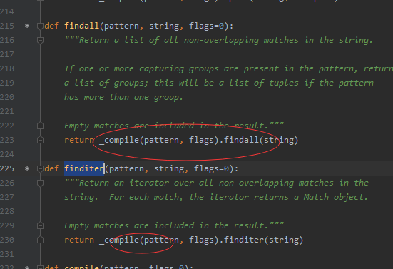

## Python3 正则表达式

正则表达式是一个特殊的字符序列，它能帮助你方便的检查一个字符串是否与某种模式匹配。

Python 自1.5版本起增加了re 模块，它提供 Perl 风格的正则表达式模式。

re 模块使 Python 语言拥有全部的正则表达式功能。

---
## re.match函数

re.match 尝试从字符串的起始位置**匹配一个模式**，如果不是起始位置匹配成功的话，match()就返回none。
```python
re.match(pattern, string, flags=0)
```
* pattern	匹配的正则表达式
* string	要匹配的字符串。
* flags	    标志位，用于控制正则表达式的匹配方式，如：是否区分大小写，多行匹配等等。

pattern 英 /ˈpætn/  美 /ˈpætərn/ n. 模式；图案；样品 vt. 模仿；以图案装饰 vi. 形成图案

我们可以使用group(num) 或 groups() 匹配对象函数来获取匹配表达式。
* group(num=0)	匹配的整个表达式的字符串，group() 可以一次输入多个组号，在这种情况下它将返回一个包含那些组所对应值的元组。
* groups()	返回一个包含所有小组字符串的元组，从 1 到 所含的小组号。

```python
import re

line = "Cats are smarter than dogs"

# .* 表示任意匹配除换行符（\n、\r）之外的任何单个或多个字符
matchObj = re.match(r'(.*) are (.*?) .*', line, re.M | re.I)

if matchObj:
    print('matchObj.groups():', matchObj.groups())
    print('matchObj.group():', matchObj.group())
    print('matchObj.group():', matchObj.group(1))
    print('matchObj.group():', matchObj.group(2))
else:
    print('No Match!')
    
'''
输出：
matchObj.groups(): ('Cats', 'smarter')
matchObj.group(): Cats are smarter than dogs
matchObj.group(): Cats
matchObj.group(): smarter
'''
```

* re.I 忽略大小写
* re.L 表示特殊字符集 \w, \W, \b, \B, \s, \S 依赖于当前环境
* re.M 多行模式
* re.S 即为' . '并且包括换行符在内的任意字符（' . '不包括换行符）
* re.U 表示特殊字符集 \w, \W, \b, \B, \d, \D, \s, \S 依赖于 Unicode 字符属性数据库
* re.X 为了增加可读性，忽略空格和' # '后面的注释


---
## re.search方法

re.search 扫描整个字符串并返回第一个成功的匹配。

```python
re.search(pattern, string, flags=0)
```
* pattern	匹配的正则表达式
* string	要匹配的字符串。
* flags	标志位，用于控制正则表达式的匹配方式，如：是否区分大小写，多行匹配等等。

匹配成功re.search方法返回**一个匹配的对象**，否则返回None。

我们可以使用group(num) 或 groups() 匹配对象函数来获取匹配表达式。
* group(num=0)	匹配的整个表达式的字符串，group() 可以一次输入多个组号，在这种情况下它将返回一个包含那些组所对应值的元组。
* groups()	返回一个包含所有小组字符串的元组，从 1 到 所含的小组号。

```python
import re

line = "Cats are smarter than dogs"

# .* 表示任意匹配除换行符（\n、\r）之外的任何单个或多个字符
searchObj = re.search(r'(.*) are (.*?) .*', line, re.M | re.I)

if searchObj:
    print('searchObj.groups():', searchObj.groups())
    print('searchObj.group():', searchObj.group())
    print('searchObj.group():', searchObj.group(1))
    print('searchObj.group():', searchObj.group(2))
else:
    print('No Match!')
    
'''
输出：
searchObj.groups(): ('Cats', 'smarter')
searchObj.group(): Cats are smarter than dogs
searchObj.group(): Cats
searchObj.group(): smarter
'''
```

* re.I 忽略大小写
* re.L 表示特殊字符集 \w, \W, \b, \B, \s, \S 依赖于当前环境
* re.M 多行模式
* re.S 即为' . '并且包括换行符在内的任意字符（' . '不包括换行符）
* re.U 表示特殊字符集 \w, \W, \b, \B, \d, \D, \s, \S 依赖于 Unicode 字符属性数据库
* re.X 为了增加可读性，忽略空格和' # '后面的注释

---
## 检索和替换

Python 的re模块提供了re.sub用于替换字符串中的匹配项。
```python
re.sub(pattern, repl, string, count=0, flags=0)
```
* pattern(必选) : 正则中的模式字符串。
* repl(必选) : 替换的字符串，也可为一个函数。
* string(必选) : 要被查找替换的原始字符串。
* count(可选) : 模式匹配后替换的最大次数，默认 0 表示替换所有的匹配。
* flags(可选) : 编译时用的匹配模式，数字形式。


```python
import re

phone = "2004-959-559 # 这是一个电话号码"

# 删除注释
num = re.sub(r'#.*$', "", phone)
print("电话号码 : ", num)

# 移除非数字的内容
# \D-匹配任意非数字
num = re.sub(r'\D', "", phone)
print("电话号码 : ", num)
'''
输出：
电话号码 :  2004-959-559 
电话号码 :  2004959559
'''
```

---
## repl 参数是一个函数

```python
import re

def double(matched):
    value = int(matched.group('value'))
    return str(value * 2)

s = 'A23G4HFD567'
print(re.sub('(?P<value>\d+)', double, s)) #输出：A46G8HFD1134
```

---
## compile  参数是一个函数(尽量不要使用compile函数)

**尽量不要使用compile函数解释**

re.match()或者re.serch()的模块的层函数都会return compile()


它会自动储存最多512条由type(pattern), pattern, flags)组成的Key，只要是同一个正则表达式，同一个flag，那么调用两次_compile时，第二次会直接读取缓存。如果直接使用compile()函数会每次都调用。


**compile 函数用于编译正则表达式，生成一个正则表达式（ Pattern ）对象，供 match() 和 search() 这两个函数使用。**

```python
re.compile(pattern[, flags])
```

pattern : 一个字符串形式的正则表达式
flags 可选，表示匹配模式，比如忽略大小写，多行模式等，具体参数为：
re.I 忽略大小写
re.L 表示特殊字符集 \w, \W, \b, \B, \s, \S 依赖于当前环境
re.M 多行模式
re.S 即为' . '并且包括换行符在内的任意字符（' . '不包括换行符）
re.U 表示特殊字符集 \w, \W, \b, \B, \d, \D, \s, \S 依赖于 Unicode 字符属性数据库
re.X 为了增加可读性，忽略空格和' # '后面的注释

```python
import re

pattern = re.compile(r'\d+') # 用于匹配至少一个数字
m = pattern.match('one12twothree34four')        # 查找头部，没有匹配
print(m)

m = pattern.match('one12twothree34four', 2, 10)        # 查找头部，没有匹配
print(m)

m = pattern.match('one12twothree34four', 3, 10)        # 查找头部，没有匹配
print(m)
print(m.group(0)) # 可省略 0
print(m.start(0)) # 可省略 0
print(m.end(0)) # 可省略 0
print(m.span(0)) # 可省略 0

'''
输出：
None
None
<re.Match object; span=(3, 5), match='12'>
12
3
5
(3, 5)
'''
````

* group([group1, …]) 方法用于获得一个或多个分组匹配的字符串，当要获得整个匹配的子串时，可直接使用 group() 或 group(0)；
* start([group]) 方法用于获取分组匹配的子串在整个字符串中的**起始位置**（子串第一个字符的索引），参数默认值为 0；
* end([group]) 方法用于获取分组匹配的子串在整个字符串中的**结束位置**（子串最后一个字符的索引+1），参数默认值为 0；
* span([group]) 方法返回 (start(group), end(group))。


---
## findall

在字符串中找到正则表达式所匹配的所有子串，并返回一个列表，如果没有找到匹配的，则返回空列表。

注意： match 和 search 是匹配一次 findall 匹配所有。

```python
re.findall(string[, pos[, endpos]])
```

* string 待匹配的字符串。
* pos 可选参数，指定字符串的起始位置，默认为 0。
* endpos 可选参数，指定字符串的结束位置，默认为字符串的长度。

```python
import re

pattern = re.compile(r'\d+') # 用于匹配至少一个数字
result1 = pattern.findall('runoob 123 google 456')
print(result1)
result2 = pattern.findall('run88oob123google456', 0, 10)
print(result2)

'''
输出：
['123', '456']
['88', '12']
'''
```

---
## re.finditer

和 findall 类似，在字符串中找到正则表达式所匹配的所有子串，并把它们作为一个迭代器返回。

```python
re.finditer(pattern, string, flags=0)
```

* pattern	匹配的正则表达式
* string	要匹配的字符串。
* flags	标志位，用于控制正则表达式的匹配方式，如：是否区分大小写，多行匹配等等。

```python
import re
# \d+匹配多个数字
it = re.finditer(r'\d+', '12a32bc43jf3')
for match in it:
    print(match.group())
    
'''
输出：
12
32
43
3
'''
```

---
## re.split

split 方法按照能够匹配的子串将字符串分割后返回列表，它的使用形式如下：

```python
re.split(pattern, string[, maxsplit=0, flags=0])
```
* pattern	匹配的正则表达式
* string	要匹配的字符串。
* maxsplit	分隔次数，maxsplit=1 分隔一次，默认为 0，不限制次数。
* flags	标志位，用于控制正则表达式的匹配方式，如：是否区分大小写，多行匹配等等。


```python
import re
# \W+匹配字母
print(re.split('\W+', 'runoob, runoob, runoob.'))
print(re.split('(\W+)', 'runoob, runoob, runoob.'))
print(re.split('\W+', 'runoob, runoob, runoob.', 1))
print(re.split('a*', 'hello world', 1))  # 对于一个找不到匹配的字符串而言，split 不会对其作出分割

'''
输出：
['runoob', 'runoob', 'runoob', '']
['runoob', ', ', 'runoob', ', ', 'runoob', '.', '']
['runoob', 'runoob, runoob.']
['', 'hello world']
'''
```

---
## 正则表达式对象

**re.RegexObject**
> 
re.compile() 返回 RegexObject 对象。

**re.MatchObject**
> 
group() 返回被 RE 匹配的字符串。
start() 返回匹配开始的位置
end() 返回匹配结束的位置
span() 返回一个元组包含匹配 (开始,结束) 的位置

---
## 正则表达式修饰符 - 可选标志

正则表达式可以包含一些可选标志修饰符来控制匹配的模式。修饰符被指定为一个可选的标志。多个标志可以通过按位 OR(|) 它们来指定。如 re.I | re.M 被设置成 I 和 M 标志：

* re.I	使匹配对大小写不敏感
* re.L	做本地化识别（locale-aware）匹配
* re.M	多行匹配，影响 ^ 和 $
* re.S	使 . 匹配包括换行在内的所有字符
* re.U	根据Unicode字符集解析字符。这个标志影响 \w, \W, \b, \B.
* re.X	该标志通过给予你更灵活的格式以便你将正则表达式写得更易于理解。


---
## 正则表达式模式,详细查看外部正则表达式文件夹
