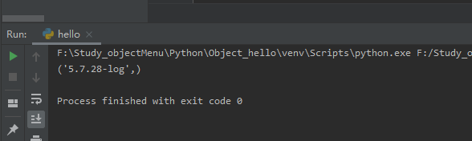

## Python 操作 MySQL 数据库

Python 标准数据库接口为 Python DB-API，Python DB-API为开发人员提供了数据库应用编程接口。

Python 数据库接口支持非常多的数据库，你可以选择适合你项目的数据库：
* GadFly
* mSQL
* MySQL
* PostgreSQL
* Microsoft SQL Server 2000
* Informix
* Interbase
* Oracle
* Sybase


Python DB-API使用流程：
* 引入 API 模块。
* 获取与数据库的连接。
* 执行SQL语句和存储过程。
* 关闭数据库连接。


## 如何安装使用pymysql(py3之前的叫法MySQLdb)?

```python
pip install pymysql
```

```python
import pymysql
```

## 数据库连接

```python
import pymysql

# 打开数据库连接
# db = pymysql.connect('localhost', 'root', 'root', 'study_sql', 3306, charset='utf8')
# 或者
db = pymysql.connect(host='localhost', user='root', password='root', database='study_sql', port=3306, charset='utf8')

# 使用cursor()方法获取操作游标
cursor = db.cursor()

# 使用execute方法执行SQL语句
cursor.execute("SELECT VERSION()")

# 使用 fetchone() 方法获取一条数据
data = cursor.fetchone()

print(data)

# 关闭数据库连接
db.close()
```



Python查询Mysql使用 fetchone() 方法获取单条数据, 使用fetchall() 方法获取多条数据。
* fetchone(): 该方法获取下一个查询结果集。结果集是一个对象
* fetchall():接收全部的返回结果行.
* rowcount: 这是一个只读属性，并返回执行execute()方法后影响的行数。

pymysql.connect()使用参数，也就是class Connection的_构造方法_init__(self, 参数)的参数

```python
 def __init__(self, host=None, user=None, password="",
                 database=None, port=0, unix_socket=None,
                 charset='', sql_mode=None,
                 read_default_file=None, conv=None, use_unicode=None,
                 client_flag=0, cursorclass=Cursor, init_command=None,
                 connect_timeout=10, ssl=None, read_default_group=None,
                 compress=None, named_pipe=None,
                 autocommit=False, db=None, passwd=None, local_infile=False,
                 max_allowed_packet=16*1024*1024, defer_connect=False,
                 auth_plugin_map=None, read_timeout=None, write_timeout=None,
                 bind_address=None, binary_prefix=False, program_name=None,
                 server_public_key=None):
```

## 数据库插入操作

```python
import pymysql

# 打开数据库连接
# db = pymysql.connect('localhost', 'root', 'root', 'study_sql', 3306, charset='utf8')
# 或者
db = pymysql.connect(host='localhost', user='root', password='root', database='study_sql', port=3306, charset='utf8')

# 使用cursor()方法获取操作游标
cursor = db.cursor()

# SQL 插入语句
sql = '''insert into persons (firstName, lastName) values ('test_name', 'test_name');'''

try:
   # 执行sql语句
   cursor.execute(sql)
   # 提交到数据库执行
   db.commit()
except:
   # Rollback in case there is any error
   db.rollback()

# 关闭数据库连接
db.close()
```


## 执行事务

事务机制可以确保数据一致性。

事务应该具有4个属性：原子性、一致性、隔离性、持久性。这四个属性通常称为ACID特性。

* 原子性（atomicity）。一个事务是一个不可分割的工作单位，事务中包括的诸操作要么都做，要么都不做。
* 一致性（consistency）。事务必须是使数据库从一个一致性状态变到另一个一致性状态。一致性与原子性是密切相关的。
* 隔离性（isolation）。一个事务的执行不能被其他事务干扰。即一个事务内部的操作及使用的数据对并发的其他事务是隔离的，并发执行的各个事务之间不能互相干扰。
* 持久性（durability）。持续性也称永久性（permanence），指一个事务一旦提交，它对数据库中数据的改变就应该是永久性的。接下来的其他操作或故障不应该对其有任何影响。

Python DB API 2.0 的事务提供了两个方法 commit 或 rollback。

```python
# SQL删除记录语句
sql = ''
try:
   # 执行SQL语句
   cursor.execute(sql)
   # 向数据库提交
   db.commit()
except:
   # 发生错误时回滚
   db.rollback()
```

对于支持事务的数据库， 在Python数据库编程中，当游标建立之时，就自动开始了一个隐形的数据库事务。

commit()方法游标的所有更新操作，rollback（）方法回滚当前游标的所有操作。每一个方法都开始了一个新的事务。


## 错误处理

| 异常 | 描述 |
| :-: | :-: |
| Warning | 当有严重警告时触发，例如插入数据是被截断等等。必须是 StandardError 的子类。 |
| Error | 警告以外所有其他错误类。必须是 StandardError 的子类。 |
| InterfaceError | 当有数据库接口模块本身的错误（而不是数据库的错误）发生时触发。 必须是Error的子类。 |
| DatabaseError | 和数据库有关的错误发生时触发。 必须是Error的子类。 |
| DataError | 当有数据处理时的错误发生时触发，例如：除零错误，数据超范围等等。 必须是DatabaseError的子类。 |
| OperationalError | 指非用户控制的，而是操作数据库时发生的错误。例如：连接意外断开、 数据库名未找到、事务处理失败、内存分配错误等等操作数据库是发生的错误。 必须是DatabaseError的子类。 |
| IntegrityError | 完整性相关的错误，例如外键检查失败等。必须是DatabaseError子类。 |
| InternalError | 数据库的内部错误，例如游标（cursor）失效了、事务同步失败等等。 必须是DatabaseError子类。 |
| ProgrammingError | 程序错误，例如数据表（table）没找到或已存在、SQL语句语法错误、 参数数量错误等等。必须是DatabaseError的子类。 |
| NotSupportedError | 不支持错误，指使用了数据库不支持的函数或API等。例如在连接对象上 使用.rollback()函数，然而数据库并不支持事务或者事务已关闭。 必须是DatabaseError的子类。 |

Internal 英 /ɪnˈtɜːnl/  美 /ɪnˈtɜːrnl/ adj. 内部的；体内的；（机构）内部的；国内的；本身的；内心的；（大学生）本校生的 n. 内脏；内部特征

Integrity 英 /ɪnˈteɡrəti/  美 /ɪnˈteɡrəti/ n. 完整；正直；诚实；廉正 复数 integrities
