## Python3 基本数据类型

变量存储在内存中的值。这就意味着在创建变量时会在内存中开辟一个空间。
基于变量的数据类型，解释器会分配指定内存，并决定什么数据可以被存储在内存中。
因此，变量可以指定不同的数据类型，这些变量可以存储整数，小数或字符。

## 变量赋值

Python 中的变量赋值不需要类型声明。
每个变量在内存中创建，都包括变量的标识，名称和数据这些信息。
每个变量在使用前都必须赋值，变量赋值以后该变量才会被创建。
等号（=）用来给变量赋值。 
等号（=）运算符左边是一个变量名,等号（=）运算符右边是存储在变量中的值。例如：

注：python3 查看解释器和包安装路径

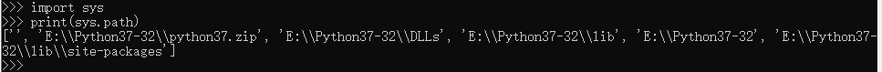

```
#-*- coding:UTF-8 -*-
#coding=utf-8  #注释中有中文，所以编码格式要放在上面，不然无法报错无法读取中文
#!/D:/Python37-32   # Python解释器目录(python.exe所在目录)
#!/usr/bin/env python
'''
    env python会去环境设置寻找 python 目录,推荐这种写法 
    linux环境中，env表示查看环境变量
'''

counter = 100  # 整型
miles = 1000.0 # 浮点型
Name = ‘john’ # 字符型

Print(counter)
Print(miles)
Print(name）
```

miles /mailz/ n. 英里（1英里约合1609米，mile的复数形式）

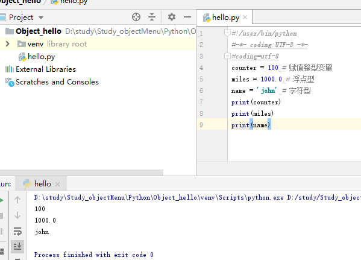

## 多个变量赋值

Python允许你同时为多个变量赋值。例如：
```
a = b = c = 1
```
以上实例，创建一个整型对象，值为1，三个变量被分配到相同的内存空间上。您也可以为多个对象指定多个变量。例如：
```
A, b, c = 1, 2, 'john'
```

以上实例，两个整型对象 1 和 2 分别分配给变量 a 和 b，字符串对象 "john" 分配给变量 c。

## 标准数据类型

在内存中存储的数据可以有多种类型。

例如，一个人的年龄可以用数字来存储，他的名字可以用字符来存储。

Python 定义了一些标准类型，用于存储各种类型的数据。

Python有五个标准的数据类型：
* Number（数字）
* String（字符串）
* List（列表）
* Tuple（元组）
* Dictionary（字典）

tupel 英 /tjʊpəl; ˈtʌpəl/  美 /ˈtjʊpəl; ˈtʌpəl/  n. [计] 元组，重数
dictionary 英 /'dɪkʃ(ə)n(ə)rɪ/  美 /'dɪkʃə'nɛri/ n. 字典；词典 复数 dictionaries

Python3 的六个标准数据类型中：

不可变数据（3 个）：Number（数字）、String（字符串）、Tuple（元组）；
可变数据（3 个）：List（列表）、Dictionary（字典）、Set（集合）。

## Number（数字）

Python3 支持 int、float、bool、complex（复数）。

在Python 3里，只有一种整数类型 int，表示为长整型，没有 python2 中的 Long。

像大多数语言一样，数值类型的赋值和计算都是很直观的。

内置的 type() 函数可以用来查询变量所指的对象类型。
```
>>> a, b, c, d = 20, 5.5, True, 4+3j
>>> print(type(a), type(b), type(c), type(d))
<class 'int'> <class 'float'> <class 'bool'> <class 'complex'>
```


此外还可以用 isinstance 来判断：

instance 英 /'ɪnst(ə)ns/  美 /'ɪnstəns/ n. 实例；情况；建议 vt. 举...为例 过去式 instanced过去分词 instanced现在分词 instancing

```
a = 11
isinstance(a, int)
```
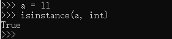

isinstance 和 type 的区别在于：
* type()不会认为子类是一种父类类型。
* isinstance()会认为子类是一种父类类型。


注意：在 Python2 中是没有布尔型的，它用数字 0 表示 False，用 1 表示 True。到 Python3 中，把 True 和 False 定义成关键字了，但它们的值还是 1 和 0，它们可以和数字相加。

当你指定一个值时，Number 对象就会被创建：
```
var1 = 1
var2 = 2
```
您也可以使用del语句删除一些对象引用。

del语句的语法是：
```
del var1[, var2[..., varN]]
```
您可以通过使用del语句删除单个或多个对象。例如：
```
del var
del var_a, var_b
```

### 数值运算
```
>>5 + 4  # 加法
9
>>> 4.3 - 2 # 减法
2.3
>>> 3 * 7  # 乘法
21
>>> 2 / 4  # 除法，得到一个浮点数
0.5
>>> 2 // 4 # 除法，得到一个整数
0
>>> 17 % 3 # 取余 
2
>>> 2 ** 5 # 乘方
32
```

注意：

1、Python可以同时为多个变量赋值，如a, b = 1, 2。
2、一个变量可以通过赋值指向不同类型的对象。
3、数值的除法包含两个运算符：/ 返回一个浮点数，// 返回一个整数。
4、在混合计算时，Python会把整型转换成为浮点数。

### 数值类型实例

| int | float | complex |
| :-: |
| 10 | 0.0 | 3.14j |
| 100 | 15.20 | 45.j |
| -786 | -21.9 | 9.322e-36j |
| 080 | 32.3e+18 | .876j |
| -0490 | -90 | -.6545 + 0j |
| -0x260 | -32.54e100 | 3e+26j |
| 0x69 | 70.2E-12 | 4.53e-7j |

Python还支持复数，复数由实数部分和虚数部分构成，可以用a + bj,或者complex(a,b)表示， 复数的实部a和虚部b都是浮点型

## String（字符串）

Python中的字符串用单引号 ' 或双引号 " 括起来，同时使用反斜杠 \ 转义特殊字符。

字符串的截取的语法格式如下：
```
变量[又下标:尾下标]
```
索引值以 0 为开始值，-1 为从末尾的开始位置，-x超过字符长度又从头开始计数


加号 + 是字符串的连接符， 星号 * 表示复制当前字符串，紧跟的数字为复制的次数。实例如下：
```
# -*- coding: UTF-8 -*-
# coding=utf-8

str = 'Runoob'

print(str) # 输出字符串
print(str[0:-1])  # 输出第一个到倒数第二个的所有字符
print(str[0])  # 输出字符串第一个字符
print(str[2:5]) # 输出从第三个开始到第五个的字符
print(str[2:]) # 输出从第三个开始的后的所有字符
print(str * 2) # 输出字符串两次
print(str + 'TEST') # 连接列表
```
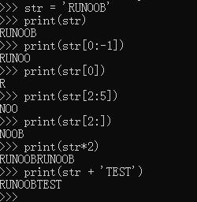

Python 使用反斜杠(\)转义特殊字符，如果你不想让反斜杠发生转义，可以在字符串前面添加一个 r，表示原始字符串：
```
print('Ru\noob')
Ru
print(r'Ru\noob')
Ru\noob
```
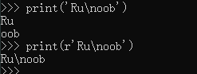

另外，反斜杠(\)可以作为续行符，表示下一行是上一行的延续。也可以使用 """...""" 或者 '''...''' 跨越多行。

注意，Python 没有单独的字符类型，一个字符就是长度为1的字符串。
```
word = 'Python'
>>> print(word[0], word[5])
P n
>>>> print(word[-1], word[-6])
n P
```
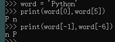

与 C 字符串不同的是，Python 字符串不能被改变。向一个索引位置赋值，比如word[0] = 'm'会导致错误。

注意：
* 1、反斜杠可以用来转义，使用r可以让反斜杠不发生转义。
* 2、字符串可以用+运算符连接在一起，用*运算符重复。
* 3、Python中的字符串有两种索引方式，从左往右以0开始，从右往左以-1开始。
* 4、Python中的字符串不能改变。

## List（列表）

List（列表） 是 Python 中使用最频繁的数据类型。

列表可以完成大多数集合类的数据结构实现。列表中元素的类型可以不相同，它支持数字，字符串甚至可以包含列表（所谓嵌套）。

列表是写在方括号 [] 之间、用逗号分隔开的元素列表。

和字符串一样，列表同样可以被索引和截取，列表被截取后返回一个包含所需元素的新列表。

列表截取的语法格式如下：
```
变量[头下标:尾下标] (不包含尾下标)
```

索引值以 0 为开始值，-1 为从末尾的开始位置。


加号 + 是列表连接运算符，星号 * 是重复操作。如下实例：

tiny 英 /'taɪnɪ/  美 /'taɪni/ adj. 微小的；很少的
n. (Tiny)人名；(葡、印)蒂尼 比较级 tinier最高级 tiniest
```
ist = [ 'abcd', 786 , 2.23, 'runoob', 70.2 ]
tinylist = [123, 'runoob']
 
print (list)            # 输出完整列表
print (list[0])         # 输出列表第一个元素
print (list[1:3])       # 从第二个开始输出到第三个元素
print (list[2:])        # 输出从第三个元素开始的所有元素
print (tinylist * 2)    # 输出两次列表
print (list + tinylist) # 连接列表
```
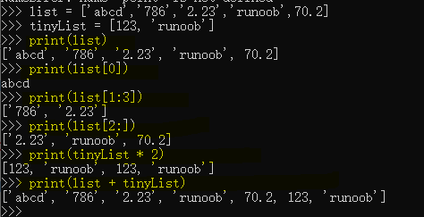

与Python字符串不一样的是，列表中的元素是可以改变的：
```
>>>a = [1, 2, 3, 4, 5, 6]
>>> a[0] = 9
>>> a[2:5] = [13, 14, 15]
>>> a
[9, 2, 13, 14, 15, 6]
>>> a[2:5] = []   # 将对应的元素值设置为 [] 
>>> a
[9, 2, 6]
```
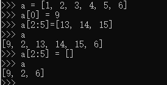

注意：

1、List写在方括号之间，元素用逗号隔开。
2、和字符串一样，list可以被索引和切片。
3、List可以使用+操作符进行拼接。
4、List中的元素是可以改变的。

Python 列表截取可以接收第三个参数，参数作用是截取的步长，以下实例在索引 1 到索引 4 的位置并设置为步长为 2（间隔一个位置）来截取字符串：
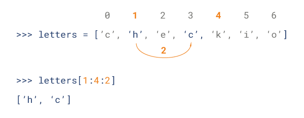
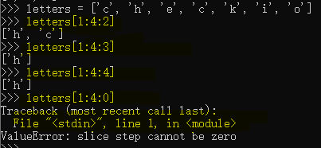

如果第三个参数为负数表示逆向读取，以下实例用于翻转字符串：
```
def reverseWords(input): 
      
    # 通过空格将字符串分隔符，把各个单词分隔为列表
    inputWords = input.split(" ") 
  
    # 翻转字符串
    # 假设列表 list = [1,2,3,4],  
    # list[0]=1, list[1]=2 ，而 -1 表示最后一个元素 list[-1]=4 ( 与 list[3]=4 一样) 
    # inputWords[-1::-1] 有三个参数
    # 第一个参数 -1 表示最后一个元素
    # 第二个参数为空，表示移动到列表末尾
    # 第三个参数为步长，-1 表示逆向
    inputWords=inputWords[-1::-1] 
  
    # 重新组合字符串
    output = ' '.join(inputWords) 
      
    return output 
  
if __name__ == "__main__": 
    input = 'I like runoob'
    rw = reverseWords(input) 
    print(rw)
```

## Tuple（元组）

元组（tuple）与列表类似，不同之处在于元组的元素*不能修改*。元组写在小括号 () 里，元素之间用逗号隔开。

元组中的元素类型也可以不相同：
```
#!/usr/bin/python3
 
tuple = ( 'abcd', 786 , 2.23, 'runoob', 70.2  )
tinytuple = (123, 'runoob')
 
print (tuple)             # 输出完整元组
print (tuple[0])          # 输出元组的第一个元素
print (tuple[1:3])        # 输出从第二个元素开始到第三个元素
print (tuple[2:])         # 输出从第三个元素开始的所有元素
print (tinytuple * 2)     # 输出两次元组
print (tuple + tinytuple) # 连接元组
```
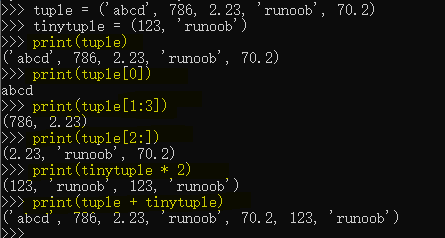

元组与字符串类似，可以被索引且下标索引从0开始，-1 为从末尾开始的位置。也可以进行截取（看上面，这里不再赘述）。

其实，可以把字符串看作一种特殊的元组。
```
>>>tup = (1, 2, 3, 4, 5, 6)
>>> tup[0] = 11  # 修改元组元素的操作是非法的
```
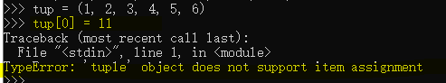

虽然tuple的元素不可改变，但它可以包含可变的对象，比如list列表。

构造包含 0 个或 1 个元素的元组比较特殊，所以有一些额外的语法规则：
```
tup1 = ()    # 空元组
tup2 = (20,) # 一个元素，需要在元素后添加逗号
```

*string、list 和 tuple 都属于 sequence（序列）。*

sequence 英 /'siːkw(ə)ns/  美 /'sikwəns/ n. [数][计] 序列；顺序；续发事件 vt. 按顺序排好 过去式 sequenced过去分词 sequenced现在分词 sequencing

注意：

1、与字符串一样，元组的元素不能修改。
2、元组也可以被索引和切片，方法一样。
3、注意构造包含 0 或 1 个元素的元组的特殊语法规则。
4、元组也可以使用+操作符进行拼接。

## Set（集合）

集合（set）是由一个或数个形态各异的大小整体组成的，构成集合的事物或对象称作元素或是成员。

基本功能是进行成员关系测试和删除重复元素。

可以使用大括号 { } 或者 set() 函数创建集合，注意：创建一个空集合必须用 set() 而不是 { }，因为 { } 是用来创建一个空字典。

创建格式：

```
parame = {value01, value02, ...}
或者
set(value)
```

实例

```
# !E:/softwareDirectory/Python37 #文件目录
# -*- coding: UTF-8 -*-
# coding=utf-8

student = {'Tom', 'jim', 'mary', 'Tom', 'Jack', 'Rose'}
print(student)

# 成员测试
if 'Rose' in student:
    print('Rose 在集合中')
else:
    print('Rose 不在集合中')

# set可以进行集合运算
a = set('abracadabra')
b = set('alacazam')

print('a集合', a)
print('a 和 b 的差集', a - b)  # 差集就是a中比b多余的元素
print('a 和 b 的并集', a | b)
print('a 和 b 的交集', a & b)
print('a 和 b 中不同时存在的元素', a ^ b)
```
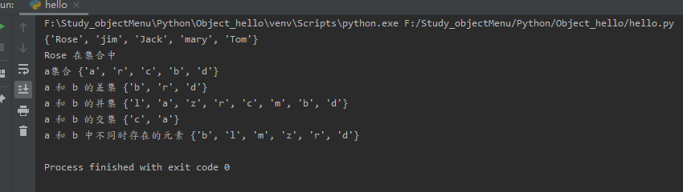

## Dictionary（字典）(类似js的对象)

字典（dictionary）是Python中另一个非常有用的内置数据类型。

列表是有序的对象集合，字典是无序的对象集合。两者之间的区别在于：字典当中的元素是通过键来存取的，而不是通过偏移存取。

字典是一种映射类型，字典用 { } 标识，它是一个无序的 键(key) : 值(value) 的集合。

键(key)必须使用不可变类型。

在同一个字典中，键(key)必须是唯一的。

```
# !E:/softwareDirectory/Python37 #文件目录
# -*- coding: UTF-8 -*-
# coding=utf-8

dict = {}
dict['one'] = '1 - 菜鸟教程'
dict[2] = '2 - 菜鸟工具'

tinydict = {'name': 'runoob', 'code': 1, 'site': 'www.runoob.com'}

print('输出键为 "one" 的值', dict['one'])
print('输出键为 2 的值', dict[2])
print('输出完整的字典', tinydict)
print('输出所有键', tinydict.keys())
print('输出所有值', tinydict.values())
```


构造函数 dict() 可以直接从键值对序列中构建字典如下：
```
dict1 = dict([('runoob', 1), ('google', 2), ('taobao', 3)])  # 列表里面包含元祖类型
print(dict1)

dict2 = {x: x**2 for x in (2, 4, 6)}  # 字典类型
print(dict2)

dict3 = dict(runoob = 1, google = 2, taobao = 3) #元素类型
print(dict3)
```
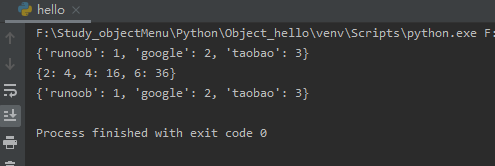

另外，字典类型也有一些内置的函数，例如clear()、keys()、values()等。

注意：

1、字典是一种映射类型，它的元素是键值对。
2、字典的关键字必须为不可变类型，且不能重复。
3、创建空字典使用 { }。

## Python数据类型转换

### int()函数
* int() 函数用于将一个字符串或数字转换为整型。
```
class int(x, base=10)
```
* x -- 字符串或数字。
* base -- 进制数，默认十进制。

* 返回值: 返回整型数据。
```
print(int()) # 0  # 不传入参数时，得到结果0

print(int(3)) # 3

print(int(3.6)) # 3

print(int('12', 16)) # 18

print(int('0xa', 16)) # 10

print(int('10', 8)) # 8
```

* 0x16进制 0二进制


### float()函数
* float() 函数用于将整数和字符串转换成浮点数。
```
class float([x])
```
* x -- 整数或字符串
* 返回值: 返回浮点数。
```
print(float(1))  # 1.0
print(float(112))  # 112.0
print(float(-123.6))  # -123.6
print(float('123'))  # 123.0
```

### complex()函数(复数 = 实部 + 虚部)
* complex() 函数用于创建一个值为 real + imag * j 的复数或者转化一个字符串或数为复数。如果第一个参数为字符串，则不需要指定第二个参数。。

complex 英 /ˈkɒmpleks/  美 /kəmˈpleks,ˈkɑːmpleks/  adj. 复杂的；合成的 n. 复合体；综合设施 比较级 more complex最高级 most complex复数 complexes
real 英 /ˈriːəl; rɪəl/  美 /ˈriːəl/ adj. 实际的；真实的；实在的 adv. 真正地；确实地 n. 现实；实数
imag 复数虚部 n. 复数虚部；图像放大 

```
class complex([real[, imag]])
```
* real -- int, long, float或字符串；
* imag -- int, long, float；
* 返回值: 返回一个复数。

```
# !E:/softwareDirectory/Python37 #文件目录
# -*- coding: UTF-8 -*-
# coding=utf-8

print(complex(1, 2))  # (1 + 2j)
print(complex(1))   # 数字 # (1 + 0j)
print(complex('1'))  # 当做字符串处理 # (1 + 0j)
print(complex('1+2j')) # 注意：这个地方在"+"号两边不能有空格，也就是不能写成"1 + 2j"，应该是"1+2j"，否则会报错 # (1 + 2j)
```

### str() 函数
* str() 函数将对象转化为适于人阅读的形式。
```
class str(object='')
```
* object -- 对象。
* 返回值：返回一个对象的string格式。
```
s = 'runoob'  
print(str(s))  # runoob

dict = {'runoob': 'runoob.com', 'google': 'google.com'}
print(str(dict))  # {'runoob': 'runoob.com', 'google': 'google.com'}
```

### repr() 函数
* repr() 函数将对象转化为供解释器读取的形式。
```
repr(object)
```
* object -- 对象。
* 返回值：返回一个对象的 string 格式。
```
s = 'runoob'  
print(repr(s))  # runoob

dict = {'runoob': 'runoob.com', 'google': 'google.com'}
print(repr(dict))  # {'runoob': 'runoob.com', 'google': 'google.com'}
```
### eval() 函数
* eval() 函数用来执行一个字符串表达式，并返回表达式的值。
```
eval(expression[, globals[, locals]])
```
* expression -- 表达式。
* globals -- 变量作用域，全局命名空间，如果被提供，则必须是`一个字典对象`。
* locals -- 变量作用域，局部命名空间，如果被提供，可以是`任何映射对象`。
* 返回值：返回表达式计算结果。
```
x = 7
print(eval('3 * x')) # 21

print(eval('pow(2, 2)')) # 4

print(eval('2 + 2')) # 4

n=81
print(eval('n + 4')) # 85
```

### tuple 函数
* tuple 函数将`列表`转换为`元组`。
```
tuple( seq )
```
* seq：要转换为元组的序列。
* 返回值：返回元组。
```
list1 = ['google', 'taobao', 'runoob', 'baidu']
print(tuple(list1)) # ('google', 'taobao', 'runoob', 'baidu')
```

### list()方法
* list() 方法用于将`元`组或`字符串`转换为`列表`。
* 注：元组与列表是非常类似的，区别在于元组的元素值不能修改，元组是放在括号中，列表是放于方括号中。
```
list(seq)
```
* seq -- 要转换为列表的元组或字符串。
* 返回值：返回列表。
```
tuple1 = (123, 'google', 'runoob', 'taobao')
print(list(tuple1)) # [123, 'google', 'runoob', 'taobao']

str = 'hello world'
print(list(str)) # ['h', 'e', 'l', 'l', 'o', ' ', 'w', 'o', 'r', 'l', 'd']
```

### set() 函数
* set() 函数创建一个无序不重复元素集，可进行关系测试，删除重复数据，还可以计算交集、差集、并集等。
```
class set([iterable])
```
* iterable 可迭代对象

* iterable -- 可迭代对象对象
* 返回值：返回新的集合对象。
```
x = set('runoob')
y = set('google')
print(x, y) # {'u', 'b', 'n', 'o', 'r'} {'g', 'o', 'e', 'l'}

print(x & y) # 交集  # {'o'}

print(x | y) # 并集  # {'r', 'g', 'e', 'o', 'l', 'b', 'u', 'n'}

print(x - y) # 差集  # {'b', 'u', 'n', 'r'}
```

### dict() 函数
* dict() 函数用于创建一个字典。
```
class dict(**keywords)
class dict(mapping, **keywords)
class dict(iterable, **keywords)
```

* iterable 可迭代对象
* mapping 英 /ˈmæpɪŋ/  美 /ˈmæpɪŋ/ n. （数学、语言学）映射，映现 v. 绘制（地图、分布图等）；了解或提供信息；映现，映射；与……有关联（map 的现在分词）

* **keywords -- 关键字
* mapping -- 元素的容器。
* iterable -- 可迭代对象。
* 返回值：返回一个字典。
```
print(dict()) # {}

print(dict(a='a', b='b', t='t'))  # 传入关键字 # {'a': 'a', 'b': 'b', 't': 't'}

print(dict(zip(['one', 'two', 'three'], [1, 2, 3]))) # 映射函数方式来构造字典 # {'one': 1, 'two': 2, 'three': 3}

print(dict([('one', 1), ('two', 2), ('three', 3)]))  # 可迭代对象方式来构造字典 # {'one': 1, 'two': 2, 'three': 3}
```

### frozenset() 函数
* frozenset() 返回一个冻结的集合，冻结后集合不能再添加或删除任何元素。
```
class frozenset([iterable])
```

* frozen 英 /ˈfrəʊzn/  美 /ˈfroʊzn/ adj. 冻结的；冷酷的 v. 结冰（freeze的过去分词）；凝固；变得刻板
* iterable -- 可迭代的对象，比如列表、字典、元组等等。
* 返回值：返回新的 frozenset 对象，如果不提供任何参数，默认会生成空集合。
```
a = frozenset(range(10)) # 生成一个新的不可变集合 
print(a) # frozenset({0, 1, 2, 3, 4, 5, 6, 7, 8, 9})

b = frozenset('runoob')
print(b) # frozenset({'r', 'n', 'o', 'b', 'u'})
```

### chr() 函数
* chr() 用一个范围在 range（256）内的（就是0～255）整数作参数，返回一个对应的字符。
```
chr(i)
```
* i -- 可以是10进制也可以是16进制的形式的数字。
* 返回值：返回值是当前整数对应的 ASCII 字符。
```
print(chr(0x30), chr(0x31), chr(0x61)) # 十六进制 # 0 1 a

print(chr(48), chr(49), chr(97)) # 0 1 a
```

### ord() 函数
* ord() 函数是 chr() 函数（对于8位的ASCII字符串）或 unichr() 函数（对于Unicode对象）的配对函数，它以一个字符（长度为1的字符串）作为参数，返回对应的 ASCII 数值，或者 Unicode 数值，如果所给的 Unicode 字符超出了你的 Python 定义范围，则会引发一个 TypeError 的异常。
```
ord(c)
```
* c -- 字符。
* 返回值：返回值是对应的十进制整数。
```
print(ord('a')) # 97
print(ord('b')) # 98
print(ord('c')) # 99
```

### hex() 函数
* hex() 函数用于将10进制整数转换成16进制，以字符串形式表示。
```
hex(x)
```
* x -- 10进制整数
* 返回值：返回16进制数，以字符串形式表示。

* hexadecimal 英 /ˌheksəˈdesɪml/  美 /ˌheksəˈdesɪml/ adj. 十六进制的 n. 十六进制

```
print(hex(255)) # 0xff
print(hex(-42)) # -0x2a
print(hex(12)) # 0xc
print(type(hex(12))) # <class 'str'>
```

### oct() 函数
* oct() 函数将一个整数转换成8进制字符串。
```
oct(x)
```
* x -- 整数。
* 返回值：返回8进制字符串。
* octal 英 /'ɒkt(ə)l/  美 /'ɑktl/ adj. [数] 八进制的
```
print(oct(10))  # 0o12
print(oct(20))  # 0o24
print(oct(15))  # 0o17
```