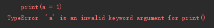
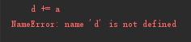

## Python3运算符

Python语言支持以下类型的运算符:
* 算术运算符
* 比较（关系）运算符
* 赋值运算符
* 逻辑运算符
* 位运算符
* 成员运算符
* 身份运算符
* 运算符优先级

## Python3算术运算符
以下假设变量： a=10，b=20：

| 运算符 | 描述 | 实例 |
| --- | --- | --- |
| + | 加 - 两个对象相加 | a + b 输出结果 30 |
| - | 减 - 得到负数或是一个数减去另一个数 | a - b 输出结果 -10 |
| * | 乘 - 两个数相乘或是返回一个被重复若干次的字符串 | a * b 输出结果 200 |
| / | 除 - x除以y | b / a 输出结果 2 |
| % | 取模 - 返回除法的余数 | b % a 输出结果 0 |
| ** | 幂 - 返回x的y次幂 | a**b 为10的20次方， 输出结果 100000000000000000000 |
| // | 取整除 - 返回商的整数部分（向下取整） | >>> 9//24输出结果0 >>> -9//2输出结果-5 |

## Python3比较运算符

以下假设变量a为10，变量b为20：

| 运算符 | 描述 | 实例 |
| --- | --- | --- |
| == (两个等号) | 等于 - 比较对象是否相等 | (a == b) 返回 False。 |
| != | 不等于 - 比较两个对象是否不相等 | (a != b) 返回 true。 |
| <> | 不等于 - 比较两个对象是否不相等 | (a <> b) 返回 true。这个运算符类似 != 。 |
| > | 大于 - 返回x是否大于y | (a > b) 返回 False 。 |
| < | 小于 - 返回x是否小于y。所有比较运算符返回1表示真，返回0表示假。这分别与特殊的变量True和False等价。 | (a < b) 返回 true 。 |
| >= | 大于等于 - 返回x是否大于等于y。 | (a >= b) 返回 False。 |
| <= | 小于等于 - 返回x是否小于等于y。 | (a <= b) 返回 true。 |

## Python赋值运算符

以下假设变量a为10，变量b为20：
| 运算符 | 描述 | 实例 |
| --- | --- | --- |
| = | 简单的赋值运算符 | c = a + b 将 a + b 的运算结果赋值为 c |
| += | 加法赋值运算符 | c += a 等效于 c = c + a |
| -= | 减法赋值运算符 | c -= a 等效于 c = c - a |
| `*=` | 乘法赋值运算符 | `c *= a 等效于 c = c * a` |
| /= | 除法赋值运算符 | c /= a 等效于 c = c / a |
| %= | 取模赋值运算符 | c %= a 等效于 c = c % a |
| **= | 幂赋值运算符 | c **= a 等效于 c = c ** a |
| //= | 取整除赋值运算符 | c //= a 等效于 c = c // a |

注1：直接输出print(a = 1)会报错，原因：a是未指定的变量，需先赋值a = 1,在print(a)

'a'是一个非法的关键字参数对于print()

注2：直接使用等号以外的赋值是错误的，原因：需要先赋值

```python
d = 0
d += a
print(d)
```

## Python位运算符

按位运算符是把数字看作二进制来进行计算的。Python中的按位运算法则如下：
下表中变量 a 为 60，b 为 13，二进制格式如下：

| 运算符 | 描述 | 实例 |
| --- | --- | --- |
| & | 按位`与`运算符：参与运算的两个值,如果两个相应位都为1,则该位的结果为1,否则为0 | (a & b) 输出结果 12 ，二进制解释： 0000 1100 |
| 竖杆 | 按位`或`运算符：只要对应的二个二进位有一个为1时，结果位就为1,否则为0 | (a 竖杆 b) 输出结果 61 ，二进制解释： 0011 1101 |
| ^ | 按位`异或运`算符：当两对应的二进位`相异时`，结果为1,否则为0 | (a ^ b) 输出结果 49 ，二进制解释： 0011 0001 |
| ~ | 按位取反运算符：对数据的每个二进制位取反,即把1变为0,把0变为1 。~x 类似于 -x-1 | (~a ) 输出结果 -61 ，二进制解释： 1100 0011，在一个有符号二进制数的补码形式。 |
| << | 左移动运算符：运算数的各二进位全部左移若干位，由 << 右边的数字指定了移动的位数，高位丢弃，低位补0。 | a << 2 输出结果 240 ，二进制解释： 1111 0000 |
| >> | 右移动运算符：把">>"左边的运算数的各二进位全部右移若干位，>> 右边的数字指定了移动的位数 | a >>  |

```python
c = 0b00000011   # 0b00000011等于3
print(‘取反’,bin(~c)) # -4
```

### 手动取反:
对数据的每个二进制位取反,即把1变为0,把0变为1 
1. 负数在计算机中是以补码形式表示的
2. 首先看符号位也就是最左的一位，如果是1代表是负数(-)如果是0代码是正数(+)
3. 然后对补码取反+1得到其源码
4. 0b11111100 取反到 0b0b00000011
5. 0b00000011 + 1(0b00000001) =(符号负数) - + 0b00000100 = -4

<b>注：</b>
0b二进制（数字0）
oct（octal）或者0o(数字0，字母o)八进制
0x十六进制（数字0）

binary英 /'baɪnərɪ/ 美 /'baɪnəri/ adj. [数] 二进制的；二元的，二态的 复数 binaries
octal英 ['ɒkt(ə)l]adj. [数] 八进制的
hexadecimal英 [,heksə'desɪm(ə)l]  美 [,hɛksə'dɛsɪml]  adj. 十六进制的 n. 十六进制


### 二进制表示:

bin()

描述：bin() 返回一个整数 int 或者长整数 long int 的二进制表示。
```python
bin(b)
```
* b -- int 或者 long int 数字
* 返回值：字符串。

## Python逻辑运算符

| 运算符 | 逻辑表达式 | 描述 | 实例 |
| --- | --- | --- | --- |
| and | x and y | 布尔"与" - 如果 x 为 False，x and y 返回 False，否则它返回 y 的计算值。 | (a and b) 返回 20。|
| or | x or y | 布尔"或" - 如果 x 是非 0，它返回 x 的值，否则它返回 y 的计算值。 | (a or b) 返回 10。|
| not | not x | 布尔"非" - 如果 x 为 True，返回 False 。如果 x 为 False，它返回 True。 | not(a and b) 返回 False |
