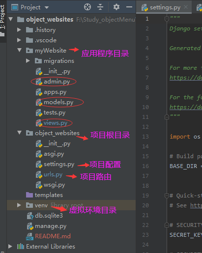
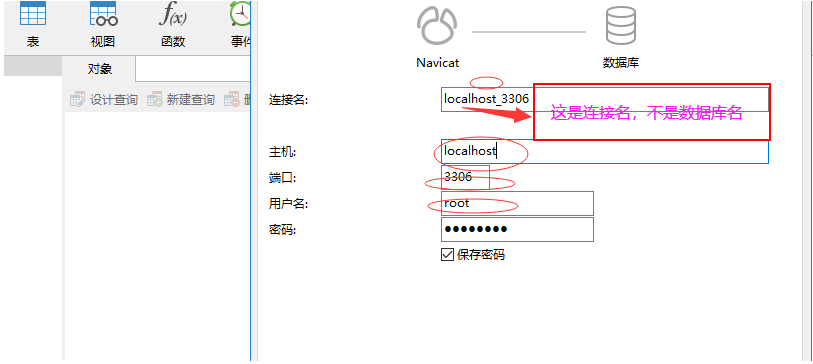
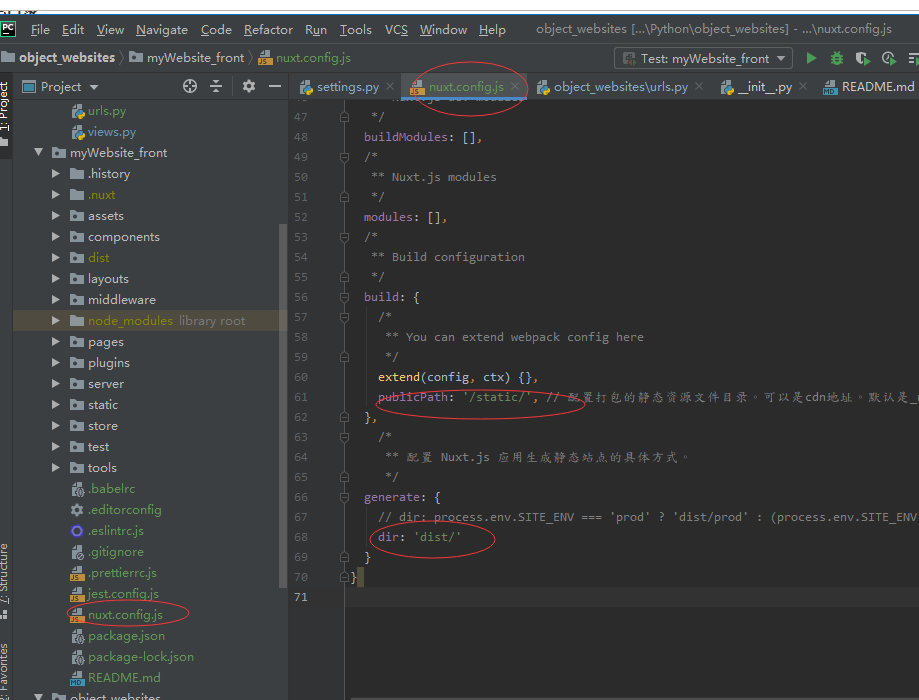
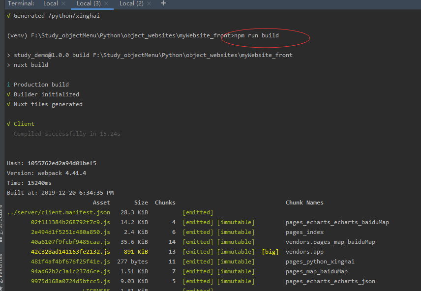
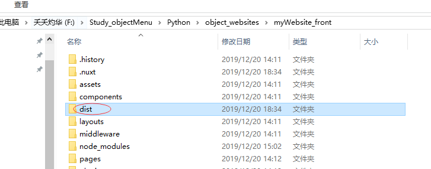
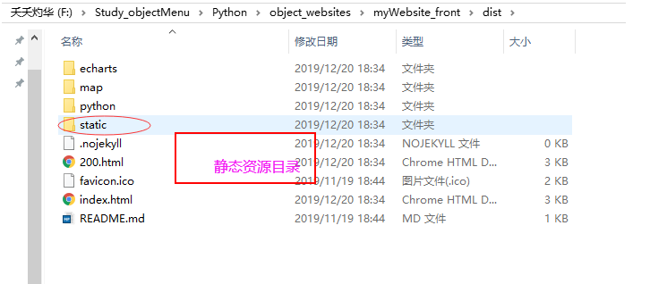
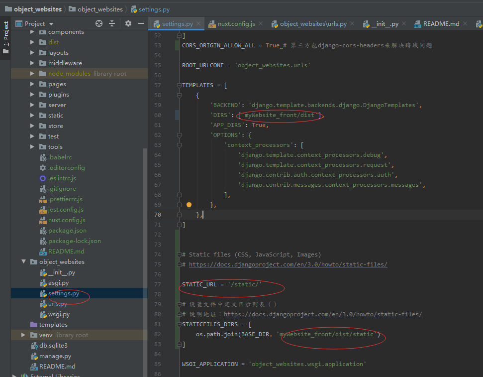
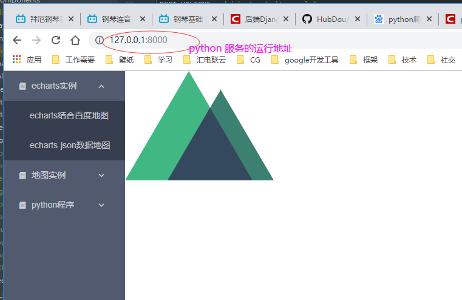

## django + vue 搭建

### pycharm搭建django

### 项目名称




---
### DATABASES配置

修改项目根目录'object_websites'下'setting.py'中数据库'DATABASES={}'配置
```python
# Database
# https://docs.djangoproject.com/en/3.0/ref/settings/#databases

DATABASES = {
    'default': {
        'ENGINE': 'django.db.backends.sqlite3',
        'NAME': os.path.join(BASE_DIR, 'db.sqlite3'),
    }
}
```
改为
```python
DATABASES = {
    # 'default': {
    #     'ENGINE': 'django.db.backends.sqlite3',
    #     'NAME': os.path.join(BASE_DIR, 'db.sqlite3'),
    # }

    'default': {
        'ENGINE': 'django.db.backends.mysql',
        'NAME': 'mywebsite', # '数据库名'不是连接名字
        'USER': 'root',     # 用户名
        'PASSWORD': 'root', # 密码
        'HOST': 'localhost', # 数据库连接设置里的主机，localhost 或者ip地址，必须一致
		'PORT': 3306 # 端口号
    }
}
```
**注意：'HOST': 'localhost'，本地数据库只能只用localhost**



---
### DOS命令连接数据库(用于测试)

cd到mysql安装目录，在DOS命令窗口输入 mysql -hlocalhost -uroot -p回车，输入密码, 进入mysql数据库.
-h为主机，localhost表示本地；-u为数据库用户名，root是mysql默认用户名；-p为密码，如果设置了密码，可直接在-p后链接输入
```python
cd C:\Program Files\MySQL\MySQL Server 5.7\bin

mysql -hlocalhost -uroot -p
```

---
### 安装pymysql mysqlclient
```python
pip install pymysql
pip install mysqlclient
```

---
### 并把app加入到installed_apps列表里：

```python
INSTALLED_APPS = [
    'django.contrib.admin',
    'django.contrib.auth',
    'django.contrib.contenttypes',
    'django.contrib.sessions',
    'django.contrib.messages',
    'django.contrib.staticfiles',
    'myWebsite'
]
```

---
### 添加项目根目录'object_websites'下'__init__.py'中配置

```python
import pymysql
pymysql.install_as_MySQLdb()
```

---
### 报错：
> 
django.core.exceptions.ImproperlyConfigured: mysqlclient 1.3.13 or newer is required; you have 0.9.3.

解决：
>  
这个是Django对MySQLdb版本的限制，我们使用的是PyMySQL，所以不用管它


---
### 报错：
> 
File "F:\Study_objectMenu\Python\object_websites\venv\lib\site-packages\django\db\backends\mysql\base.py", line 37, in <module>
    raise ImproperlyConfigured('mysqlclient 1.3.13 or newer is required; you have %s.' % Database.__version__)
django.core.exceptions.ImproperlyConfigured: mysqlclient 1.3.13 or newer is required; you have 0.9.3.

解决：
> 
按图找到你Django F:\Study_objectMenu\Python\object_websites\venv\lib\site-packages\django\db\backends\mysql\base.py目录下的base.py文件注释掉：
if version < (1, 3, 13):
    raise ImproperlyConfigured('mysqlclient 1.3.13 or newer is required; you have %s.' % Database.__version__)


---
### 提示
python manage.py migrate

解决：
> 
执行python manage.py migrate后，它可以让我们在修改Model后可以在不影响现有数据的前提下重建表结构。

migrate 英 /maɪˈɡreɪt/  美 /ˈmaɪɡreɪt/ vi. 移动；随季节而移居；移往 vt. 使移居；使移植 过去式 migrated过去分词 migrated现在分词 migrating第三人称单数 migrates

makemigrations 生成数据库同步脚本

---
### 搭建并且运行一个vue项目

python结构


#### 关键配置1：nuxt打包目录






```python
build: {
  publicPath: '/static/', // 配置打包的静态资源文件目录。可以是cdn地址。默认是_nuxt文件夹
},

/*
 ** 配置 Nuxt.js 应用生成静态站点的具体方式。
 */
generate: {
  // dir: process.env.SITE_ENV === 'prod' ? 'dist/prod' : (process.env.SITE_ENV === 'qa' ? 'dist/qa' : 'dist/dev')
  dir: 'dist/'
}
```

注意： 
**1. build{}里面publicPath: '/static/'配置一个静态js css资源目录，这是python下setting STATICFILES_DIRS = []一一对应的， 否则python无法加载资源**

**2. generate{}里面的dir: 'dist/' 指定npm run build打包后文件夹名字, 这是python下setting TEMPLATES = [{DIRS: ''}]一一对应的，否则找不到index.html**


#### 关键配置2：python下 项目根目录配置



```python
TEMPLATES = [
    {
        'DIRS': ['myWebsite_front/dist']
    },
]

# Static files (CSS, JavaScript, Images)
# https://docs.djangoproject.com/en/3.0/howto/static-files/

STATIC_URL = '/static/'

# 设置文件中定义目录列表（）
# 说明地址：https://docs.djangoproject.com/en/3.0/howto/static-files/
STATICFILES_DIRS = [
    os.path.join(BASE_DIR, 'myWebsite_front/dist/static')
]

```

注意：
**1. TEMPLATES = []下 'DIRS' 下 myWebsite_front是python里面的vue项目目录，dist是Nuxt炫目打包后目录，里面包含index.html**

**2. STATICFILES_DIRS = [] 下 myWebsite_front 是python里面的vue项目目录， dist是Nuxt炫目打包后目录，static是静态资源目录，如果是nuxt默认的打包目录_nuxt则无法访问，所以需要修改nuxt build:{publicPath: '/static/'}配置**

**2. STATIC_URL = '/static/'必须放在 STATIC_URL上面**



缺点是每次修改完vue后 需要重新打包，才能在python展示

---
### 每次都需要重新打包解决

Jenkins + git 自动部署

---
### 写一个接口

