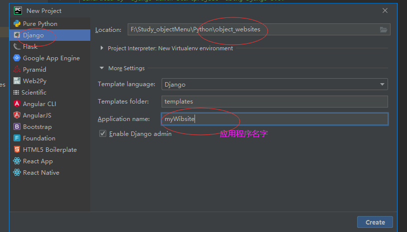
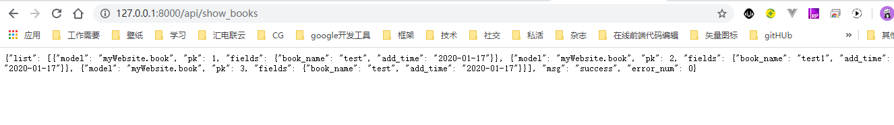

## django + vue 搭建

---
## pycharm搭建django

### 1.项目名称




### 2.DATABASES配置

修改项目根目录'object_websites'下'setting.py'中数据库'DATABASES={}'配置
```python
# Database
# https://docs.djangoproject.com/en/3.0/ref/settings/#databases

DATABASES = {
    'default': {
        'ENGINE': 'django.db.backends.sqlite3',
        'NAME': os.path.join(BASE_DIR, 'db.sqlite3'),
    }
}
```
改为
```python
DATABASES = {
    # 'default': {
    #     'ENGINE': 'django.db.backends.sqlite3',
    #     'NAME': os.path.join(BASE_DIR, 'db.sqlite3'),
    # }

    'default': {
        'ENGINE': 'django.db.backends.mysql',
        'NAME': 'mywebsite', # '数据库名'不是连接名字
        'USER': 'root',     # 用户名
        'PASSWORD': 'root', # 密码
        'HOST': 'localhost', # 数据库连接设置里的主机，localhost 或者ip地址，必须一致
		'PORT': 3306 # 端口号
    }
}
```
**注意：'HOST': 'localhost'，本地数据库只能只用localhost**


### 3.DOS命令连接数据库(用于测试)

cd到mysql安装目录，在DOS命令窗口输入 mysql -hlocalhost -uroot -p回车，输入密码, 进入mysql数据库.
-h为主机，localhost表示本地；-u为数据库用户名，root是mysql默认用户名；-p为密码，如果设置了密码，可直接在-p后链接输入
```python
cd C:\Program Files\MySQL\MySQL Server 5.7\bin

mysql -hlocalhost -uroot -p
```


### 4.安装pymysql mysqlclient
```python
pip install pymysql
pip install mysqlclient
```


### 5.并把app加入到installed_apps列表里：

```python
INSTALLED_APPS = [
    'django.contrib.admin',
    'django.contrib.auth',
    'django.contrib.contenttypes',
    'django.contrib.sessions',
    'django.contrib.messages',
    'django.contrib.staticfiles',
    'myWebsite'
]
```


### 6.添加项目根目录'object_websites'下'__init__.py'中配置

```python
import pymysql
pymysql.install_as_MySQLdb()
```


### 7.报错：
> 
django.core.exceptions.ImproperlyConfigured: mysqlclient 1.3.13 or newer is required; you have 0.9.3.

解决：
>  
这个是Django对MySQLdb版本的限制，我们使用的是PyMySQL，所以不用管它


### 8.报错：
> 
File "F:\Study_objectMenu\Python\object_websites\venv\lib\site-packages\django\db\backends\mysql\base.py", line 37, in <module>
    raise ImproperlyConfigured('mysqlclient 1.3.13 or newer is required; you have %s.' % Database.__version__)
django.core.exceptions.ImproperlyConfigured: mysqlclient 1.3.13 or newer is required; you have 0.9.3.

解决：
> 
按图找到你Django F:\Study_objectMenu\Python\object_websites\venv\lib\site-packages\django\db\backends\mysql\base.py目录下的base.py文件注释掉：
if version < (1, 3, 13):
    raise ImproperlyConfigured('mysqlclient 1.3.13 or newer is required; you have %s.' % Database.__version__)


---
## 命令行搭建django app(和app myWebsite一样的)

```
python manage.py startapp apiTest
```


---
## 搭建并且运行一个vue项目

python结构


---
## 关键配置1：nuxt打包目录


```python
build: {
  publicPath: '/static/', // 配置打包的静态资源文件目录。可以是cdn地址。默认是_nuxt文件夹
},

/*
 ** 配置 Nuxt.js 应用生成静态站点的具体方式。
 */
generate: {
  // dir: process.env.SITE_ENV === 'prod' ? 'dist/prod' : (process.env.SITE_ENV === 'qa' ? 'dist/qa' : 'dist/dev')
  dir: 'dist/'
}
```

注意： 
**1. build{}里面publicPath: '/static/'配置一个静态js css资源目录，这是python下setting STATICFILES_DIRS = []一一对应的， 否则python无法加载资源**

**2. generate{}里面的dir: 'dist/' 指定npm run build打包后文件夹名字, 这是python下setting TEMPLATES = [{DIRS: ''}]一一对应的，否则找不到index.html**

---
## 关键配置2：python下 项目根目录配置


```python
TEMPLATES = [
    {
        'DIRS': ['myWebsite_front/dist']
    },
]

# Static files (CSS, JavaScript, Images)
# https://docs.djangoproject.com/en/3.0/howto/static-files/

STATIC_URL = '/static/'

# 设置文件中定义目录列表（）
# 说明地址：https://docs.djangoproject.com/en/3.0/howto/static-files/
STATICFILES_DIRS = [
    os.path.join(BASE_DIR, 'myWebsite_front/dist/static')
]

```

注意：
**1. TEMPLATES = []下 'DIRS' 下 myWebsite_front是python里面的vue项目目录，dist是Nuxt炫目打包后目录，里面包含index.html**

**2. STATICFILES_DIRS = [] 下 myWebsite_front 是python里面的vue项目目录， dist是Nuxt炫目打包后目录，static是静态资源目录，如果是nuxt默认的打包目录_nuxt则无法访问，所以需要修改nuxt build:{publicPath: '/static/'}配置**

**2. STATIC_URL = '/static/'必须放在 STATIC_URL上面**


缺点是每次修改完vue后 需要重新打包，才能在python展示

---
## django项目结构

### 1.在项目工程目录myWebsite(和文件夹名字相同)里包含：

settings.py: 目的总配置文件，里面包含了数据库、web应用、时间等配置

urls.py: URL根配置

wsgi.py: 内置runserver命令的WSGI应用配置

__init__.py: 用来告诉python，当前目录是python模块

### 2.APP目录object_websites里包含

admin:对应应用后台管理配置文件

apps:对应应用的配置文件

models:数据模块，用于设计数据库等

tests:编写测试脚本

views：视图层，直接和浏览器进行交互


---
## 写一个输入字符业务

* 1.在app目录下views中

```python
from django.http import HttpResponse

"""
 django.http模块中定义了HttpResponse 对象的API
 作用：不需要调用模板直接返回数据
 HttpResponse属性：
    content: 返回内容,字符串类型
    charset: 响应的编码字符集
    status_code: HTTP响应的状态码
"""

def msg(request, name, age):
    return HttpResponse('My name is ' + name + ',i am ' + age + ' years old')
```


* 2.urls是用来声明请求url的映射关系。也就是程序通过urls里的配置来找到我们写的这个view。

```
from django.conf.urls import url
from . import views

urlpatterns = [
    url(r'add_book$', views.add_book, ),
    url(r'show_books$', views.show_books, ),
]
```

* 3.调用

首先地址路由会调用跟目录里的urls：
```
# 此处路由地址都是在server地址 http://127.0.0.1:8000/后的路径
urlpatterns = [
    path('admin/', admin.site.urls),
    url(r'^api/', include(myWebsite.urls)),
    url(r'^$', TemplateView.as_view(template_name="index.html")),
]
```

然后调用app项目目录里的urls：
```
urlpatterns = [
    url(r'add_book$', views.add_book, ),
    url(r'show_books$', views.show_books, ),
    url(r'^msg/(?P<name>\w+)/(?P<age>\d+)/$', views.msg)
]
```

浏览器输入：http://http://127.0.0.1:8000/api/msg/小白/121/


---
## python里URL常见写法示例 regex

```
url(r'test/\d{2}/$', views.test) # test/66
url(r'test/(?P<id>\d{2})/$', views.test)
url(r'test2/(?P<id>\d{2})/(?P<key>\w+)/$', views.test)
```
1. r 表示字符串为非转义的原始字符串，让编译器忽略反斜杠，也就是忽略转义字符。

2. '^'为严格前匹配，也就是限定开头。浏览器输入http://localhost:8000/hello/a/b 也是可以访问view.hello视图

3. $匹配字符串的末尾。

4. .'(?P...)' 分组匹配：(?P<name>\w+) -> 表示匹配name字段为一个或任意个匹配数字字母下划线；(?P<age>\d+) -> 表示匹配age字段为1一个或者多个数字。

---
## 写一个接口

### 1.app目录models.py中写数据模块（也就是规定'表名'、'字段名'）

```python
from django.db import models

class Book(models.Model):
    book_name = models.CharField(max_length=64) # CharField：字符串类型，映射到数据库中会转换成varchar类型，
    add_time = models.DateField(auto_now_add=True) # 、DateTimeField：日期时间类型，在python中对应的是datetime.datetime类型，

    def __unicode__(self):
        return self.book_name
```
### 2.python manage.py migrate和 python manage.py makemigrations

migrate 英 /maɪˈɡreɪt/  美 /ˈmaɪɡreɪt/ vi. 移动；随季节而移居；移往 vt. 使移居；使移植 过去式 migrated过去分词 migrated现在分词 migrating第三人称单数 migrates

makemigrations 生成数据库同步脚本

migrations 数据库迁移 迁移功能 迁徙


* 1.修改app目录下models.py后执行

```
python manage.py makemigrations
```

执行后会在app目录migrations下生成一个0001_inital.py的文件：


但是数据并没有关于 book的表

* 2.执行

```
python manage.py migrate
```

会在数据生成一张表(表名是app小写名字+小写类名)(mywebsite_book)：


### 3.app目录views.py中写逻辑

```
from django.views.decorators.http import require_http_methods
from django.core import serializers
from django.http import JsonResponse, HttpResponse
import json

@require_http_methods(['GET'])
def add_book(request):
    response = {}
    try:
        book = Book(book_name=request.GET.get('book_name'))
        book.save()
        response['msg'] = 'success'
        response['error_num'] = 0
    except Exception as e:
        response['msg'] = str(e)
        response['error_num'] = 1

    return JsonResponse(response)

@require_http_methods(["GET"])
def show_books(request):
    response = {}
    try:
        books = Book.objects.filter()
        response['list'] = json.loads(serializers.serialize("json", books))
        response['msg'] = 'success'
        response['error_num'] = 0
    except  Exception as e:
        response['msg'] = str(e)
        response['error_num'] = 1
    return JsonResponse(response)
```

### 4.app目录urls.py中写导入路由

```
from django.conf.urls import url, include

from . import views

urlpatterns = [
    url(r'add_book$', views.add_book, ),
    url(r'show_books$', views.show_books, )
	# r防止字符转义，例如\r \t等
    # '^'为严格前匹配，也就是限定开头。浏览器输入http://localhost:8000/hello/a/b 也是可以访问view.hello视图
    # $匹配字符串的末尾。
    # .'(?P...)' 分组匹配：(?P<anme>\w+) -> 表示匹配name字段为一个或任意个匹配数字字母下划线
]
```
### 5.根目录中urls.py导入app的urls

```
from django.contrib import admin
from django.urls import path
from django.conf.urls import url, include
from django.views.generic import TemplateView

# urls导入
import myWebsite.urls

# 此处路由地址都是在server地址 http://127.0.0.1:8000/后的路径
urlpatterns = [
    path('admin/', admin.site.urls),
    url(r'^api_test/', include(myWebsite.urls)), # 函数 include() 允许引用其它 URLconfs。每当 Django 遇到 include() 时，它会截断与此项匹配的 URL 的部分，并将剩余的字符串发送到 URLconf 以供进一步处理。
    url(r'^$', TemplateView.as_view(template_name="index.html")),
]
``` 

### 6.postman调试接口或者浏览器输入

```
http://127.0.0.1:8000/api/add_book?book_name=test
```


```
http://127.0.0.1:8000/api/show_books
```



```
http://http://127.0.0.1:8000/api/msg/小白/121/
```


---
## Django 拆分app里的model和view

