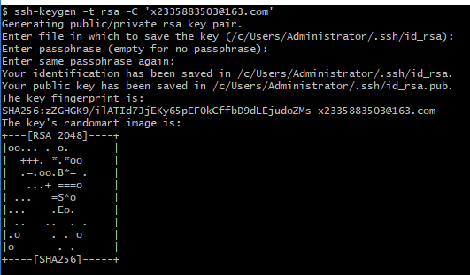
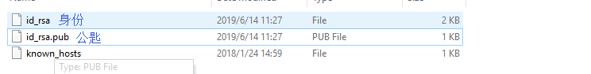
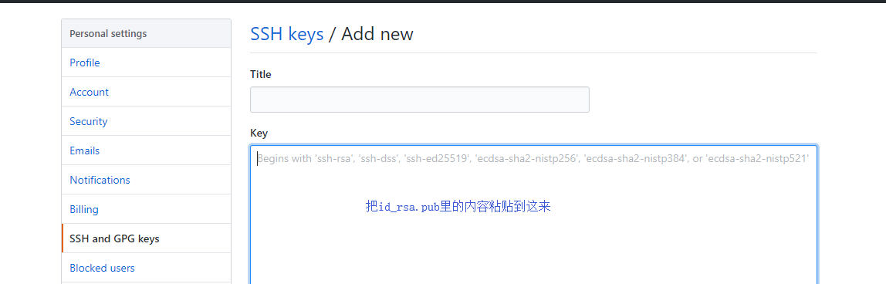

## ls查看是否有密匙公匙

首先，你需要确认自己是否已经拥有密钥。 默认情况下，用户的 SSH 密钥存储在其c:\users\administrator\.ssh 目录下。 进入该目录并列出其中内容，你便可以快速确认自己是否已拥有密钥：


## ssh-keygen -t rsa -C ‘github邮箱地址’

我们需要寻找一对以 id_dsa 或 id_rsa 命名的文件，其中一个带有 .pub 扩展名。 .pub 文件是你的公钥，另一个则是私钥。 如果找不到这样的文件（或者根本没有 .ssh 目录），你可以通过运行 ssh-keygen程序来创建它们。

```
$ ssh-keygen -t rsa -C "github邮箱地址"
Generating public/private rsa key pair.
Enter file in which to save the key (/home/schacon/.ssh/id_rsa):
（输入要保存密匙的文件）
Created directory '/home/schacon/.ssh'.
Enter passphrase (empty for no passphrase):
（输入密码（空为无密码））
Enter same passphrase again:
Your identification has been saved in /c/Users/Administrator/.ssh/id_rsa.
（你的身份已保存在 /home/sch）
Your public key has been saved in /c/Users/Administrator/.ssh/id_rsa.pub.
（你的公匙已保存在 /home/sch）
The key's randomart image is:
（关键的随机艺术图像是）
+---[RSA 2048]----+
|oo... . o.       |
|  +++. *.*oo     |
|  .=.oo.B*= .    |
|   ...+ ===o     |
| ...   =S*o      |
|...    .Eo.      |
| ..   ..  . .    |
|.o     . . o     |
|o       . .      |
+----[SHA256]-----+
```



## 粘贴密匙到github



