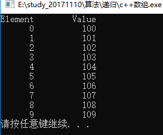

## C++ 数组

C++ 支持数组数据结构，它可以存储一个固定大小的相同类型元素的顺序集合。数组是用来存储一系列数据，但它往往被认为是一系列相同类型的变量。

数组的声明并不是声明一个个单独的变量，比如 number0、number1、...、number99，而是声明一个数组变量，比如 numbers，然后使用 numbers[0]、numbers[1]、...、numbers[99] 来代表一个个单独的变量。数组中的特定元素可以通过索引访问。

所有的数组都是由连续的内存位置组成。最低的地址对应第一个元素，最高的地址对应最后一个元素。

## 声明数组

在 C++ 中要声明一个数组，需要指定元素的类型和元素的数量，如下所示：
```
type arrayName [ arraySize ];
```

这叫做一维数组。arraySize 必须是一个大于零的整数常量，type 可以是任意有效的 C++ 数据类型。例如，要声明一个类型为 double 的包含 10 个元素的数组 balance，声明语句如下：

balance 英 /'bæl(ə)ns/  美 /'bæləns/ n. 平衡；余额；匀称 vt. 使平衡；结算；使相称 vi. 保持平衡；相称；抵销
```
double balance[10];
```

现在 balance 是一个可用的数组，可以容纳 10 个类型为 double 的数字。

## 初始化数组

在 C++ 中，您可以逐个初始化数组，也可以使用一个初始化语句，如下所示：
```
double balance[5] = {1000.0, 2.0, 3.4, 7.0, 50.0};
```

大括号 { } 之间的值的数目不能大于我们在数组声明时在方括号 [ ] 中指定的元素数目。

如果您省略掉了数组的大小，数组的大小则为初始化时元素的个数。因此，如果：
```
double balance[] = {1000.0, 2.0, 3.4, 7.0, 50.0};
```

您将创建一个数组，它与前一个实例中所创建的数组是完全相同的。下面是一个为数组中某个元素赋值的实例：
```
balance[4] = 50.0;
```

述的语句把数组中第五个元素的值赋为 50.0。所有的数组都是以 0 作为它们第一个元素的索引，也被称为基索引，数组的最后一个索引是数组的总大小减去 1。以下是上面所讨论的数组的的图形表示：


## 访问数组元素

数组元素可以通过数组名称加索引进行访问。元素的索引是放在方括号内，跟在数组名称的后边。例如：
```
double salary = balance[9];
```

上面的语句将把数组中第 10 个元素的值赋给 salary 变量。下面的实例使用了上述的三个概念，即，声明数组、数组赋值、访问数组：

io代表输入输出

stream 英 /striːm/  美 /strim/  n. 溪流；流动；潮流；光线；（数据）流 vi. 流；涌进；飘扬 vt. 流出；涌出；使飘动

manip是manipulator（操纵器）的缩写(在c++上只能通过输入缩写才有效）

manipulator 英 /mə'nɪpjʊleɪtə(r)/  美 /mə'nɪpjuletɚ/ n. 操纵器，调制器；操作者；善于操控者；善于摆布（欺骗）他人者

`std::setw`:
* 设置字段宽度(也就是：需要填充多少个字符,默认填充的字符为' '空格****)
* 设置要在输出操作上使用的字段宽度。
* 表现得好像是成员宽度在作为操纵器插入/提取它的流上用n作为参数调用（它可以在输入流或输出流上插入/提取）。
* 这个操纵器在头文件中声明<iomanip>。

·std::setfill：设置std::setw将填充什么样的字符,如:std::setfill('*')
```
#include <iostream>
using namespace std;

#include <iomanip>
using std::setw;

int main() {
	int n[10]; // n 是一个包含 10 个整数的数组
			   // 初始化数组元素     
	for (int i = 0; i < 10; i++) {
		n[i] = i + 100;
	}
	cout << "Element" << setw(13) << "Value" << endl;
	for (int j = 0; j < 10; j++) {
		cout << setw(7) << j << setw(13) << n[j] << endl;
	}
	system("PAUSE");
    return 0;
}
```
