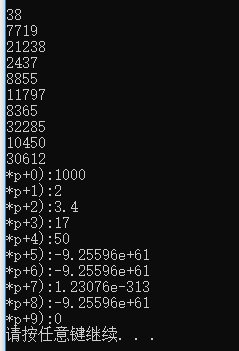

## C++ 从函数返回数组

C++ 不允许返回一个完整的数组作为函数的参数。但是，您可以通过指定带不索引的数组名来返回一个*指向数组的指针*。

如果您想要从函数返回一个一维数组，您必须声明一个*返回指针的函数*，如下：
```
int *func () {
	...
}
```

另外，C++ 不支持在函数外返回局部变量的地址，除非定义局部变量为 static 变量。

static 英 /'stætɪk/  美 /'stætɪk/ adj. 静态的；静电的；静力的 n. 静电；静电干扰

现在，让我们来看下面的函数，它会生成 10 个随机数，并使用数组来返回它们，具体如下：
```
/*
@discription: cstdlib是C++里面的一个常用函数库， 等价于C中的<stdlib.h>。
@discription:  stdlib.h可以提供一些函数与符号常量
 */
#include <cstdlib>;
/*
@discription: ctime分函数和类两种用途。
@discription: ctime功能是 把日期和时间转换为字符串，而ctime类的对象表示的时间是基于格林威治标准时间（GMT）的。
*/

#include <ctime>;
// 生成 10 个随机数，并使用数组来返回它
int  * getRandom() {
	static int r[10]; // C++ 不支持在函数外返回局部变量的地址，除非定义局部变量为 static 变量。

	// 设置种子
	srand((unsigned(NULL)));
	for (int i = 0; i < 10; ++i) {
		r[i] = rand();
		cout << r[i] << endl;
	}
	return r;
}

// C++ 生成 10 个随机数，并使用数组来返回它们
	cout << "\n\r\n\r";
	// 一个指向整数的指针
	int *pp;  // int *p会报错
	pp = getRandom();
	for (int i = 0; i < 10; i++) {
		cout << "*p+" << i << "):";
		cout << *(p + i) << endl;
	}
	system("PAUSE");
    return 0;
```
