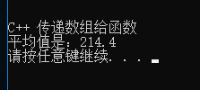

## C++ 传递数组给函数

C++ 中您可以通过指定不带索引的数组名来传递一个指向数组的指针。

C++ 传数组给一个函数，数组类型自动转换为指针类型，因而传的实际是地址。

如果您想要在函数中传递一个一维数组作为参数，您必须以下面三种方式来声明函数形式参数，这三种声明方式的结果是一样的，因为每种方式都会告诉编译器将要接收一个整型指针。同样地，您也可以传递一个多维数组作为形式参数。

### 方式 1

形式参数是一个指针：
```
void fun (int *param) {
	...
}
```

### 方式 2

形式参数是一个已定义大小的数组：
```
void fun (int param[10])
```

### 方式 3

形式参数是一个未定义大小的数组：
```
void fun (int param[]) {
	...
}
```

### 实例

现在，让我们来看下面这个函数，它把数组作为参数，同时还传递了另一个参数，根据所传的参数，会返回数组中各元素的平均值：
```
// 函数声明
double getAverge(int arr[], int size) {
	int i, sum = 0;
	double avg;
	for (i = 0; i < size; ++i) {
		sum += arr[i];
	}
	avg = double(sum) / size;
	return avg;
}

int main() {
	// C++ 传递数组给函数
	cout << "\n\r\n\r";
	cout << "C++ 传递数组给函数" << endl;
	int balance1[5] = { 1000, 2, 3, 17, 50 };
	double avg = getAverge(balance1, 5);
	cout << "平均值是：" << avg << endl;
}
```
