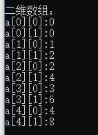

## C++ 多维数组

C++ 支持多维数组。多维数组声明的一般形式如下：
```
type name[size1][size2]...[sizeN];
```

例如，下面的声明创建了一个三维 5 . 10 . 4 整型数组：
```
int three_dimensional[5][10][4];
```

dimensional 英 /daɪ'mɛnʃənl/  美 /dɪ'menʃənəl/ adj. 空间的；尺寸的

## 二维数组

多维数组最简单的形式是二维数组。一个二维数组，在本质上，是一个一维数组的列表。声明一个 x 行 y 列的二维整型数组，形式如下：
```
type arrayName [ x ][ y ];
```

其中，type 可以是任意有效的 C++ 数据类型，arrayName 是一个有效的 C++ 标识符。

一个二维数组可以被认为是一个带有 x 行和 y 列的表格。下面是一个二维数组，包含 3 行和 4 列：


因此，数组中的每个元素是使用形式为 a[ i , j ] 的元素名balance称来标识的，其中 a 是数组名称，i 和 j 是唯一标识 a 中每个元素的下标。

### 初始化二维数组

多维数组可以通过在括号内为每行指定值来进行初始化。下面是一个带有 3 行 4 列的数组。

balance 英 /'bæl(ə)ns/  美 /'bæləns/ n. 平衡；余额；匀称 vt. 使平衡；结算；使相称 vi. 保持平衡；相称；抵销

```
int a[3][4] = {
	{0, 1, 2, 3},
	{4, 5, 6, 7}
	{8, 9, 10, 11}
}
```

内部嵌套的括号是可选的，下面的初始化与上面是等同的：
```
int a[3][4] = {0,1,2,3,4,5,6,7,8,9,10,11};
```

### 访问二维数组元素

二维数组中的元素是通过使用下标（即数组的行索引和列索引）来访问的。例如：
```
int val = a[2][3];
```

上面的语句将获取数组中第 3 行第 4 个元素。您可以通过上面的示意图来进行验证。让我们来看看下面的程序，我们将使用嵌套循环来处理二维数组：
```
// 一个带有 5 行 2 列的数组
int a[5][2] = { { 0, 0 },{ 1, 2 },{ 2, 4 },{ 3, 6 },{ 4, 8 } };

// 输出数组中每个元素的值
for (int i = 0; i < 5; i++) {
	for (int j = 0; j < 2; j++) {
		cout << "a[" << i << "][" << j << "]:";
		cout << a[i][j] << endl;
	}
}
```
