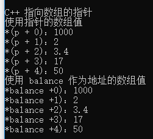

## C++ 指向数组的指针

数组名是一个指向数组中第一个元素的*常量指针*。因此，在下面的声明中：
```
double balance[50] // balance[50]存储数组元素地址
```
balance 英 /'bæl(ə)ns/  美 /'bæləns/ n. 平衡；余额；匀称 vt. 使平衡；结算；使相称 vi. 保持平衡；相称；抵销

balance 是一个指向 &balance[0] 的指针，即数组 balance 的第一个元素的地址。因此，下面的程序片段把 p 赋值为 balance 的第一个元素的地址：
```
double *p;
double balance[10];

p = balance;
```

使用数组名作为常量指针是合法的，反之亦然。因此，*(balance + 4) 是一种访问 balance[4] 数据的合法方式。

例子
```
cout << "C++ 指向数组的指针" << endl;
// 带有 5 个元素的双精度浮点型数组
double balance[5] = { 1000.0, 2.0, 3.4, 17.0, 50.0 };
double *p;
p = balance;

// 输出数组中每个元素的值
cout << "使用指针的数组值" << endl;
for (int i = 0; i < 5; i++) {
	cout << "*(p + " << i << ")：";
	cout << *(p + i) << endl;
}
cout << "使用 balance 作为地址的数组值" << endl;
for (int i = 0; i < 5; i++) {
	cout << "*balance +" << i << ")：";
	cout << *(balance + i) << endl;
}
```
