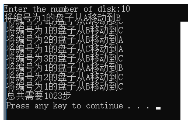
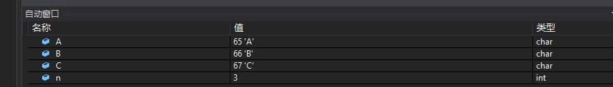
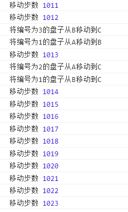
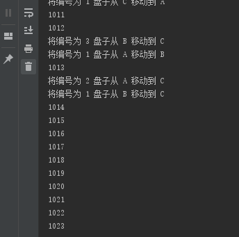

## 递归典型问题： 
###  梵塔问题（汉诺塔问题）


* 相传在古印度圣庙中，有一种被称为汉诺塔(Hanoi)的游戏。该游戏是在一块铜板装置上，有三根杆(编号A、B、C)，在A杆自下而上、由大到小按顺序放置64个金盘(如下图)。游戏的目标：把A杆上的金盘全部移到C杆上，并仍保持原有顺序叠好。**操作规则**：每次只能移动**一个盘子**，并且在移动过程中**三根杆上都始终保持大盘在下，小盘在上**，操作过程中盘子可以置于**A、B、C任一杆上**，找出移动次数最小的方案.

* 如果将这个问题的盘子数量减为10个或更少，就不会有太大的问题了。但盘子数量为64的话，你一共需要移动约1800亿亿步（18,446,744,073,709,551,615），才能最终完成整个过程。这是一个天文数字，没有人能够在有生之年通过手动的方式来完成它。即使借助于计算机，假设计算机每秒能够移动100万步，那么约需要18万亿秒，即58万年。将计算机的速度再提高1000倍，即每秒10亿步，也需要584年才能够完成。

### 算法实现：
>1. (A->C->B)先将A上的n-1个盘子通过C移动到B(移动到C上从上到下是**大到小**,再移动到B上从上到下是**小到大**)
>2. (A->C)将A上的最后一个盘子直接移动到C
>3. (B->A->C)将B上的n-1的盘子通过A移动到C即可实现(移动到A上从上到下是**大到小**,在移动到C上从上到下是**小到大**)

### c++ 程序如下:

buffer 英 /'bʌfə/ n. [计] 缓冲区；缓冲器，[车辆] 减震器 vt. 缓冲
disk 英 /dɪsk/ n. [计] 磁盘，磁碟片；圆盘，盘状物；唱片

```
int  steps = 0;
#include <iostream>
using namespace std;	
void hanoiTower(int n, char A, char B, char C){
	if (n == 1) {
		cout<< "将编号为" << n << "的盘子从" << A << "移动到" << C << endl;
	} else {
		hanoiTower(n - 1, A, C, B);  
		// ACB改变了参数位置，也就改变了值，此时参数ABC对应'A''C''B'
		cout<< "将编号为" << n << "的盘子从" << A << "移动到" << C << endl;
		hanoiTower(n - 1, B, A, C);
		// BAC改变了参数位置，也就改变了值，此时参数ABC对应'B''A''C'
	}
	steps += 1;
}
int main(){
	int num;
	cout<< "Enter the number of disk:";
	cin>> num; 
	hanoiTower(num, 'A', 'B', 'C');
	cout << "总共需要" << steps << "步" << endl;
    system('PAUSE');
	return 0;
}
```




### js程序如下:
```
 let steps = 0
 function hanoiTower(n, A, B, C) {
 	if (n === 1) {
 		console.log('将编号为'+ n + '的盘子从' + A + '移动到' + C)
 	} else {
 		hanoiTower(n - 1, A, C, B)
 		console.log('将编号为'+ n + '的盘子从' + A + '移动到' + C)
 		hanoiTower(n - 1, B, A, C)
 	}
 	steps += 1
 	console.log('移动步数', steps)
 }
 hanoiTower(10, 'A', 'B', 'C')
```


### python程序如下:
```
# !E:/softwareDirectory/Python37 #文件目录
# -*- coding: UTF-8 -*-
#coding=utf-8
steps = 0
def hanoiTower(n, A, B, C):
	if n == 1:
		print('将编号为', n, '盘子从', A, '移动到', C)
	else:
		hanoiTower(n - 1, A, C, B)
		print('将编号为', n, '盘子从', A, '移动到', C)
		hanoiTower(n - 1, B, A, C)
		global steps
		''' 在函数内部对变量赋值进行修改后，该变量就会被Python解释器认为是局部变量而非全局变量，
			程序执行到steps +=1 的时候，因为这条语句是给a赋值，所以a成为了局部变量，
			那么在执行return a(或是print a)的时候，因为a这个局部变量还没有定义，自然就会抛出这样的错误。
			当全局变量来看，就是使用global关键字，在函数内部先声明a这个变量是全局变量。
		'''
		steps += 1
		print(steps)

 hanoiTower(10, 'A', 'B', 'C')
```
 
