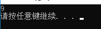
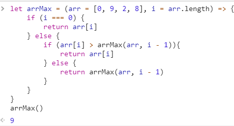
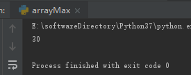

## 递归例子：求数组中的最大数

### 思路：递归每个值相互比较

### C++程序：

```
#include <iostream>
using namespace std;
// 数组的长度要在调用函数之前获取，因为调用函数的时候，数组退化为指针（参数里只传进去的是数组的首地址），
// 在32位系统下，不管什么类型的指针，均为4个字节。
/*
sizeof() => 返回一个对象或类型所占的内存字节数。
sizeof(x数组) => 返回整个数组的内存字节数
sizeof(x[0]) => 返回数组的内一个值的(数组内值的类型一致，字节数一致)内存字节数
*/
int arrayMax(int x[], int n){
	if (n == 1) {
		return x[0];
	} else {
		if (x[n] > arrayMax(x, n - 1)) {
			return x[n];
		} else {
			return arrayMax(x, n - 1);
		}
	}
}

int main()
{
	int x[5] = { 2, 6, 9, 0, 1 };
	int arrLength = sizeof(x) / sizeof(x[0]);  // 获取数组长度解释见上面
	cout << arrayMax(x, arrLength) << endl;
	cout << sizeof(x[0]) << endl;
	system("PAUSE");
    return 0;
}
```


### js程序：

```
let arrayMax = (arr = [0, 9, 2, 8], i = arr.length) => {
	if (i === 0) {
		return arr[i]
	} else {
		if (arr[i] > arrayMax(arr, i - 1)){
			return arr[i]
		} else {
			return arrayMax(arr, i - 1)
		}
	}
}
arrayMax()
```


### python程序：

```
# !E:/softwareDirectory/Python37 #文件目录
# -*- coding: UTF-8 -*-
# coding=utf-8


def listMax(arr, i):
    if i == 0:
        return arr[0]
    else:
        if arr[i] > listMax(arr, i - 1):
            return arr[i]
        else:
            return listMax(arr, i - 1)


listNum = [2, 30, 1, 8]
print(listMax(listNum, len(listNum) - 1))
```
