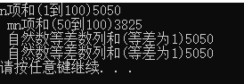

## 递归例子：自然数列求和：1+2+3+...+n：

### 公式
* 大家都知道高斯的1+2+3+...+100=5050
* 这便是1到100的自然数之和。 一般的自然数求和，我们可以用下面的公式:
1.   Sn = n * (n + 1) / 2
2.  Smn=(n + m)(n - m + 1) / 2

### 公式推导过程：

#####  从1到n的自然数之和:Sn = n * (n + 1) / 2

把两个相同的自然数列逆序相加：
* 2Sn=1+n + 2+(n-1) + 3+(n-2) + ... n+1
*    =n+1 +n+1 + ... +n+1
*    =n*(n+1)
* 所以 Sn=n*(n+1)/2 

#####  从m到n的自然数之和:Smn=(n-m+1)/2*(m+n)

* (n>m)
* Smn=Sn-S(m-1)
*    =n*(n+1)/2 -(m-1)*(m-1+1)/2
*    ={n*(n+1) - m(m-1)}/2
*    ={n*(n+1) - mn + m(1-m) + mn }/2
*    ={n*(n-m+1)+ m(1+ n-m)}/2
*    =(n+m)(n-m+1)/2

### 扩展式

其实自然数和就是等差数列
等差数列：
* 1.通项公式：差为d的n项为：An=A1+(n-1)d
* 2.等差求和公式：Sn=n(A1+An)/2 | Sn=n(A1)+ n(n-1)d/2


### c++程序：

```
#include <iostream>;
using namespace std;

int main()
{
	/*
		自然数求和公式：
		Sn = n * (n + 1) / 2
		Smn = (n + m)(n - m + 1) / 2

		等差数列公式：
		1.通项公式：差为d的n项为An = A1 + (n - 1)d
		2.等差求和公式：Sn = n(A1 + An) / 2 | Sn = n(A1) + n(n - 1)d / 2

	*/

	// 初始化自然数组
	int naturalNumber[100];
	for (int i = 0; i < 100; i++) {
		naturalNumber[i] = i + 1;
	}
	// 数组的长度要在调用函数之前获取，因为调用函数的时候，数组退化为指针（参数里只传进去的是数组的首地址），
	// 在32位系统下，不管什么类型的指针，均为4个字节。
	/*
	sizeof() => 返回一个对象或类型所占的内存字节数。
	sizeof(x数组) => 返回整个数组的内存字节数
	sizeof(x[0]) => 返回数组的内一个值的(数组内值的类型一致，字节数一致)内存字节数
	*/
	int NULegth = sizeof(naturalNumber) / sizeof(naturalNumber[0]);
	// n项和(1到100)
	int Sn = naturalNumber[NULegth - 1] * (naturalNumber[NULegth - 1] + 1) / 2;
	// mn项和(50到100)
	int Smn = (naturalNumber[NULegth - 1] + naturalNumber[NULegth / 2 - 1]) * (naturalNumber[NULegth - 1] - naturalNumber[NULegth / 2 - 1] + 1) / 2;
	// 自然数等差数列和(等差为1)
	int SSn = NULegth * (naturalNumber[0] + naturalNumber[NULegth - 1]) / 2;
	int SSn1 = NULegth * naturalNumber[0] + NULegth * (NULegth - 1) * 1 / 2;
	cout << "n项和(1到100)" << Sn << endl;
	cout << " mn项和(50到100)" << Smn << endl;
	cout << " 自然数等差数列和(等差为1)" << SSn << endl;
	cout << " 自然数等差数列和(等差为1)" << SSn1 << endl;
	system("PAUSE");
    return 0;
}
```


### js程序：

```

```